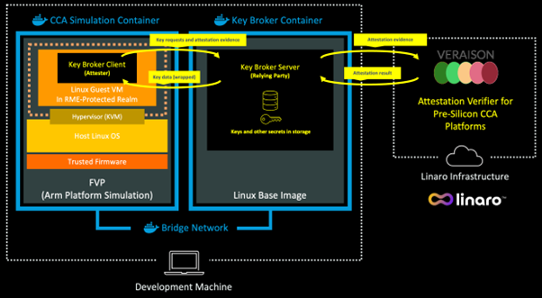

---
# User change
title: "Overview of the Software Architecture"

weight: 2 # 1 is first, 2 is second, etc.

# Do not modify these elements
layout: "learningpathall"
---

## The role of Attestation 
In this Learning Path, you will learn how attestation can control the release of confidential data into a confidential Linux realm for processing.

The role of attestation is to assess whether the target compute environment offers a provable level of confidential isolation. In this Learning Path, the target compute environment is a Linux realm. The assessment of a provable level of confidential isolation needs to occur before the realm can be trusted to receive confidential data or algorithms. This use of attestation to judge the trustworthiness of a compute environment, before allowing it to do any processing, is a common practice in confidential computing. Here, you will learn about this practice using a minimal set of software components.

## Understanding the key software components 
In this Learning Path, you will make use of a Key Broker Service, or KBS. 

The role of the KBS is to be a repository for encryption keys or other confidential data resources. A KBS releases secrets for processing in a confidential computing environment, but only when that environment has proved itself trustworthy through attestation.

The workload that runs inside the realm is a client of the KBS. It calls the KBS to request a secret, but the KBS does not return the secret immediately. Instead, it issues an attestation challenge back to the client. The client must respond with evidence in the form of a [CCA attestation token](/learning-paths/servers-and-cloud-computing/cca-container/cca-container/#obtain-a-cca-attestation-token-from-the-virtual-guest-in-a-realm).

When the KBS receives an attestation token from the realm, it needs to call a verification service that checks the token's cryptographic signature and verifies that it denotes a confidential computing platform. As you saw in the prerequisite reading Learning Path [Get Started with CCA Attestation and Veraison](/learning-paths/servers-and-cloud-computing/cca-veraison), Linaro provides such an attestation verifier for use with pre-silicon CCA platforms. This verifier is built from the Open-Source [Veraison project](https://github.com/veraison). The KBS calls this verifier to obtain an attestation result. The KBS then uses this result to decide whether to release the secrets into the realm for processing.

For additional security, the KBS does not release any secrets in clear text, even after a successful verification of the attestation token. Instead, the realm provides an additional public encryption key to the KBS. This is known as a wrapping key. The KBS uses this public key to wrap, which here means encrypt, the secrets. The client workload inside the realm is then able to use its own private key to unwrap the secrets and use them.

In the example in this Learning Path, you will see that the secret that is exchanged between the KBS and the realm is a small string value, which the realm decrypts and echoes to its console window once all the attestation steps have succeeded.

For convenience, both the KBS and the client software are packaged in docker containers, which you can execute on any suitable AArch64 or x86_64 development machine. Since the client software runs in a realm, it makes use of the Fixed Virtual Platform (FVP) and the reference software stack for Arm CCA. If you have not yet familiarized yourself with running applications in realms using FVP and the reference software stack, see the [Run an application in a Realm using the Arm Confidential Computing Architecture (CCA)](/learning-paths/servers-and-cloud-computing/cca-container) Learning Path.

The attestation verification service is hosted by Linaro, so it is not necessary for you to build or deploy this service yourself.

Figure 1 demonstrates the software architecture that you will construct to run the attestation example.

You can now proceed to the next section to run the end-to-end attestation example with the software components and architecture as described here.
