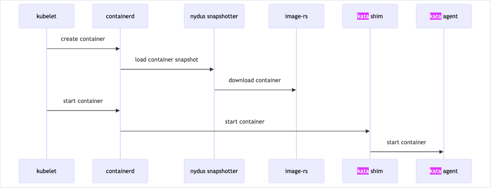
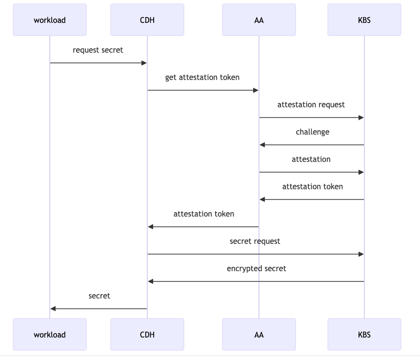
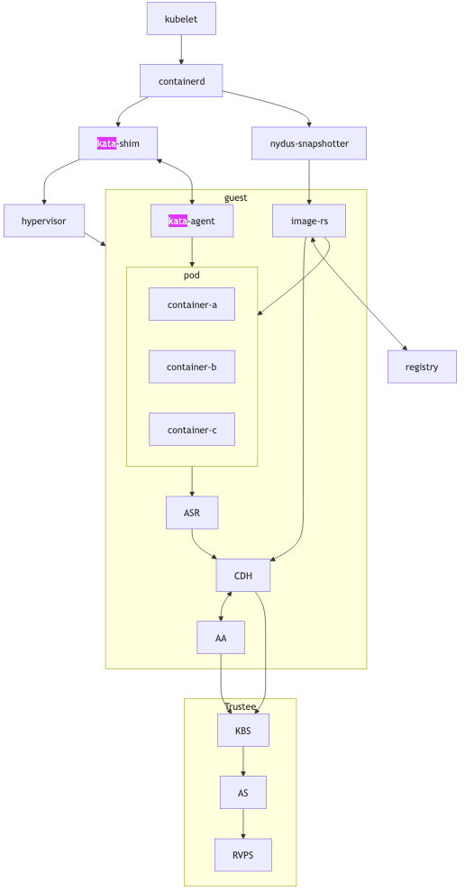

---
# User change
title: "Overview of Confidential Containers and Arm CCA Attestation with Trustee"

weight: 2 # 1 is first, 2 is second, etc.

# Do not modify these elements
layout: "learningpathall"
---

## Confidentail Containers

["Confidential Containers"](https://github.com/confidential-containers/confidential-containers) is an open source community
working to enable cloud native confidential computing by leveraging Trusted Execution Environments to protect containers and data.

## Design overview

Confidential computing projects are largely defined by what is inside the enclave and what is not.
For Confidential Containers, the enclave contains the workload pod and helper processes and daemons that facilitate the workload pod.
Everything else, including the hypervisor, other pods, and the control plane, is outside of the enclave and untrusted.

### Kata Containers

Confidential Containers and ["Kata Containers"](https://github.com/kata-containers/kata-containers) are closely linked,
but the relationship might not be obvious at first. Kata Containers is an existing open source project that encapsulates pods inside of VMs and
VMs can be run in TEEs. In this Learning Path the guest VM will be run in an ARM CCA realm and you will be able to confirm it by checking kernel messages.

Given the pod-centric design of Confidential Containers this is a perfect match. But if Kata runs pods inside of VM,
why do we need the Confidential Containers project at all? There are crucial changes needed on top of Kata Containers to preserve confidentiality.

### Image Pulling

When using Kata Containers container images are pulled on the worker node with the help of a CRI runtime like **containerd**.
The images are exposed to the guest via filesystem passthrough. This is not suitable for confidential workloads
because the container images are exposed to the untrusted host. With Confidential Containers images are pulled and unpacked inside of the guest.
This requires additional components such as **image-rs** to be part of the guest rootfs. These components are beyond the scope of
traditional Kata deployments and live in the Confidential Containers ["guest components"](https://github.com/confidential-containers/guest-components) repository.

On the host, a **nydus snapshotter** is used to pre-empt image pull and divert control flow to **image-rs** inside the guest.
This is a simplified diagram showing the interaction of **containerd**, the **nydus snapshotter**, and **image-rs**.

### Attestation

Confidential Containers also provides components inside the guest and elsewhere to facilitate attestation.
Attestation is a crucial part of confidential computing and a direct requirement of many guest operations.
For example, to unpack an encrypted container image, the guest must retrieve a secret key.
Inside the guest the **confidential-data-hub** and **attestation-agent** handle operations involving secrets and attestation.
Again, these components are beyond the scope of traditional Kata deployments and are located in the ["guest components"](https://github.com/confidential-containers/guest-components) repository.

The CDH and AA use the KBS Protocol to communicate with an external, trusted entity.
Confidential Containers provides [Trustee](https://github.com/confidential-containers/trustee) as an attestation service and key management engine that validates the guest TCB and releases secret resources.

This is a simplified diagram of the attestation process

In this Learnig Path the attestation process will be used to obtain an encryption key required to decrypt a container image.
Learn more about how Trustee services are used to evaluate the trustworthiness of a CCA realm and how attestation policy gates secrets release in
["Run an end-to-end Attestation with Arm CCA and Trustee"](/learning-paths/servers-and-cloud-computing/cca-trustee)

### Full diagram

If we take Kata Containers and add guest image pulling and attestation, we arrive at the following diagram, which represents Confidential Containers.

For convenience, Trustee services and the Confidential Containers software are packaged in Docker containers,
which you can run on any suitable AArch64 or x86_64 development host.
Because the client runs in a realm, it uses the Fixed Virtual Platform (FVP) and the reference software stack for Arm CCA.

Proceed to the next section to run a confidential container using the components and architecture described here.
