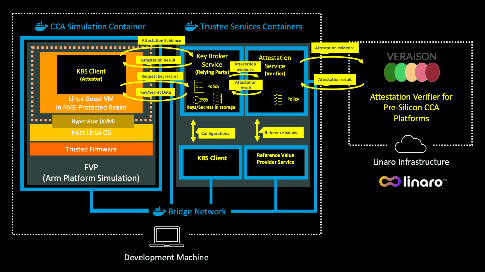

---
# User change
title: "Overview of the Software Architecture"

weight: 2 # 1 is first, 2 is second, etc.

# Do not modify these elements
layout: "learningpathall"
---

## The role of Attestation
In this Learning Path, you will learn how attestation can control the release
of confidential data into a confidential Linux realm for processing.

The role of attestation is to assess whether the target compute environment
offers a provable level of confidential isolation. In this Learning Path,
the target compute environment is a Linux realm. The assessment of a provable
level of confidential isolation needs to occur before the realm can be trusted
to receive confidential data or algorithms. This use of attestation to judge
the trustworthiness of a compute environment, before allowing it to do any
processing, is a common practice in confidential computing.

## Understanding the key software components

This Learning Path is similar to
[Run an end-to-end Attestation Flow with Arm CCA](/learning-paths/servers-and-cloud-computing/cca-essentials/).

The main difference is that instead of KBS from the [Veraison](https://github.com/veraison) project you will use
the components implemented in the [confidential containers (CoCo)](https://github.com/confidential-containers)
to support the [IETF RATS model](https://datatracker.ietf.org/doc/rfc9334/)
(Remote ATtestation procedureS Architecture). The components include the Attestation Service (AS),
Key Broker Service (KBS), Reference Value Provider Service (RVPS), Attestation Agent (AA), and Confidential Data Hub (CDH).
The AS, KBS, and RVPS components are part of the [Trustee project](https://github.com/confidential-containers/trustee),
whereas the AA and CDH are part of the [Guest Components](https://github.com/confidential-containers/guest-components) project in CoCo.

### RATS key components

This is a list of components used in this Learning Path:

- `Attester` - provides Evidence, which is evaluated and appraised to decide its
   trustworthiness (for instance, a test to see whether it’s authorized to perform some action).
   Evidence may include configuration data, measurements, telemetry, or inferences.
- `Verifier` - evaluates the validity of the evidence received from the attester
   and produces attestation results, which are sent to the Relying party.
   Attestation results typically include information regarding the Attester,
   while the Verifier vouches for the validity of the results.
- `Relying party` - depends on the validity of information originating from
   the attester for reliably applying an action. This information can come
   from the verifier or directly through the attester.

### Trustee components

The Trustee project includes components deployed on a trusted side and used to verify
whether the remote workload is running in a trusted execution environment (TEE).
It also verifies that the remote environment uses the expected software and hardware versions.

#### Key Broker Service (KBS)

The Key Broker Service (KBS) facilitates remote attestation and managing
and delivering secrets. Equating this to the RATS model, the KBS is the
`relying party` entity. The KBS, however, doesn’t validate the attestation evidence.
Instead, it uses the attestation service (AS) to verify the TEE evidence.

#### Attestation Service (AS)

The Attestation Service (AS) is responsible for validating the TEE evidence.
When mapped to the RATS model, the AS is the equivalent of the `verifier`.
The AS receives attestation evidence and returns an attestation token
containing the results of a two-step verification process.

The following diagram shows the AS components:

The AS runs the following verification process:

1. Verify the formatting and the origin of the evidence - for example, checking the signature of the evidence.
   This is accomplished by one of the platform-specific Verifier Drivers.
2. Evaluate the claims provided in the evidence - for example, validating that the measurements are what the
   client expects. This is done by a Policy Engine with help from the RVPS.

##### Verifier driver

A verifier driver parses the attestation evidence provided by the hardware TEE. It performs the following tasks:

1. Verifies the hardware TEE signature of the TEE quote and report provided in the evidence
2. Receives the evidence and organizes the status into a JSON format to be returned

In this Learning Path, the AS is configured to use an external CCA verifier.

[Linaro](https://www.linaro.org) provides such an attestation verifier for use with pre-silicon Arm CCA platforms.
This verifier is built from the Open-Source [Veraison project](https://github.com/veraison).
You can learn more about Veraison and Linaro attestation verifier service in
[Get Started with CCA Attestation and Veraison](https://learn.arm.com/learning-paths/servers-and-cloud-computing/cca-veraison/)

##### Policy Engine

The AS allows users to upload their own policies when performing evidence verification.
When an attestation request is received by the AS, it uses a policy ID in the request
to decide which policies should be evaluated.
The results of all policies evaluated are included in the attestation response.

In this Learning Path the AS attestation policy includes specific Arm CCA rules.

#### Reference Value Provider Service (RVPS)

The reference value provider service (RVPS) is a component in the AS responsible for verifying,
storing, and providing reference values. RVPS receives and verifies inputs from the software
supply chain, stores the measurement values, and generates reference value claims for the AS.
This operation is performed based on the evidence verified by the AS.

### Guest components

The guest components are the services/tools that run inside the realm (TEE).
When mapped to the RATS model, these components are the equivalent of the `Attester`.

For simplicity instead of Attestation Agent (AA) and Confidential Data Hub (CDH)
you will use [KBS Client Tool](https://github.com/confidential-containers/trustee/tree/main/tools/kbs-client)

This is a simple client for the KBS that facilitates basic attestation flows.
You will run this tool inside of a realm to make requests for an attestation result token (EAR) and a secret.

The client tool can also be used to provision the KBS/AS with resources and policies.

KBS Client connects to the KBS in order to perform attestation. To prove the trustworthiness of the environment
KBS Client sends the evidence (claims) from the TEE in the form of a CCA attestation token.
You can learn more about CCA attestation tokens in
[Get Started with CCA Attestation and Veraison](https://learn.arm.com/learning-paths/servers-and-cloud-computing/cca-veraison/)

For convenience, Trustee services and the client software are packaged in
docker containers, which you can execute on any suitable AArch64 or x86_64
development machine. Since the client software runs in a realm, it makes use
of the Fixed Virtual Platform (FVP) and the reference software stack for Arm CCA.
If you have not yet familiarized yourself with running applications in realms using
FVP and the reference software stack, see the
[Run an application in a Realm using the Arm Confidential Computing Architecture (CCA)](/learning-paths/servers-and-cloud-computing/cca-container)
Learning Path.

When the AS receives an attestation token from the realm via KBS:
- it calls an external CCA verifer (the Linaro attestation verifier service) to obtain an attestation result.
- the external CCA verifer checks the token's cryptographic signature,
  verifies that it denotes a confidential computing platform and provides an attestation result.
- it also checks the token evidences against its own attestation policies and updates attestation result status and trustworthiness vectors.

When asked for a resource the KBS uses the attestation result to decide whether to release the secrets into the realm for processing.

Figure 1 demonstrates the software architecture that you will construct to run the attestation example.

You can now proceed to the next section to run the end-to-end attestation example with the software components and architecture as described here.
