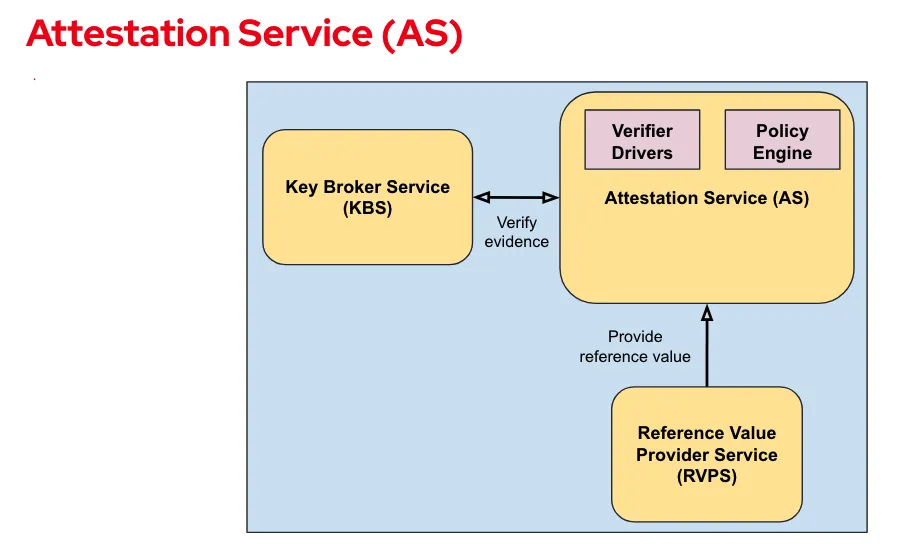

---
# User change
title: "Architecture overview for Arm CCA Attestation with Trustee"

weight: 2 # 1 is first, 2 is second, etc.

# Do not modify these elements
layout: "learningpathall"
---

## The role of attestation

In this Learning Path, you will learn how attestation controls the release of confidential data into a confidential Linux realm for processing. The role of attestation is to assess whether the target compute environment offers a provable level of confidential isolation. In this Learning Path,
the target compute environment is a Linux realm. The assessment of a provable level of confidential isolation must occur before the realm can be trusted to receive confidential data or algorithms. This use of attestation to judge the trustworthiness of a compute environment, before allowing it to do any processing, is a common practice in confidential computing.

## Key software components

This Learning Path is similar to
[Run an end-to-end Attestation Flow with Arm CCA](/learning-paths/servers-and-cloud-computing/cca-essentials/). The main difference is that, instead of the KBS from the [Veraison](https://github.com/veraison) project, you will use components implemented in the [Confidential Containers (CoCo) Project](https://github.com/confidential-containers) to support the [IETF RATS model](https://datatracker.ietf.org/doc/rfc9334/) (Remote ATtestation procedureS). These components include the Attestation Service (AS), Key Broker Service (KBS), Reference Value Provider Service (RVPS), Attestation Agent (AA), and Confidential Data Hub (CDH).
The AS, KBS, and RVPS components are part of the [Trustee project](https://github.com/confidential-containers/trustee),
whereas the AA and CDH are part of the [Guest Components](https://github.com/confidential-containers/guest-components) project in CoCo.

## RATS roles

This Learning Path focuses on the following key concepts:

- **Attester** – provides evidence that is evaluated to decide **Trustworthiness** (for example, whether it is authorized to perform an action). 
- **Evidence** can include configuration data, measurements, telemetry, or inferences.
- **Verifier** – evaluates the evidence from the Attester and produces attestation results that are sent to the Relying party. The Verifier vouches for the validity of those results.
- **Relying party** – depends on the validity of information from the Attester (either directly or through the Verifier) to make an access or policy decision.

## Trustee components

Trustee components run on the trusted side and verify whether a remote workload is executing in a trusted execution environment (TEE) and using the expected software and hardware versions.

## Key Broker Service (KBS)

The KBS facilitates remote attestation and manages and delivers secrets. In RATS terms, the KBS is the **Relying party**. The KBS does not validate attestation evidence itself; it relies on the Attestation Service (AS) to verify the TEE evidence.

## Attestation Service (AS)

The Attestation Service (AS) validates TEE evidence. In RATS terms, the AS is the **Verifier**. The AS receives attestation evidence and returns an attestation token containing the results of a two-step verification process.

The following diagram shows the AS components:

The AS performs this verification flow:

- **Verify format and origin of evidence** – for example, verify the evidence signature. This is handled by a platform-specific Verifier driver.
- **Evaluate claims** – for example, validate that measurements match expected values. This is handled by the Policy engine, with RVPS support.

## Verifier driver

A Verifier driver parses the attestation evidence provided by the hardware TEE and:

- Verifies the hardware TEE signature of the quote and report included in the evidence.
- Normalizes the verified evidence into a JSON structure to be returned.

In this Learning Path, the AS is configured to use an external CCA Verifier.

[Linaro](https://www.linaro.org) provides an attestation Verifier for pre-silicon Arm CCA platforms. It is built from the open-source [Veraison](https://github.com/veraison) project. Learn more in
[Get Started with CCA Attestation and Veraison](https://learn.arm.com/learning-paths/servers-and-cloud-computing/cca-veraison/).

## Policy engine

The AS lets you upload custom policies used during evidence verification. When the AS receives an attestation request, it uses the policy ID in the request to decide which policies to evaluate. The attestation response includes the results of all evaluated policies.

In this Learning Path, the AS policy includes Arm CCA–specific rules.

## Reference Value Provider Service (RVPS)

RVPS verifies, stores, and provides reference values. It receives inputs from the software supply chain, stores measurement values, and generates reference value claims for the AS, based on evidence verified by the AS.

## Guest components

Guest components run inside the realm (TEE). In RATS terms, these components act as the **Attester**.

For simplicity, instead of Attestation Agent (AA) and Confidential Data Hub (CDH), you will use the [KBS Client Tool](https://github.com/confidential-containers/trustee/tree/main/tools/kbs-client).

This is a simple client for the KBS that facilitates basic attestation flows.
You will run this tool in a realm to make requests for an attestation result token (EAR) and a secret.

The client tool can also be used to provision the KBS/AS with resources and policies.

To prove the environment’s trustworthiness, the KBS Client sends CCA attestation evidence (a CCA attestation token) to the KBS. Learn more about CCA attestation tokens in
[Get Started with CCA Attestation and Veraison](https://learn.arm.com/learning-paths/servers-and-cloud-computing/cca-veraison/).

For convenience, Trustee services and the client software are packaged in Docker containers, which you can run on any suitable AArch64 or x86_64 development host. Because the client runs in a realm, it uses the Fixed Virtual Platform (FVP) and the reference software stack for Arm CCA. If you are new to running applications in realms with FVP, see
[Run an application in a Realm using the Arm Confidential Computing Architecture (CCA)](/learning-paths/servers-and-cloud-computing/cca-container).

When the AS receives an attestation token from the realm using the KBS, it:

- Calls an external CCA Verifier (the Linaro attestation Verifier service) to obtain an attestation result.
- Checks the token’s cryptographic signature and confirms that it represents a confidential computing platform.
- Evaluates evidence in the token against its policies and updates the attestation result and trustworthiness vectors.

When a resource is requested, the KBS uses the attestation result to decide whether to release secrets to the realm for processing.

This diagram shows the software architecture you will construct to run the attestation example:

Proceed to the next section to run the end-to-end attestation example using the components and architecture described here.
