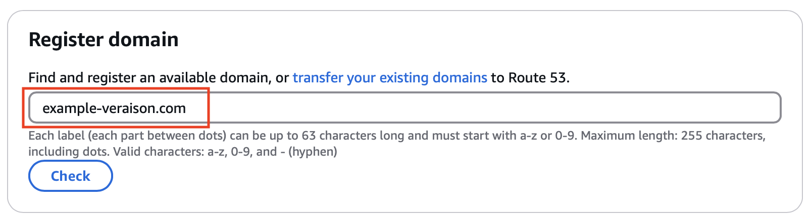
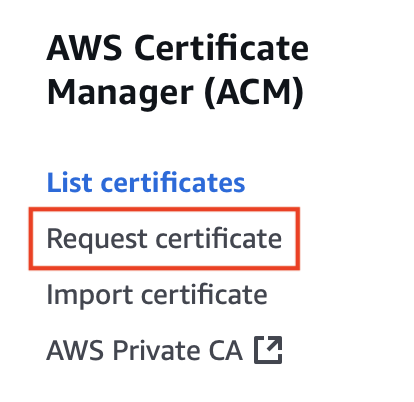
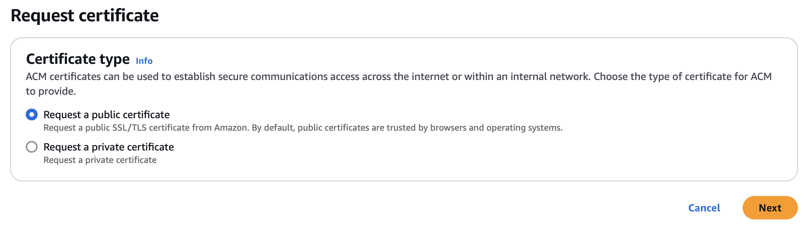
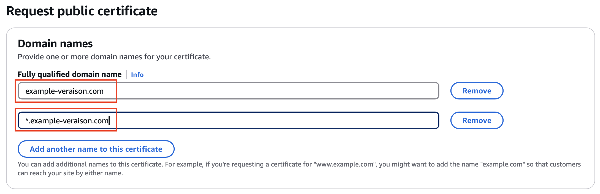
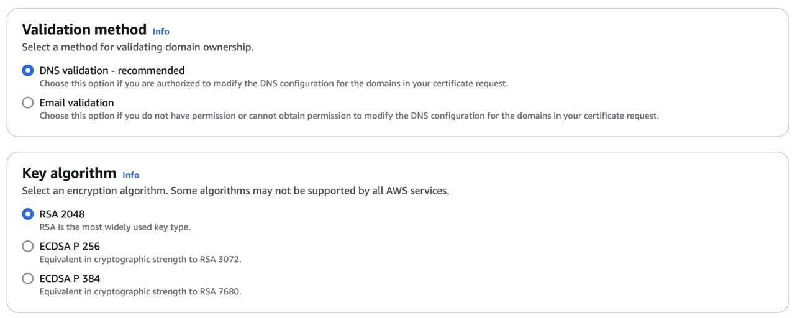

## Create Your Domain in Route53
Veraison provides cloud services for attestation. These services are published on the internet and are accessible via HTTPS using RESTful APIs. Like all cloud services, they need a domain so users can easily find and access them. Domains are named using string labels separated by dots. You will be familiar with domain names such as `www.amazon.com` - they allow public internet resources to be located conveniently and routed using shared internet infrastructure such as DNS.
### What is Route53?

[Route53](https://docs.aws.amazon.com/Route53/latest/DeveloperGuide/Welcome.html) is an AWS service that allows you to register and manage domains. In order to create your Veraison deployment in AWS, you first need to choose a domain name and register it with Route53.

### Choosing Your Domain Name

Your domain name must be unique and specific to your Veraison deployment. Remember that this domain name is for creating public internet services, so it cannot clash with any other domains that exist on the public internet. 

In this Learning Path, you will use `example-veraison.com` as an illustrative example of a domain name. However, do not use this name for your own deployment. Choose your own name, and use it in place of the example as you progress through the Learning Path.

### Registering Your Domain with Route53

The easiest way to create your domain is using the Route53 dashboard in the AWS Management Console:

* Using your web browser and AWS account credentials, sign into the console and search for the Route53 service. This takes you to the Route53 dashboard. 
* Locate the domain registration option, which looks something like the image below. Remember to use your own domain name where highlighted, not the `example-veraison.com` domain.

{}
If you have an existing domain, you can transfer it into Route53 instead of registering a new one, as shown below. Otherwise, the instructions here assume that you are creating a new domain.
{}

Route53 checks your domain name to make sure it's unique on the internet. Provided that there isn't a clash, Route53 gives you the option of registering your chosen domain name, or some alternatives. For example, it might suggest you could use `example-veraison.net` or `example-veraison.org`.

Route53 charges an annual fee for domain registration, which varies depending on your chosen name. Choose the name that you would like to use, and proceed to complete the registration process using the on-screen instructions in your browser.

## Request Your Domain Certificate

### Why Do I Need a Domain Certificate?
Veraison publishes secure cloud services that can be reached on the internet using HTTPs. You need a domain certificate so users can securely and confidently connect to your Veraison services.

### Requesting a Certificate with AWS Certificate Manager 
You can use the [AWS Certificate Manager (ACM)](https://aws.amazon.com/certificate-manager/) to issue a certificate for your domain: 

* Navigate to this service within the AWS Management Console in your web browser.

* Select **Request Certificate** from the menu on the left as shown.

On the first page of the certificate wizard, select **Request a public certificate**, then click **Next**.

The next page of the wizard is for setting other properties of the certificate, starting with the domain name. The primary domain name of the certificate must precisely match the domain name that you registered with Route53 in the previous step. However, the Veraison deployment also creates a number of named services nested within that primary domain. 

In order for the certificate to adequately cover all of those named services, you need to give the certificate an additional name, which uses an asterisk (*) wildcard as shown below. Remember, once again, substitute your chosen domain name to use in place of `example-veraison.com`.

Use the **Add another name to this certificate** button to create the secondary name with the wildcard.

For the validation method, you should use **DNS validation**, which is the recommended default. You can also use the default **RSA 2048** for the certificate key algorithm as shown below.

Now click **Request** to request the certificate from the Certificate Manager.

### Validating Your Domain Ownership

Before AWS can issue the certificate, it checks that you own the domain. Since you registered the domain in Route53 earlier, this is straightforward.

Use the ACM dashboard to view the certificate. You will see that it has a status of "Pending Validation". You will also see the two associated domains: `example-veraison.com` and `*.example-veraison.com`, or whatever your chosen domain name is.

Click **Create records in Route 53** to confirm domain ownership. AWS then issues the certificate, and its status changes from **Pending Validation** to **Issued**. Be aware that this process can take up to about half an hour.

Once your domain and certificate are prepared, you are ready to create your Veraison deployment.
