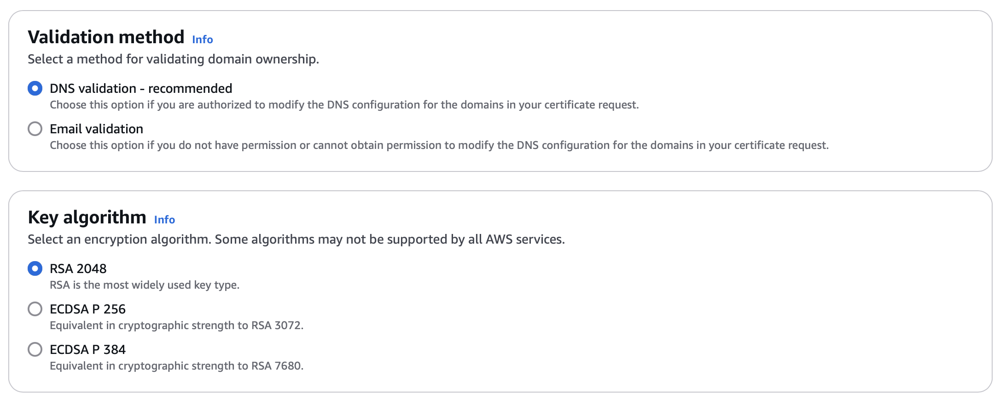

## Create Your Domain in Route53
Veraison provides cloud services for attestation. These services are published on the internet and are accessible via HTTPS using RESTful APIs. Like all cloud services, they require a suitable internet domain that allows the consumers of those services to locate them. Domains are named using string labels separated by dots (full stops). You will be familiar with domain names such as `www.amazon.com` - they allow public internet resources to be located conveniently and routed using shared internet infrastructure such as DNS.

[Route53](https://docs.aws.amazon.com/Route53/latest/DeveloperGuide/Welcome.html) is an AWS service that allows you to register and manage domains. In order to create your Veraison deployment in AWS, you will first need to choose a domain name and register it with Route53.

Your domain name _must_ be unique and specific to your Veraison deployment. Remember that this domain name will be used to create public internet services, so it cannot clash with any other domains that exist on the public internet. In this learning path, we will use `example-veraison.com` as an illustrative example of a domain name. However, _do not_ use this name for your own deployment. Choose your own name, and use it in place of the example as you progress through the learning path.

The easiest way to create your domain is using the Route53 dashboard in the AWS Management Console. Using your web browser and AWS account credentials, sign into the console and search for the Route53 service. This will take you to the Route53 dashboard. Locate the domain registration option, which will look something like the image below. Remember to use your own domain name where highlighted, not the `example-veraison.com` domain.

**Note:** If you have an existing domain and you wish to transfer it into Route53, instead of creating a new domain, you can use this option as well as shown below. Otherwise, the instructions here assume that you are creating a new domain.

Route53 will check the domain name for you to ensure that it doesn't clash with others on the internet. Provided that there isn't a clash, Route53 will give you the option of registering your chosen domain name, or some alternatives. For example, it might suggest you could use `example-veraison.net` or `example-veraison.org`.

Route53 will charge an annual fee for the domain registration, and the size of this fee can differ depending on your name choice. Choose the name that you would like to use, and proceed to complete the registration process using the on-screen instructions in your browser.

## Request Your Domain Certificate
Veraison publishes secure cloud services that can be reached on the internet using HTTPs. This means that you will need a certificate for your registered domain. A certificate will allow consumers of your Veraison services to trust those services and connect with them securely.

The [AWS Certificate Manager (ACM)](https://aws.amazon.com/certificate-manager/) can be used to issue a certificate for your domain. Navigate to this service within the AWS Management Console in your web browser.

Select "Request Certificate" from the menu on the left as shown.

On the first page of the certificate wizard, select the option to request a **public certificate** as shown below and click **Next**.

The next page of the wizard will be used to set other properties of the certificate, starting with the domain name. The primary domain name of the certificate must precisely match the domain name that you registered with Route53 in the previous step. However, the Veraison deployment will also create a number of named services nested within that primary domain. In order for the certificate to adequately cover all of those named services, you need to give the certificate an additional name, which uses an asterisk (*) wildcard as shown below. Remember, once again, substitute your chosen domain name to use in place of `example-veraison.com`.

Use the **Add another name to this certificate** button to create the secondary name with the wildcard.

For the validation method, you should use **DNS validation**, which will be the recommended default. You can also use the default **RSA 2048** for the certificate key algorithm as shown below.

Now click **Request** to request the certificate from the Certificate Manager.

Before AWS can issue the certificate, it will need to check that you own the domain. Since you have registered the domain in Route53 in the previous step, this will be straightforward.

Use the ACM dashboard to view the certificate. You will see that it has a status of "Pending Validation". You will also see the two associated domains: `example-veraison.com` and `*.example-veraison.com`, or whatever your chosen domain name is.

Click the button that says **Create records in Route 53**. This will allow AWS to prove that you own the domain, at which point it will issue the certificate, and the status will change from "Pending Validation" to "Issued". Be aware that this process can take up to about half an hour.

Once your domain and certificate are prepared, you are ready to create your Veraison deployment.
