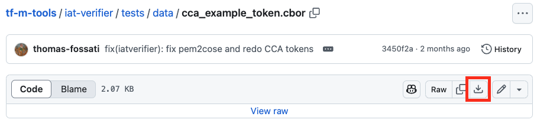

In this section, you will obtain an example CCA attestation token. To set up the tools that you need for attestation, you need to install the Go language on your system.

## Install Go

First, start by removing any existing Go installation. Next, obtain the install files and run the following command:

```bash
rm -rf /usr/local/go

wget https://go.dev/dl/go1.23.3.linux-$(dpkg --print-architecture).tar.gz
tar -C /usr/local -xzf go1.23.3.linux-$(dpkg --print-architecture).tar.gz
```

Export the installation path and add it to your `$PATH environment` variable:

```bash
export PATH=$PATH:/usr/local/go/bin
```
Verify the installation by running the following command to check the version of the installation:

```bash
go version
```

## Install Git

Verify that `git` is installed by using the command below. It should produce an output that lists the version available on your computer:

```bash
git --version
```

## Install jq

The jq utility is a popular command-line tool that you can use to parse and manipulate JSON data. 

To install it, you can use your local package manager, for instance:

```bash
sudo apt install jq
```

## Download the Example CCA Attestation Token

Using your preferred web browser, navigate to the [token in the TrustedFirmware-M tools repository](https://github.com/TrustedFirmware-M/tf-m-tools/blob/main/iat-verifier/tests/data/cca_example_token.cbor).

Use GitHub’s download button, located on the right of the upper toolbar, to download the token as a `raw` binary file.



Place this file in the `$HOME` folder, while retaining the file name. 

The rest of this Learning Path uses the notation `$HOME/cca_example_token.cbor` as the file path.

{}
You will notice that the filename extension on the example token is `.cbor`, which also denotes the format of the data. CBOR is an acronym for Concise Binary Object Representation. You might already be familiar with JSON (the JavaScript Object Notation). JSON provides a standard way of conveying the nested structures of key-value pairs. CBOR is conceptually the same as JSON. The difference is that CBOR is a binary format, rather than a text-based format like JSON. CBOR is designed for compactness and machine-readability, but at the expense of human-readability. You can learn more about CBOR [here](https://cbor.io/).
{}

## Build the evcli tool

Now that you have downloaded the example CCA attestation token, the next step is to look inside the token and learn about the data that it contains. As the token is a binary file, you will need to use a tool to parse the file and display its contents. The tool that you will use is a command-line tool called `evcli`. 

`evcli` is an acronym for EVidence Command Line Interface, which goes back to the idea that attestation tokens are used to convey evidence about realms and the platforms on which they are hosted. The `evcli` tool is part of the Veraison Open-Source project, which was covered in the previous section.

Clone the source code using git as follows:

```bash
cd $HOME
git clone https://github.com/veraison/evcli.git
```
Change the directory and build the tool:

```bash
cd evcli
go build
```

The tool is quite small, so this should not take long. Once it has built, you can progress to the next step.

## Inspect the CCA Example Attestation Token

Now that you have built the `evcli` command-line tool, you can use it to inspect the contents of the example CCA attestation token that you downloaded earlier.

Run the following command:

```bash
./evcli cca print --token $HOME/cca_example_token.cbor
```

The contents of the token are displayed as JSON. Check that the output matches the below. Some of the output has been removed for better readability.

```output
{
  "cca-platform-token": {
    "cca-platform-profile": "tag:arm.com,2023:cca_platform#1.0.0",
    "cca-platform-challenge": "tZc8touqn8VVWHhrfsZ/aeQN9bpaqSHNDCf0BYegEeo=",
    "cca-platform-implementation-id": "f0VMRgIBAQAAAAAAAAAAAAMAPgABAAAAUFgAAAAAAAA=",
    "cca-platform-instance-id": "AQcGBQQDAgEADw4NDAsKCQgXFhUUExIREB8eHRwbGhkY",
    "cca-platform-config": "z8/Pzw==",
    "cca-platform-lifecycle": 12291,
    "cca-platform-sw-components": [
      {
        "measurement-type": "RSE_BL1_2",
        "measurement-value": "micfKpFrC27mzsskJvCzIG7wdFeL5V2byU9vP+Orhqo=",
        "signer-id": "U3h5YwdTXfPsjYsVouLcVkFBnD0wYM/jIjjA+pc/eqM=",
        "measurement-description": "sha-256"
      },
      (...)
      {
        "measurement-type": "SOC_FW_CONFIG",
        "measurement-value": "5sIejSYP5xiC3r2zOdJAKiynZIUpvCMD9IZJvOA4ABc=",
        "signer-id": "U3h5YwdTXfPsjYsVouLcVkFBnD0wYM/jIjjA+pc/eqM=",
        "measurement-description": "sha-256"
      }
    ],
    "cca-platform-service-indicator": "https://veraison.example/.well-known/veraison/verification",
    "cca-platform-hash-algo-id": "sha-256"
  },
  "cca-realm-delegated-token": {
    "cca-realm-profile": "tag:arm.com,2023:realm#1.0.0"
    "cca-realm-challenge": "bobW2XzHE7xt1D285JGmtAMRwCeov4WjnaY+nORMEyqKEZ0pb65qaZnpvz5EcbDOASRdiJQkwx6JeTs7HWsVBA==",
    "cca-realm-personalization-value": "VGhlIHF1aWNrIGJyb3duIGZveCBqdW1wcyBvdmVyIDEzIGxhenkgZG9ncy5UaGUgcXVpY2sgYnJvd24gZm94IA==",
    "cca-realm-initial-measurement": "MRMUq3NiA1DPdYg0rlxl2ejC3H/r5ufZZUu+hk4wDUk=",
    "cca-realm-extensible-measurements": [
      "JNWwopbMBcvYBoxQZ8W9Rzt3Ddpq4IL+O6MKvj+aarE=",
      "eI/AkL/GuO2QMVK6hBTnPa9bjHux55rVAqsGmbZZ7RY=",
      "2sRqWEFdw6ANenQYUgCOnK5k9S0DufdtdvSzZE/vxBY=",
      "MsavxiflVYXAMVU1nzMaDiJfaEDblH3Zbvq4G+JnGTk="
    ],
    "cca-realm-hash-algo-id": "sha-256",
    "cca-realm-public-key": "BHb5iAkb5YXtQYAa7Pq4WFSMYwV+FrDmdhILvQ0vnCngVsXUGgEw65whUXiZ3CMUayjhsGK9PqSzFf0hnxy7Uoy250ykm+Fnc3NPYaHKYQMbK789kY8vlP/EIo5QkZVErg==",
    "cca-realm-public-key-hash-algo-id": "sha-256"
  }
}
```

It is not important to understand every detail of the attestation token, but here are some of the highlights:

- The CCA attestation token is a variant of a more general-purpose attestation data format known as the Entity Attestation Token (EAT). The EAT specification has been established to create better alignment across the industry with respect to attestation data, so that common tools and libraries can be used to process it.
- Specific variants of the EAT format are known as profiles, so this token is adopting the Arm CCA profile of the EAT specification.
- The CCA attestation token is divided at the top level into two sub-tokens. These are known individually as the platform token and the realm token.
- The platform token contains the evidence about the Arm CCA platform on which the realm is running, which includes details about the state of the hardware and firmware that compose the platform. You can think of the platform as a single server or self-contained computing device. A single platform can host many realms, which can be executing as virtual machines or containers. Therefore, many realms might produce the same platform token.
- The realm token contains the evidence about the realm itself, which is running on the platform. It is the more dynamic part of the token. It includes information about the realm’s initial memory contents and boot state.
- The top-level data items in each sub-token are known as claims. A claim is an individual evidence fragment that describes a specific property of the system.
- The claims of the platform token are labeled with the prefix `cca-platform-*`
- The claims of the realm token are labeled with the prefix `cca-realm-*`
- Many of the claims take the form of _measurements_. A measurement is a hash (checksum) that is computed from one of the firmware or software components that are running within the realm or within the platform. Checking these measurements against known-good values is an essential step for evaluating the trustworthiness of the realm. Any mismatch could mean that the system is running some software or firmware that has been tampered with, or is at the wrong patch or version level.

You might find it instructive to view the token in a formatting tool such as https://jsonviewer.stack.hu, where you can interactively expand and collapse different parts of the object tree to gain a better feel for the structure. Doing this may help you to digest the bullet points above.

To test out the formatting tool, see if you can find the measurement of the Realm Management Monitor (RMM). The RMM is part of the firmware for a CCA platform.

Next, you will see the steps involved in verifying and evaluating a CCA attestation token.
