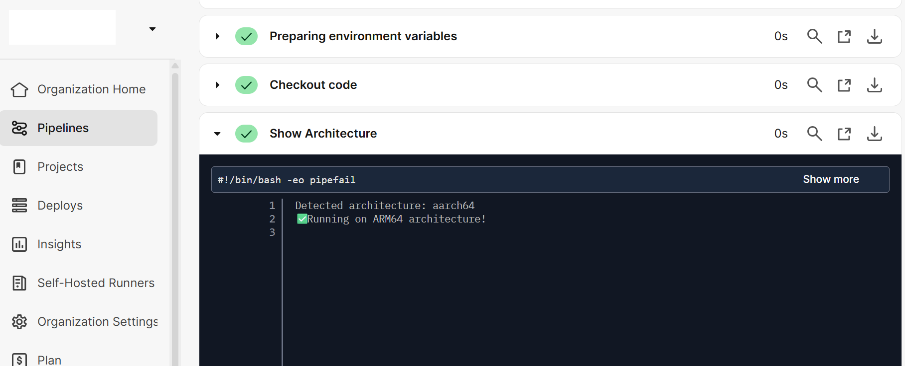
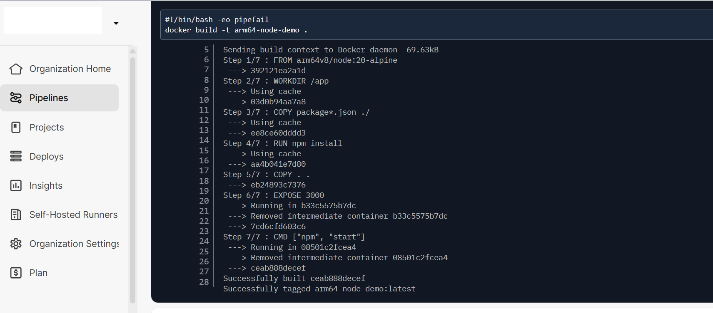
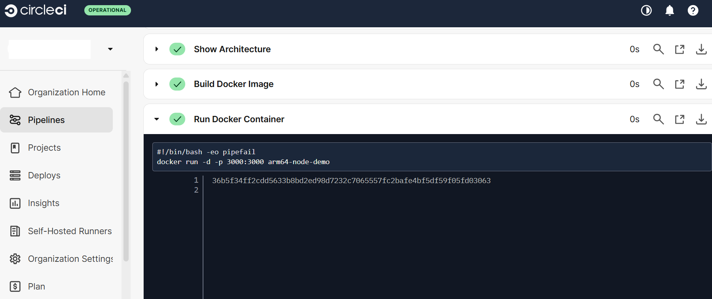
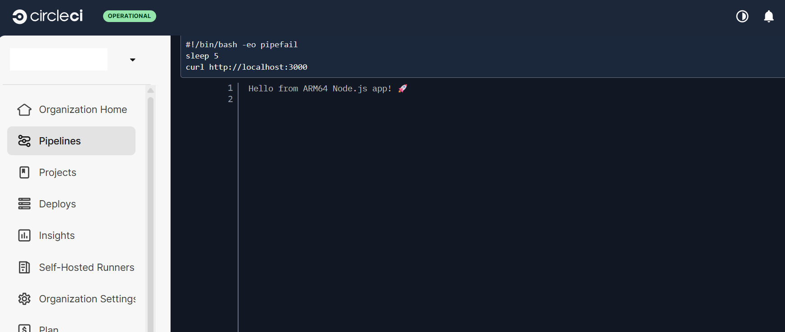

## Deploying a Cloud-Native Arm64 Node.js App using self-hosted CircleCI Runner on GCP

This guide walks through building and testing a simple **Node.js web app** using a **self-hosted CircleCI Arm64 runner** on a **GCP SUSE Arm64 VM**.


### Install and Configure Docker
Ensure Docker is installed, started, and accessible by both your user and the CircleCI runner service.

- **Install Docker**: Refresh your package manager and install Docker on your system.
- **Enable Docker Service**: Ensure Docker starts on boot and is running.
- **Add User to Docker Group**: Add both your user and the CircleCI runner to the Docker group to grant access.

```console
sudo zypper refresh
sudo zypper install docker
sudo systemctl enable docker
sudo systemctl start docker
sudo systemctl status docker
sudo usermod -aG docker $USER
sudo usermod -aG docker circleci
```
### Validate Docker access
This command switches to the CircleCI user and checks if Docker is working correctly.

```console
sudo -u circleci -i
docker ps
exit
```

### Verify Docker Permissions
Check Docker socket permissions and ensure that the CircleCI runner is active and running.

```console
ls -l /var/run/docker.sock
ps -aux | grep circleci-runner
```
- **Check Docker Socket Permissions**: This command ensures the Docker socket is accessible.
- **Verify CircleCI Runner Process**: Confirm the CircleCI runner service is active and running.

### **Install Node.js and npm**

Before proceeding with the app setup, please make sure **Node.js** and **npm** (Node.js package manager) are installed on the VM, as they are required to run your Node.js app.

- **Install Node.js**: Use the official Node.js package for Arm64 architecture. 
- **Install npm**: npm is automatically installed when Node.js is installed.

```console
sudo zypper install nodejs
sudo zypper install npm
```
### Create a repository for your example code
First, install GitHub CLI:

```bash
sudo zypper install gh
```
Authenticate:

```bash
gh auth login
```

Create a new repository for your example code:

```console
gh repo create arm64-node-demo --public --clone
cd arm64-node-demo
```

### Create a Dockerfile
In the root of your project, create a `Dockerfile` that defines how to build and run your application container.

```dockerfile
# Dockerfile
FROM arm64v8/node:20-alpine
WORKDIR /app
COPY package*.json ./
RUN npm install
COPY . .
EXPOSE 3000
CMD ["npm", "start"]
```
- **Use Arm64 Node.js Image**: The `arm64v8/node` image is specifically designed for Arm64 architecture.
- **Install Dependencies**: `RUN npm install` installs the project dependencies listed in `package.json`.
- **Expose Port**: The app will run on port 3000.
- **Start the App**: The container will execute `npm start` to launch the Node.js server.

### Add a CircleCI Configuration
Create a `.circleci/config.yml` file to define the CircleCI pipeline for building and testing your Node.js app on Arm64 architecture.

```yaml
version: 2.1

jobs:
  arm64-demo:
    machine: true
    resource_class: <Your_resource_class>
    steps:
      - checkout
      - run:
          name: Show Architecture
          command: |
            ARCH=$(uname -m)
            echo "Detected architecture: $ARCH"
            if [ "$ARCH" = "aarch64" ]; then
              echo "✅ Running on ARM64 architecture!"
            else
              echo "Not running on ARM64!"
              exit 1
            fi
      - run:
          name: Build Docker Image
          command: docker build -t arm64-node-demo .
      - run:
          name: Run Docker Container
          command: docker run -d -p 3000:3000 arm64-node-demo
      - run:
          name: Test Endpoint
          command: |
            sleep 5
            curl http://localhost:3000

workflows:
  version: 2
  arm64-workflow:
    jobs:
      - arm64-demo
```
- **arm64-demo Job**: This job checks if the architecture is Arm64, builds the Docker image, runs it in a container, and tests the app endpoint.
- **resource_class**: Specify the resource class for the CircleCI runner (e.g., a custom Arm64 runner if using self-hosted).
- **Test Endpoint**: The job sends a request to the app to verify it’s working.

### Node.js Application
Here’s the basic code for the Node.js app.

`index.js`:

```javascript
const express = require('express');
const app = express();
const PORT = process.env.PORT || 3000;

app.get('/', (req, res) => {
  res.send('Hello from ARM64 Node.js app! 🚀');
});

app.listen(PORT, () => {
  console.log(`Server running on port ${PORT}`);
});
```
package.json

```json
{
  "name": "arm64-node-demo",
  "version": "1.0.0",
  "main": "index.js",
  "scripts": {
    "start": "node index.js",
    "test": "echo \"No tests yet\""
  },
  "dependencies": {
    "express": "^4.18.2"
  }
}
```
- **Express Server**: The application uses Express.js to handle HTTP requests and respond with a simple message.
- **Package Dependencies**: The app requires the `express` package for handling HTTP requests.

### Push Code to GitHub

Once all files (`Dockerfile`, `index.js`, `package.json`, `.circleci/config.yml`) are ready, push your project to GitHub so CircleCI can build it automatically.

```console
git config --global user.name "your-user-name"
git add .
git commit -m "Add ARM64 CircleCI Node.js demo project"
git push -u origin main
```
- **Add and Commit Changes**: Stage and commit your project files.
- **Push to GitHub**: Push your code to the GitHub repository so that CircleCI can trigger the build.

### Start CircleCI Runner and Execute Job
Ensure that your CircleCI runner is enabled and started. This will allow your self-hosted runner to pick up jobs from CircleCI.

```console
sudo systemctl enable circleci-runner
sudo systemctl start circleci-runner
sudo systemctl status circleci-runner
```
- **Enable CircleCI Runner**: Ensure the CircleCI runner is set to start automatically on boot.
- **Start and Check Status**: Start the CircleCI runner and verify it is running.

After pushing your code to GitHub, open your **CircleCI Dashboard → Projects**, and confirm that your **ARM64 workflow** starts running using your **self-hosted runner**.

If the setup is correct, you’ll see your job running under the resource class you created.

### Output
Once the job starts running, CircleCI will:

- Detect the ARM64 architecture.



- Build the Docker image.



- Runs a container from that image.



- Test the application by hitting the endpoint.



If successful, you will see your CircleCI job running and the app deployed in the CircleCI Dashboard.
