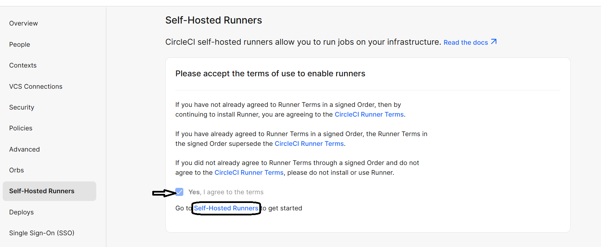
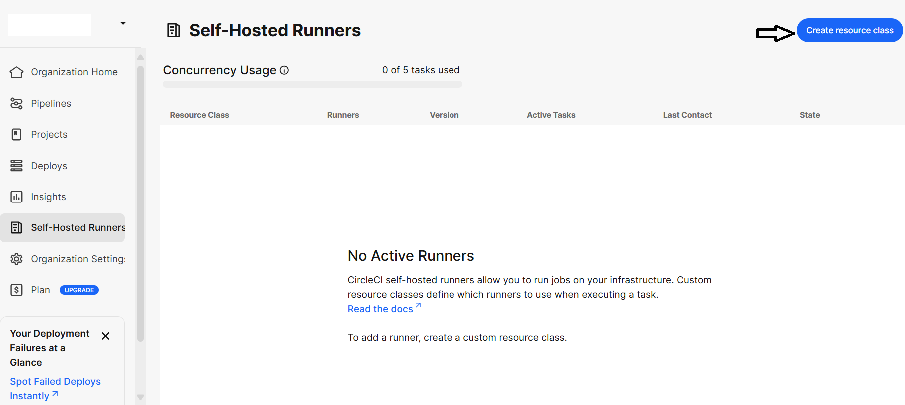
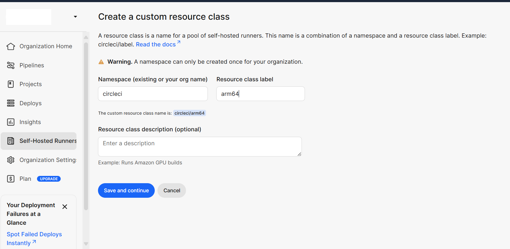
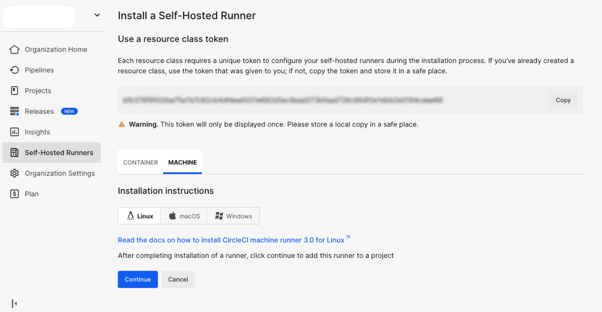

## Create a Resource Class for Self-Hosted Runner in CircleCI
This guide explains how to create a **Resource Class** in the **CircleCI Web Dashboard** for a **self-hosted runner**.  
A Resource Class defines a unique identifier for your runner and links it to your CircleCI namespace, allowing CircleCI jobs to target your custom machine environment.

### Steps

1. **Go to the CircleCI Web Dashboard**
   - From the left sidebar, navigate to **Self-Hosted Runners**.  
   - You’ll see a screen asking you to accept the **terms of use**.  
   - **Check the box** that says **“Yes, I agree to the terms”** to enable runners.  
   - Then click **Self-Hosted Runners** to continue setup.

2. **Create a New Resource Class**

Click **Create Resource Class** on your CircleCI dashboard. 

**Fill in the following details:** 

   - **Namespace:** Your CircleCI username or organization name (e.g., `circleci`)
   - **Resource Class Name:** A clear, descriptive name for your runner (e.g., `arm64`)
   - Click **Create Resource Class**.

3. **Save and Copy the Token**
   - Once created, CircleCI will generate a **Resource Class Token**.  
   - Copy this token and store it securely — you will need it to register your runner on the GCP VM.

   
Now that your resource class and token are generated, proceed to the next section to set up the CircleCI self-hosted runner.
