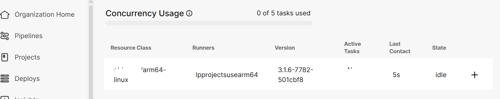

## Install CircleCI Machine Runner on SUSE Arm64

This guide explains how to install and configure the **CircleCI Machine Runner** on a **GCP SUSE Arm64 virtual machine**.  
This setup allows your self-hosted environment to execute CircleCI jobs targeting Arm64 architecture.

### Add CircleCI Package Repository

SUSE is an RPM-based distribution, so first add the official CircleCI repository:

```console
curl -s https://packagecloud.io/install/repositories/circleci/runner/script.rpm.sh?any=true | sudo bash
```

### Install the CircleCI Runner
Install the pre-built CircleCI runner package:

```console
sudo zypper install -y circleci-runner
```
### Prepare User and Permissions
Before starting the runner, ensure the required user, group, and directory permissions are properly set up:

```console
# Create a symlink for adduser (required on SUSE)
sudo ln -s /usr/sbin/useradd /usr/sbin/adduser

# Create CircleCI system user and group
sudo useradd -m -r circleci
sudo groupadd --system circleci

# Set up CircleCI directories and permissions
sudo mkdir -p /var/lib/circleci
sudo chown -R circleci:circleci /var/lib/circleci
sudo chown -R circleci:circleci /etc/circleci-runner

# Reload systemd and restart the runner service
sudo systemctl daemon-reload
sudo systemctl restart circleci-runner

# Verify service status
sudo systemctl status circleci-runner
```

### Configure the Runner Token

Replace the authentication token in the runner configuration file.
Use the token obtained from your Resource Class in the CircleCI Dashboard.

```console
export RUNNER_AUTH_TOKEN="AUTH_TOKEN "
sudo sed -i "s/<< AUTH_TOKEN >>/$RUNNER_AUTH_TOKEN/g" /etc/circleci-runner/circleci-runner-config.yaml
```

### Enable and Start the Runner
Enable the CircleCI runner service to start automatically and verify it’s running:

```console
sudo systemctl enable circleci-runner
sudo systemctl start circleci-runner
sudo systemctl status circleci-runner
```

If the status shows active (running), your runner is successfully installed and connected to CircleCI.

```output
● circleci-runner.service - Run the CircleCI self-hosted runner agent
     Loaded: loaded (/usr/lib/systemd/system/circleci-runner.service; enabled; vendor preset: disabled)
     Active: active (running) since Thu 2025-10-09 08:59:40 UTC; 2h 29min ago
   Main PID: 10150 (circleci-runner)
      Tasks: 9
        CPU: 1.524s
     CGroup: /system.slice/circleci-runner.service
             └─ 10150 /usr/bin/circleci-runner machine -c /etc/circleci-runner/circleci-runner-config.yaml

Oct 09 11:12:11 lpprojectsusearm64 circleci-runner[10150]: 11:12:11 7927c 72.264ms worker loop: claim:  app.backoff_ms=5000 a>
Oct 09 11:15:03 lpprojectsusearm64 circleci-runner[10150]: 11:15:03 6f109 46.059ms POST /api/v3/runner/claim app.loop_name=cl>
Oct 09 11:15:03 lpprojectsusearm64 circleci-runner[10150]: 11:15:03 6f109 46.119ms claim app.loop_name=claim:  mode=agent res>
Oct 09 11:15:03 lpprojectsusearm64 circleci-runner[10150]: 11:15:03 6f109 46.144ms worker loop: claim:  app.backoff_ms=5000 a>
```
Also, you can verify it from the dashboard:


