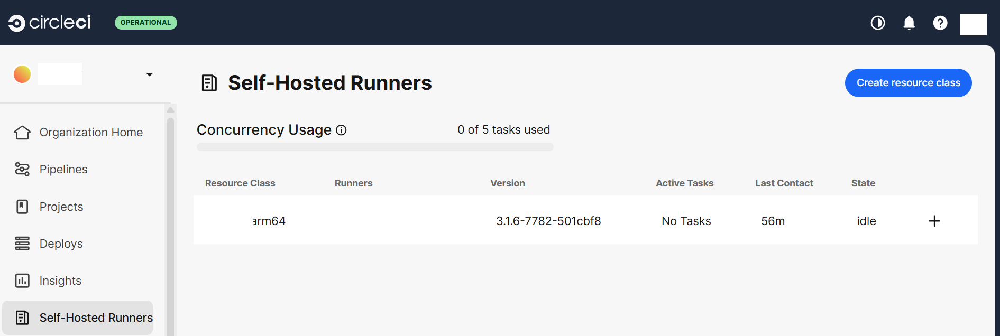

## Install CircleCI Machine Runner on AWS Graviton2

This guide provides step-by-step instructions to install and configure the **CircleCI Machine Runner** on an **AWS Graviton2 (Neoverse N1) instance**.  
With this setup, your self-hosted **Arm64 environment** can efficiently execute CircleCI jobs directly on the Graviton2 architecture, enabling faster builds and improved performance for ARM-based workloads.


### Add CircleCI Package Repository
For **Debian/Ubuntu-based systems** running on **AWS Graviton2 (Arm64)**, first add the official CircleCI repository.  
This ensures you can install the CircleCI Runner package directly using `apt`.

```console
curl -s https://packagecloud.io/install/repositories/circleci/runner/script.deb.sh?any=true | sudo bash
```

- The `curl` command downloads and executes the repository setup script from CircleCI’s official package server.  
- It configures the repository on your system, allowing `apt` to fetch and install the CircleCI runner package.  
- After successful execution, the CircleCI repository will be added under `/etc/apt/sources.list.d/`.

### Configure the Runner Token
- Each self-hosted runner requires a unique authentication token generated from your Resource Class in the CircleCI Dashboard.  
- Copy the token from the CircleCI web interface.  
- Export the token as an environment variable and update the runner configuration file as shown:

```console
export RUNNER_AUTH_TOKEN="YOUR_AUTH_TOKEN"
sudo sed -i "s/<< AUTH_TOKEN >>/$RUNNER_AUTH_TOKEN/g" /etc/circleci-runner/circleci-runner-config.yaml
```

### Install the CircleCI Runner
Install the pre-built CircleCI runner package:

```console
sudo apt-get install -y circleci-runner
```
 
- Installs the latest CircleCI Machine Runner compatible with your Arm64 instance.  
- Runner binary and configuration files are located in `/usr/bin/` and `/etc/circleci-runner/`.

### Configure the Runner Authentication Token
Update the CircleCI runner configuration with your authentication token. This token is generated from the Resource Class you created in the CircleCI Dashboard.

```console
export RUNNER_AUTH_TOKEN="YOUR_AUTH_TOKEN"
sudo sed -i "s/<< AUTH_TOKEN >>/$RUNNER_AUTH_TOKEN/g" /etc/circleci-runner/circleci-runner-config.yaml
```

### Enable and Start the CircleCI Runner
Set the CircleCI runner service to start automatically and verify it is running:

```console
sudo systemctl enable circleci-runner
sudo systemctl start circleci-runner
sudo systemctl status circleci-runner
```

If the status shows active (running), your runner is successfully installed and connected to CircleCI.

```output
● circleci-runner.service - Run the CircleCI self-hosted runner agent
     Loaded: loaded (/usr/lib/systemd/system/circleci-runner.service; enabled; preset: enabled)
     Active: active (running) since Fri 2025-10-17 05:33:20 UTC; 51min ago
   Main PID: 2226 (circleci-runner)
      Tasks: 9 (limit: 18717)
     Memory: 53.0M (peak: 66.9M)
        CPU: 1.249s
     CGroup: /system.slice/circleci-runner.service
             └─2226 /usr/bin/circleci-runner machine -c /etc/circleci-runner/circleci-runner-config.yaml

Oct 17 05:41:28 ip-172-31-34-224 circleci-runner[2226]: 05:41:28 7b67e 24.210ms worker loop: claim:  app.backoff_ms=5000 app.>
Oct 17 06:00:08 ip-172-31-34-224 circleci-runner[2226]: 06:00:08 a8093 22.942ms POST /api/v3/runner/claim app.loop_name=claim>
Oct 17 06:00:08 ip-172-31-34-224 circleci-runner[2226]: 06:00:08 a8093 23.028ms claim app.loop_name=claim:  mode=agent result>
Oct 17 06:00:08 ip-172-31-34-224 circleci-runner[2226]: 06:00:08 a8093 23.064ms worker loop: claim:  app.backoff_ms=5000 app.>
Oct 17 06:04:49 ip-172-31-34-224 circleci-runner[2226]: 06:04:49 73039 19.847ms POST /api/v3/runner/claim app.loop_name=claim>
Oct 17 06:04:49 ip-172-31-34-224 circleci-runner[2226]: 06:04:49 73039 19.936ms claim app.loop_name=claim:  mode=agent result>
Oct 17 06:04:49 ip-172-31-34-224 circleci-runner[2226]: 06:04:49 73039 19.971ms worker loop: claim:  app.backoff_ms=5000 app.>
Oct 17 06:19:13 ip-172-31-34-224 circleci-runner[2226]: 06:19:13 c34c1 22.392ms POST /api/v3/runner/claim app.loop_name=claim>
Oct 17 06:19:13 ip-172-31-34-224 circleci-runner[2226]: 06:19:13 c34c1 22.479ms claim app.loop_name=claim:  mode=agent result>
Oct 17 06:19:13 ip-172-31-34-224 circleci-runner[2226]: 06:19:13 c34c1 22.514ms worker loop: claim:  app.backoff_ms=5000 app.>
```

This confirms that the CircleCI Runner is actively connected to your CircleCI account and ready to accept jobs.

Also, you can verify it from the dashboard:


