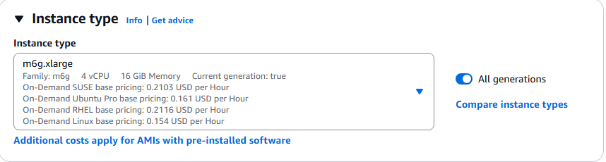
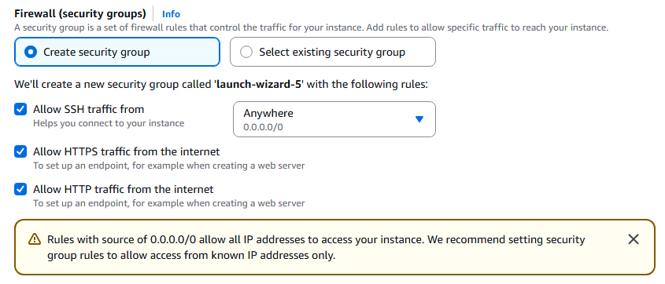

## Overview

In this section, you will learn how to provision an **AWS Graviton2 Arm64 EC2 instance** on **Amazon Web Services (AWS)** using the **m6g.xlarge** instance type (2 vCPUs, 8 GB memory) in the **AWS Management Console**. 

{}
For support on AWS setup, see the Learning Path [Getting started with AWS](https://learn.arm.com/learning-paths/servers-and-cloud-computing/csp/aws/).
{}

## Provision an AWS EC2 Arm64 Graviton2 Instance in the AWS Management Console

To create a virtual machine based on the AWS Graviton2 Instance type:  
- Navigate to the [AWS Management Console](https://aws.amazon.com/console/).  
- Go to **EC2 > Instances** and select **Launch Instance**.  
- Under **Instance configuration**:  
   - Enter an appropriate **Instance name**.  
   - Choose an **Amazon Machine Image (AMI)** such as **Ubuntu 24.04 ARM64**.

     ")
     
   - Under **Instance type**, select a Graviton2-based type `m6g.xlarge`.

     

   - Configure your **Key pair (login)** by either creating a new key pair or selecting an existing one to securely access your instance. 
   - In **Network settings**, ensure that **Allow HTTP traffic from the internet** and **Allow HTTPS traffic from the internet** are checked.

     
  
   - Adjust **Storage** settings as needed — for most setups, 30 GB of gp3 (SSD) storage is sufficient.  
   - Click **Launch Instance** to create your EC2 virtual machine.  
