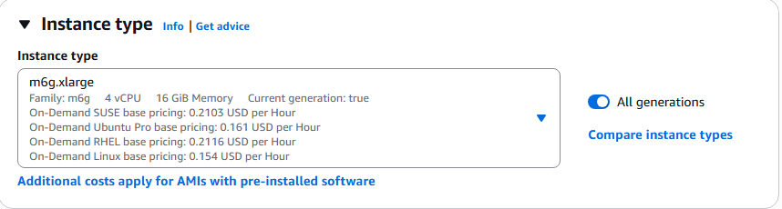
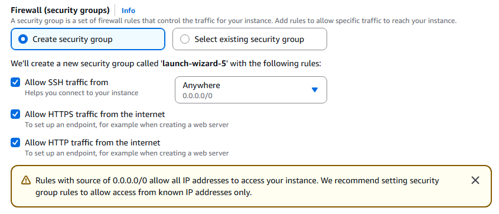

## Overview

In this section, you will learn how to set up an AWS Graviton Arm64 EC2 instance on Amazon Web Services (AWS) using the `m6g.large` instance type in the AWS Management Console. 

{}
For support on AWS setup, see the Learning Path [Getting started with AWS](https://learn.arm.com/learning-paths/servers-and-cloud-computing/csp/aws/).
{}

## Set up an instance in the AWS Management Console

To create your virtual machine:  
- Navigate to the [AWS Management Console](https://aws.amazon.com/console/).  
- Go to EC2 > Instances and select Launch Instance.  
- Under Instance configuration:  
   - Enter an appropriate Instance name.
   - Choose an Amazon Machine Image (AMI) such as Ubuntu 24.04 ARM64.

     ")
     
   - Under Instance type, select a Graviton-based type `m6g.large`.

     

   - Configure your Key pair (login) by either creating a new key pair or selecting an existing one to securely access your instance. 
   - In Network settings, ensure that Allow HTTP traffic from the internet and Allow HTTPS traffic from the internet are checked.

     

  {}
  Be careful with permissive network inbound rules, as they pose a security risk. Good practice is to configure the machine to only allow traffic from your IP.
  {}
  

   - Adjust Storage settings as needed — for this setup, 30 GB of gp3 (SSD) storage is sufficient.  
   - Click Launch Instance to create your virtual machine.  
