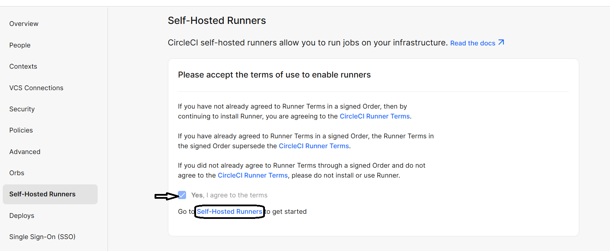
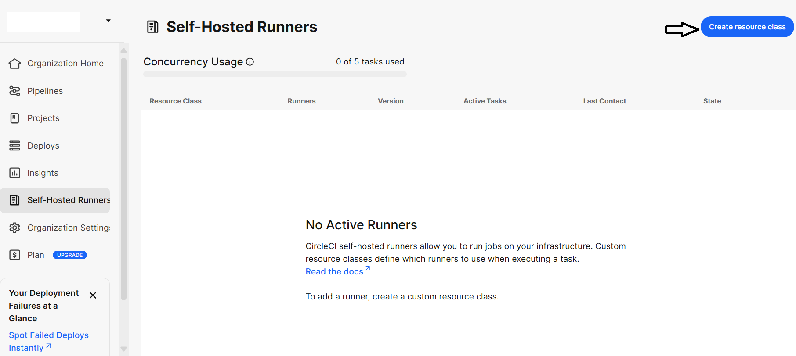
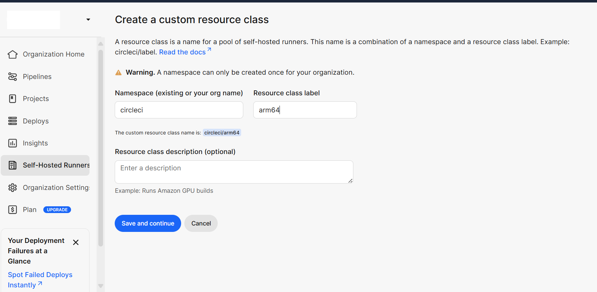
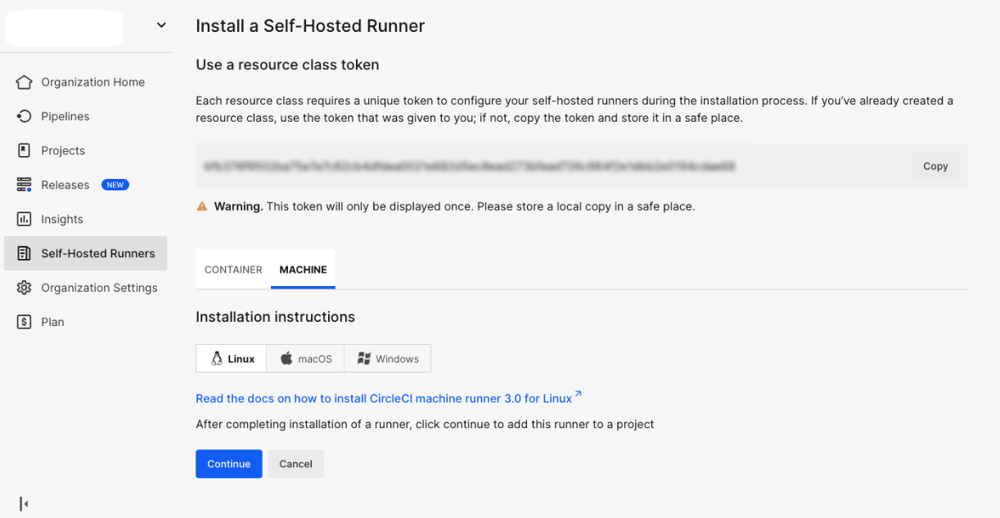

## Create a Resource Class for Self-Hosted Runner in CircleCI
This guide describes creating a **Resource Class** in the **CircleCI Web Dashboard** for a **self-hosted runner**.  
A Resource Class uniquely identifies the runner and links it to your CircleCI namespace, enabling jobs to run on your custom machine environment.

### Steps

1. **Go to the CircleCI Web Dashboard**
   - From the left sidebar, navigate to **Self-Hosted Runners**.  
   - You’ll see a screen asking you to accept the **terms of use**.  
   - **Check the box** that says **“Yes, I agree to the terms”** to enable runners.  
   - Then click **Self-Hosted Runners** to continue setup.

2. **Create a New Resource Class**
   - Click **Create Resource Class**.

3. **Fill in the Details**
   - **Namespace:** Your CircleCI username or organization (e.g., `circleci`)  
   - **Resource Class Name:** A descriptive name for your runner, such as `arm64`

4. **Save and Copy the Token**
   - Once created, CircleCI will generate a **Resource Class Token**.  
   - Copy this token and store it securely — you will need it to register your runner on the AWS Arm VM.

   
With your Resource Class and token ready, proceed to the next section to set up the CircleCI self-hosted runner.
