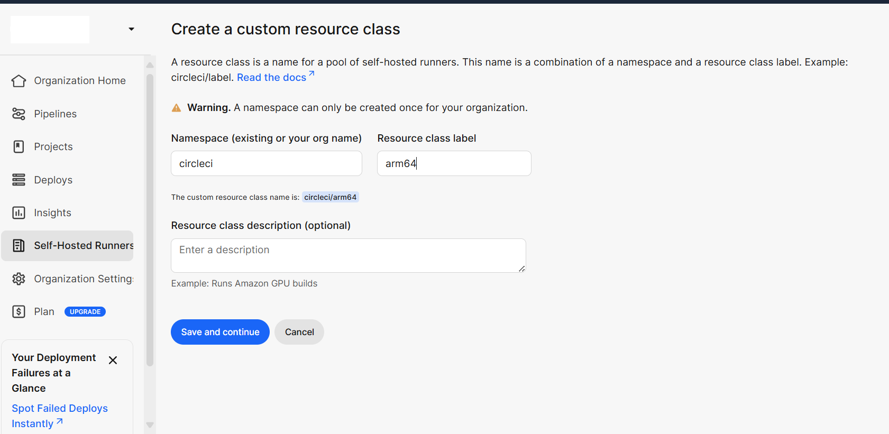
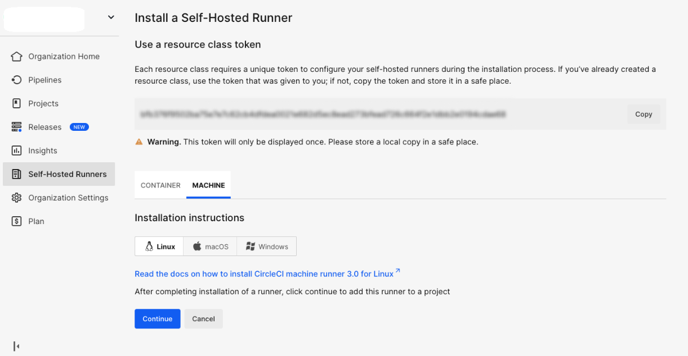

## Create a Resource Class for Self-Hosted Runner in CircleCI
This guide describes creating a Resource Class in the CircleCI Web Dashboard for a self-hosted runner.  
A Resource Class uniquely identifies the runner and links it to your CircleCI namespace, enabling jobs to run on your custom machine environment.

### Steps

1. Log into your CircleCI account and navigate to your dashboard.

2. If you don't have an organization set up already, create one for testing purposes.

3. From the left sidebar in the Organization view, navigate to Self-Hosted Runners. Check the box that says "Yes, I agree to the terms" to enable runners. Then click Self-Hosted Runners to continue setup.

4. Create a New Resource Class by clicking Create Resource Class.

5. Fill in the Details
   - Namespace: Your CircleCI username or organization (e.g., `circleci`)  
   - Resource class label: A descriptive name for your runner, such as `arm64`

6. Once created, CircleCI will generate a Resource Class Token. Copy this token and store it securely. You will need it to register your runner on the AWS Arm VM.

   
With your Resource Class and token ready, proceed to the next section to set up the CircleCI self-hosted runner.
