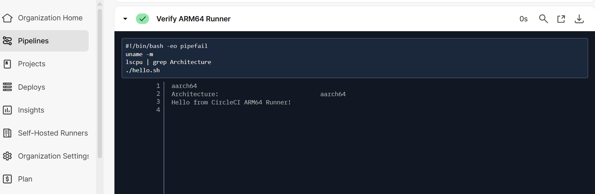
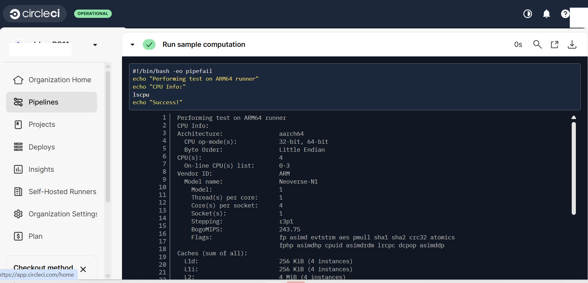

## Verify CircleCI Arm64 Self-Hosted Runner

This guide demonstrates validating your **self-hosted CircleCI runner** on an **Arm64 machine** by executing a simple workflow and a test computation. This ensures your runner is correctly configured and ready to process jobs.

### Create a Test Repository
Start by creating a GitHub repository dedicated to verifying your Arm64 runner:

```console
git clone https://github.com/<your_repo_name/aws-circleci/
cd aws-circleci
```
This repository serves as a sandbox to confirm that your CircleCI runner can pick up and run jobs for Arm64 workflows.

### Add a Sample Script
Create a minimal shell script that will be used to confirm the runner executes commands correctly:

```console
echo 'echo "Hello from CircleCI Arm64 Runner!"' > hello.sh
chmod +x hello.sh
```

### Define the CircleCI Configuration
Create a `.circleci/config.yml` file to define the workflow that will run on your Arm64 runner:

```yaml
version: 2.1

jobs:
  test-Arm64:
    machine:
      enabled: true
    resource_class: your-namespace/Arm64-linux   # Replace with your actual resource class
    steps:
      - checkout
      - run:
          name: Verify Arm64 Runner
          command: |
            uname -m
            lscpu | grep Architecture
            ./hello.sh
      - run:
          name: Run sample computation
          command: |
            echo "Performing test on Arm64 runner"
            echo "CPU Info:" 
            lscpu
            echo "Success!"

workflows:
  test-workflow:
    jobs:
      - test-Arm64
```
- Defines a single job `test-Arm64` using a machine executor on a self-hosted Arm64 runner.  
- Checks CPU architecture with `uname -m` and `lscpu` to verify the runner.  
- Executes a simple script `hello.sh` to confirm the runner can run commands.  
- Runs a sample computation step to display CPU info and print.

### Commit and Push to GitHub
Once all files you created (`hello.sh`, `.circleci/config.yml`) are ready, push your project to GitHub so CircleCI can build and verify the Arm64 runner automatically.

```console
git add .
git commit -m "Initial CircleCI Arm64 test"
git branch -M main
git push -u origin main
```

- **Add Changes**: Stage all modified and new files using `git add .`.
- **Commit Changes**: Commit the staged files with a descriptive message.
- **Set Main Branch**: Rename the current branch to `main`.
- **Add Remote Repository**: Link your local repository to GitHub.
- **Push Changes**: Push the committed changes to the `main` branch on GitHub.

### Start CircleCI Runner and Execute Job
Ensure that your CircleCI runner is enabled and started. This will allow your self-hosted runner to pick up jobs from CircleCI.

```console
sudo systemctl enable circleci-runner
sudo systemctl start circleci-runner
sudo systemctl status circleci-runner
```
- **Enable CircleCI Runner**: Ensure the CircleCI runner is set to start automatically on boot.
- **Start and Check Status**: Start the CircleCI runner and verify it is running.

After pushing your code to GitHub, open your **CircleCI Dashboard → Projects**, and confirm that your **test-Arm64 workflow** starts running using your **self-hosted runner**.

If the setup is correct, you’ll see your job running under the resource class you created.

### Output
Once the job starts running, CircleCI will:

- Verify Arm64 Runner:

  
  
- Run sample computation:

  

All CircleCI jobs have run successfully, the sample computation completed, and all outputs are visible in the CircleCI Dashboard.
