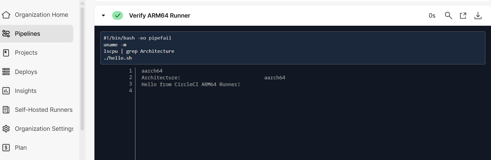
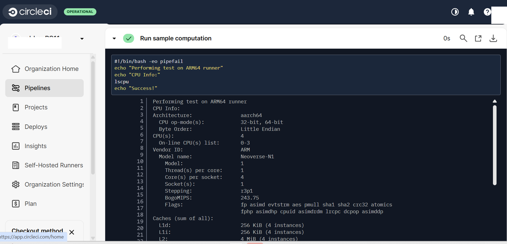

## Verify CircleCI Arm64 Self-Hosted Runner

This guide demonstrates validating your self-hosted CircleCI runner on an Arm64 machine by executing a simple workflow and a test computation. This ensures your runner is correctly configured and ready to process jobs.

### Create a Test Repository
Start by creating a GitHub repository dedicated to verifying your Arm64 runner:

```console
git clone https://github.com/<your-username>/aws-circleci/
cd aws-circleci
```
This repository serves as a sandbox to confirm that your CircleCI runner can pick up and run jobs for Arm64 workflows.

### Add a Sample Script
Create a minimal shell script that will be used to confirm the runner executes commands correctly:

```console
echo 'echo "Hello from CircleCI Arm64 Runner!"' > hello.sh
chmod +x hello.sh
```

### Define the CircleCI Configuration
The next step is to adding a `.circleci/config.yml` file to define the workflow that will run on your Arm64 runner. Start by creating the directory in your new repository.

```bash
mkdir .circleci
```

Then enter the YAML content:

```yaml
version: 2.1

jobs:
  test-Arm64:
    machine:
      enabled: true
    resource_class: circleci/arm64   # Replace with your actual resource class
    steps:
      - checkout
      - run:
          name: Verify Arm64 Runner
          command: |
            uname -m
            lscpu | grep Architecture
            ./hello.sh
      - run:
          name: Run sample computation
          command: |
            echo "Performing test on Arm64 runner"
            echo "CPU Info:" 
            lscpu
            echo "Success!"

workflows:
  test-workflow:
    jobs:
      - test-Arm64
```

{}
In the snippet above, you need to replace the `resource_class` variable with the name you defined in the previous section.
{}


This snippet:
- Defines a single job `test-Arm64` using a machine executor on a self-hosted Arm64 runner.  
- Checks CPU architecture with `uname -m` and `lscpu` to verify the runner.  
- Executes a simple script `hello.sh` to confirm the runner can run commands.  
- Runs a sample computation step to display CPU info and print.

### Commit and Push to GitHub
When the files you created (`hello.sh`, `.circleci/config.yml`) are ready, push your project to GitHub so CircleCI can build and verify the Arm64 runner automatically.


```bash
git add .
git commit -m "Initial CircleCI Arm64 test"
```

If you haven't already, you need to configure your GitHub credentials before pushing. Once that is done, run the following to upstream your changes:

```bash
git branch -M main
git push -u origin main
```

After pushing your code to GitHub, open your CircleCI Dashboard → Projects, and confirm that your test-Arm64 workflow starts running using your self-hosted runner.

If the setup is correct, you’ll see your job running under the resource class you created.

### Output
Once the job starts running, CircleCI will:

- Verify Arm64 Runner:

  
  
- Run sample computation:

  

All CircleCI jobs have run successfully, the sample computation completed, and all outputs are visible in the CircleCI Dashboard.
