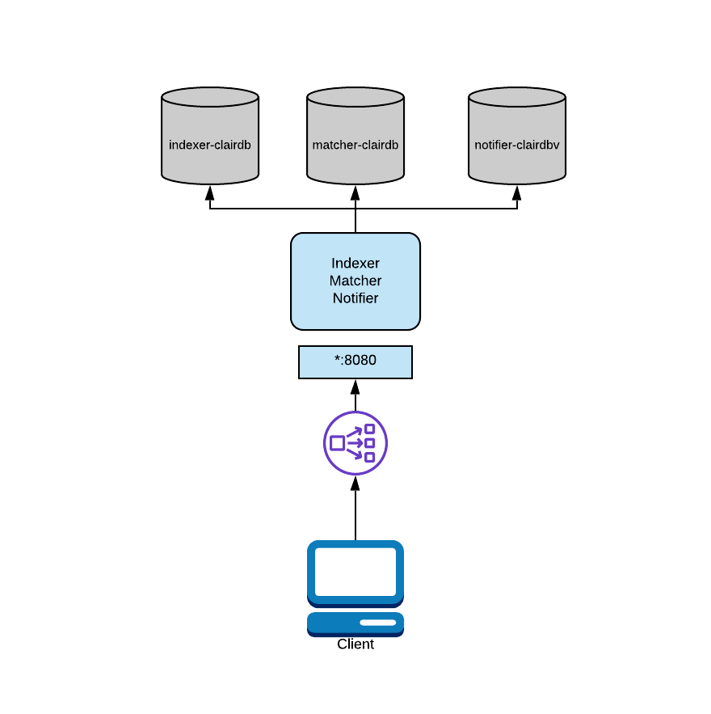
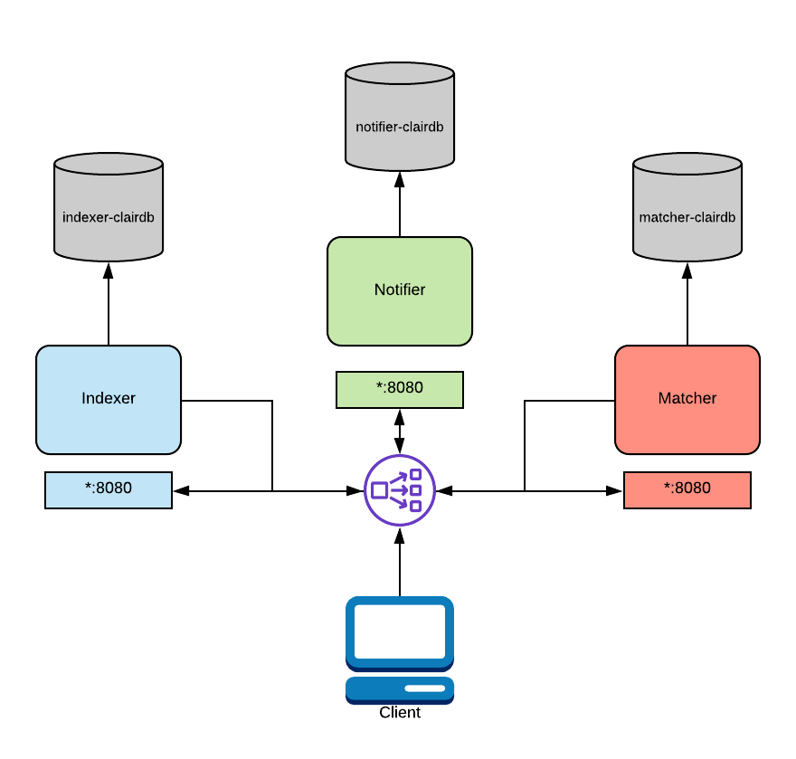

---
# User change
title: "Introduction to Clair deployment models"

weight: 2 # 1 is first, 2 is second, etc.

# Do not modify these elements
layout: "learningpathall"
---

[Clair](https://github.com/quay/clair) is an application for parsing container images and reporting vulnerabilities. This is done using static analysis, without running container images. 

## Clair functionality

Clair's analysis is broken into three separate components:

- Indexer
- Matcher
- Notifier

You can run each component separately (distributed deployment) or run all three components in a single process (combined deployment). 

### Indexer

The indexer receives a manifest, retrieves the image layers, scans the contents of each layer, and generates an intermediate representation called an IndexReport. 

The indexer's function is to understand the packages in the image.

The IndexReport is saved for the matcher. 

### Matcher

The matcher takes an IndexReport and correlates it with the database of vulnerabilities.

The matcher is continually importing new security data so it is always up to date with the latest vulnerabilities. 

### Notifier

When new vulnerabilities are discovered, the notifier determines if the vulnerabilities affect the indexed manifests. 

The notifier takes action as directed by the configuration settings.

## PostgreSQL database

Clair uses PostgreSQL for its data persistence. Clair supports migrations, so you can configure it with a fresh database and let it do the setup for you.

## Deploying Clair

Clair has two deployment models, combined and distributed. You can select either model. 

### Combined Deployment

A combined deployment runs all three Clair components in a single operating system (OS) process. 

Combined is the easiest deployment model to configure because it involves limited resources. 

In a combined deployment, any configuration information related to other nodes is ignored because there is no inter-process communication. 

For added flexibility, you can split the databases in combined mode so each component has it's own database.

Since Clair is a set of micro-services, its processes do not share database tables even when combined into the same OS process.

### Distributed Deployment

If you expect a heavy workload or uneven requests on each component you should create a distributed deployment.

In a distributed deployment, each Clair component runs in its own OS process. Typically this is a Kubernetes or OpenShift pod.

A load balancer must be setup for this deployment model. The load balancer routes traffic to the correct components and routes traffic between the Clair nodes.

To learn more refer to the [Clair documentation](https://quay.github.io/clair/whatis.html#what-is-clair).
