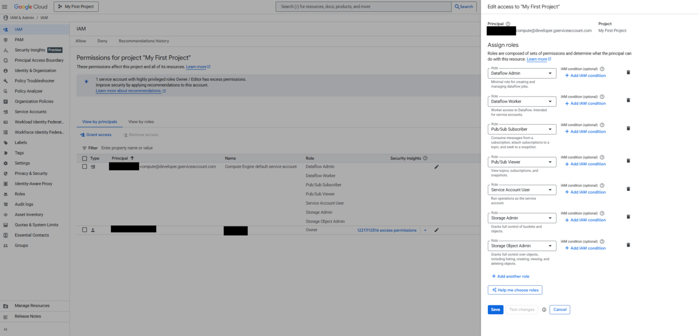

## Pub/Sub and IAM Setup on GCP (UI-first)
This section prepares the **Google Cloud messaging and access foundation** required for the real-time analytics pipeline.  
It focuses on **Pub/Sub resource creation and IAM roles**, ensuring Dataflow and the Axion VM can securely communicate.

### Create Pub/Sub Topic
The Pub/Sub topic acts as the **ingestion entry point** for streaming log events.

- Open **Google Cloud Console**
- Navigate to **Pub/Sub → Topics**
- Click **Create Topic**
- Enter:
   - **Topic ID:** `logs-topic`
- Leave encryption and retention as the default
- Click **Create**

This topic will receive streaming log messages from producers.


### Create Pub/Sub Subscription

The subscription allows **Dataflow to pull messages** from the topic.

- Open the newly created `logs-topic`
- Click **Create Subscription**
- Configure:
   - **Subscription ID:** `logs-sub`
   - **Delivery type:** Pull
   - **Ack deadline:** Default (10 seconds)
- Click **Create**


This subscription will later be referenced by the Dataflow pipeline.

### Verify Pub/Sub Resources

Navigate to **Pub/Sub → Topics** and confirm:

- Topic: `logs-topic`
- Subscription: `logs-sub`

This confirms the messaging layer is ready.


### Identify Compute Engine Service Account

Dataflow and the Axion VM both rely on the **Compute Engine default service account**.

Navigate to:

**IAM & Admin → IAM**

Locate the service account in the format:

```bash
<PROJECT_NUMBER>-compute@developer.gserviceaccount.com
```

This account will be granted the required permissions.

### Assign Required IAM Roles

Grant the following roles to the **Compute Engine default service account**:

| Role | Purpose |
|----|----|
| Dataflow Admin | Create and manage Dataflow jobs |
| Dataflow Worker | Execute Dataflow workers |
| Pub/Sub Subscriber | Read messages from Pub/Sub |
| Pub/Sub Publisher | Publish test messages |
| Storage Object Admin | Read/write Dataflow temp files |
| Service Account User | Allow service account usage |

**Steps (UI):**
- Go to **IAM & Admin → IAM**
- Click **Grant Access**
- Add the service account
- Assign the roles listed above
- Save



VM OAuth scopes are limited by default. IAM roles are authoritative.

### Create GCS Bucket for Dataflow (UI)

Dataflow requires a Cloud Storage bucket for staging and temp files.

- Go to **Cloud Storage → Buckets**
- Click **Create**
- Configure:
   - **Bucket name:** `imperial-time-463411-q5-dataflow-temp`
   - **Location type:** Region
   - **Region:** `us-central1`
- Leave defaults for storage class and access control
- Click **Create**


### Grant Bucket Access

Ensure the Compute Engine service account has access to the bucket:

- Role: **Storage Object Admin**

This allows Dataflow workers to upload and read job artifacts.

### Validation Checklist

Before proceeding, confirm:

- Pub/Sub topic exists (`logs-topic`)
- Pub/Sub subscription exists (`logs-sub`)
- IAM roles are assigned correctly
- GCS temp bucket is created and accessible

With Pub/Sub and IAM configured, the environment is now ready for **Axion VM setup and ClickHouse installation** in the next phase.
