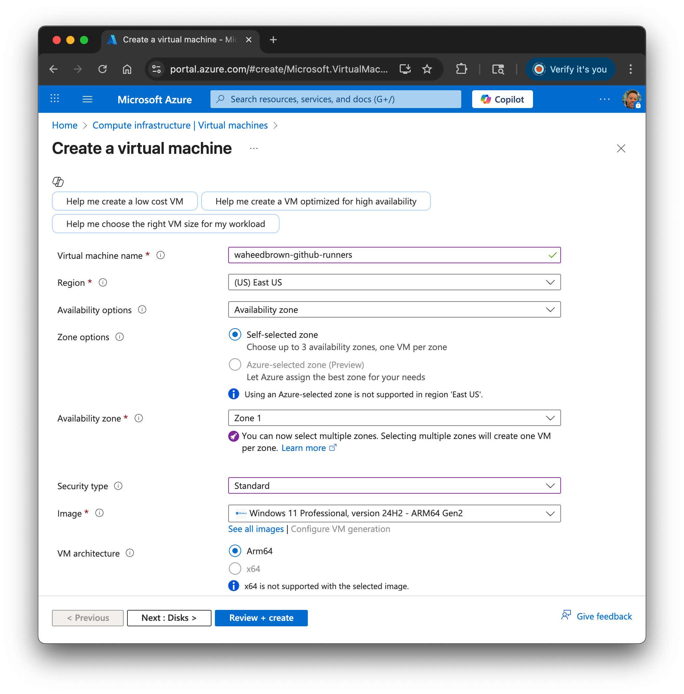

## Use the Azure Portal to deploy a Cobalt 100 VM

Cobalt 100 is Microsoft’s first Arm-based server processor, built on the Armv9 Neoverse-N2 CPU architecture. It is optimized for the performance and efficiency of scale-out, cloud-based applications.

Azure offers Cobalt 100–powered virtual machines in two series:

- **Dpsv6** and **Dplsv6** (general-purpose)
- **Epsv6** (memory-optimized)

To create a Cobalt 100 VM, follow these steps:

1. Sign in to the [Azure Portal](https://portal.azure.com/).
2. Select **Create a resource → Compute → Virtual machine**.
3. Complete the fields in the **Basics** tab using the values shown in the figure below:

   
   
   Cobalt 100 powers the Dpsv6 and Dplsv6 series. Selecting **Standard_D2ps_v6** creates a Cobalt VM with two physical cores. 
   You can choose a different size if you need more cores.
4. Create an administrator username and password, for use with RDP, and confirm that you [purchased a Windows 11 license](https://support.microsoft.com/en-us/windows/activate-windows-c39005d4-95ee-b91e-b399-2820fda32227):

   

5. For the **Public inbound ports** field, select **None**.
6. On the **Disks** tab, accept the default options.
7. On the **Networking** tab, ensure that a **Public IP** is selected. You will need it to connect to the VM later. Leave the NSG settings as **Basic**. 

8. Select **Review + create**, then **Create**. Azure deploys the VM and the automatically-generated Network Security Group (NSG). Provisioning takes ~2 minutes.

9. Navigate to the **Deployment in progress** pane or open the **Notifications** panel to track progress. When the deployment completes, proceed to the next step to expose an inbound port.
