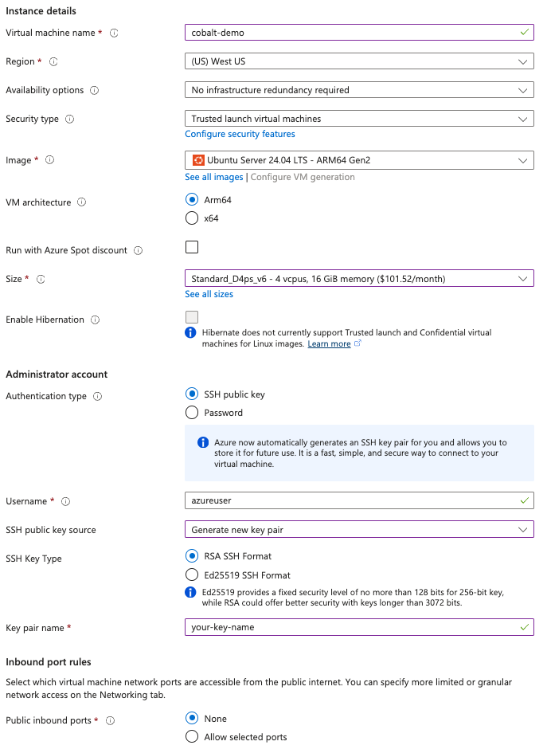

## Use the Azure Portal to deploy a Cobalt 100 VM

Azure Cobalt 100 VMs are a part of the ['D' family of Azure VMs](https://learn.microsoft.com/en-us/azure/virtual-machines/sizes/general-purpose/d-family). To deploy one, follow these steps:

1. Sign in to the [Azure Portal](https://portal.azure.com/).
2. Select **Create a resource → Compute → Virtual machine**.
3. Complete the *Basics* tab:
   
   The Dpsv6-series are powered by Cobalt 100. Selecting Standard_D4ps_v6 will give you a Cobalt VM with 4 physical cores. you can change the 4 to another value if you want a different number of cores.
4. Upload your public SSH key or generate a new one in the wizard.
5. Disallow public inbound ports for now.
5. Accept the defaults on the *Disks* tab.
6. On the *Networking* tab ensure that a **Public IP** is selected. You will need it to connect later. Leave the NSG settings as *Basic* for now. 

Click **Review + create** followed by **Create**. Azure now deploys the VM and the automatically-generated Network Security Group (NSG). Provisioning takes ~2 minutes.

Navigate to the **Deployment in progress** pane or open the **Notifications** panel to track progress. When the deployment succeeds proceed to the next step to expose an inbound port.
