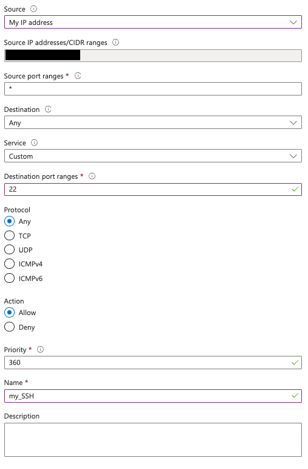

## Allow external traffic to TCP ports 22 (SSH) and 8080

Every new virtual machine created through the Azure wizard is associated with a **Network Security Group (NSG)**. An NSG acts like a stateful firewall – if no rule explicitly allows traffic, Azure blocks it.

In this step you will open port 22 for SSH, as well as port 8080 so that a web application running on the VM is reachable from your IP for testing. Substitute a different port if required by your workload, or a different IP range if you'd like broader accessibility.

1. In the Azure Portal open the newly created VM resource and click **Networking → Network settings** in the left nav.
2. Select the **Network security group**.
3. Click on **Create Port Rule** and from the drop-down men select **Inbound port rule**
4. Fill in the form, specifying **My IP address** as the source and 22 as the destination port:
   
5. Click **Add**.
To open port 8080, follow steps 3 through 5 again, but instead choose port 8080 for the destination port.

You have now opened ports 22 and 8080 to your IP. In the next step you will verify connectivity.
