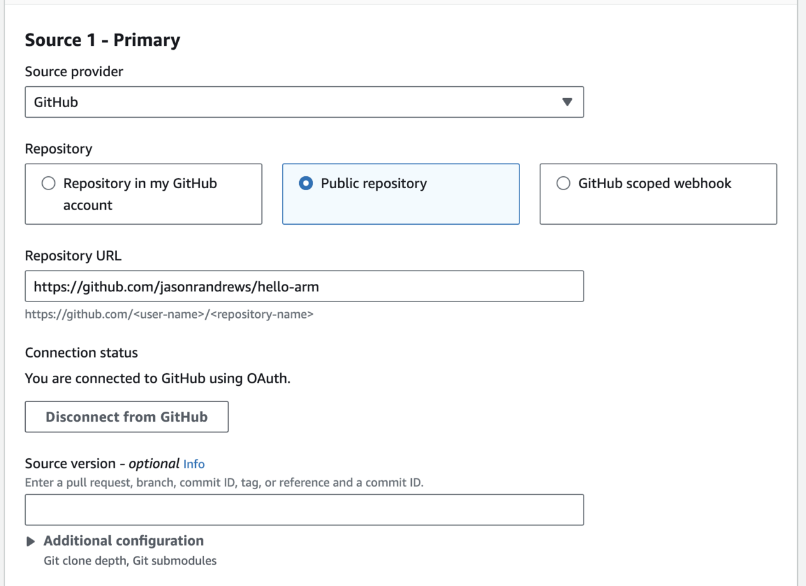
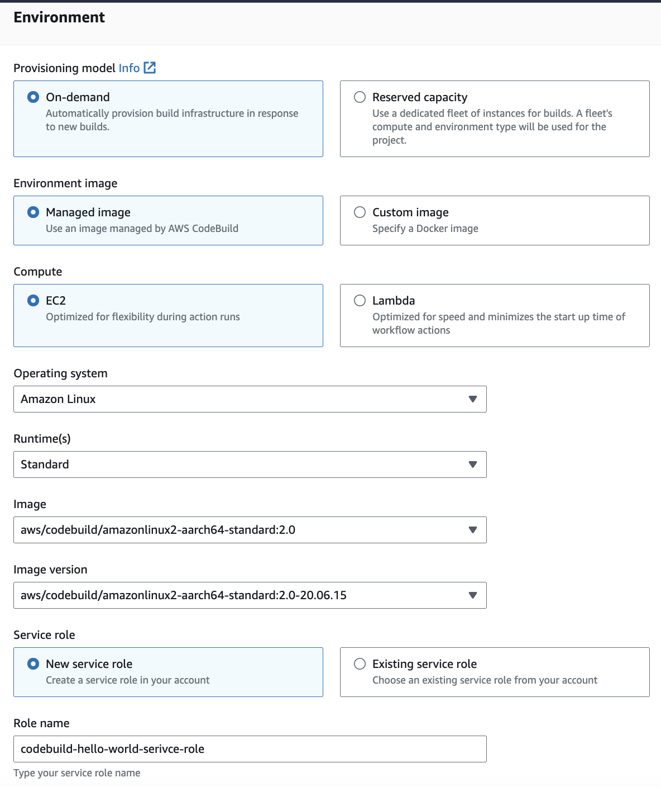

---
# User change
title: "Build Docker images using AWS CodeBuild"

weight: 2 # 1 is first, 2 is second, etc.

# Do not modify these elements
layout: "learningpathall"
---

## Introduction

[AWS CodeBuild supports Arm workloads on AWS Graviton processors](https://aws.amazon.com/about-aws/whats-new/2021/02/aws-codebuild-supports-arm-based-workloads-using-aws-graviton2/). 

[CodeBuild](https://aws.amazon.com/codebuild/) automates software build and test, including building Docker images for software hosted on GitHub. You can build AArch64 Docker images using CodeBuild and share them in the [Amazon ECR Public Gallery](https://gallery.ecr.aws/) and on [Docker Hub](https://hub.docker.com/). 

You should have some experience with [Docker](https://www.docker.com/) and be interested in how to automate containers image creation for Arm systems. Docker provides excellent support for the Arm architecture, and managed services like CodeBuild make image creation even easier.

## Use an example GitHub Project

You can start learning CodeBuild on AWS Graviton processors using a small Docker image for Arm. The [GitHub repository](https://github.com/jasonrandrews/hello-arm) contains a simple collection of "hello world" applications.

Imagine hello.c is an actual software project which changes regularly, and the Docker image needs to be rebuilt when the source file changes. This article does not cover GitHub Actions to trigger automatic builds, but actions can be easily added. The goal is to go from a button click in the AWS Console to new images in container repositories.

Head over to the [AWS Console](https://aws.amazon.com/console/) to get started with CodeBuild.

## Create a repository in ECR Public

In the AWS Console navigate to Elastic Container Registry. Create an ECR Public repository by clicking on the Public tab and then using the "Create repository" button on the top right. For more details refer to the [getting started guide](https://docs.aws.amazon.com/AmazonECR/latest/public/public-getting-started.html).

Create a repository named `c-hello-world` and tagged it for the ARM 64 architecture. The new repository should now be visible in the ECR Public Gallery. Note the URI of the repository which should be similar to: `public.ecr.aws/m6s3k6o5/c-hello-world`.
 
There is no need to push an image yet, CodeBuild will do that automatically.

## Create a repository in Docker Hub

Login to your [Docker Hub](https://hub.docker.com/) account to create a new repository. 

Use the Create Repository button near the top right, enter `c-hello-world` as the name, and mark the repository as public. Confirm the repository is visible on Docker Hub.  

You should now have two repositories ready to receive the Docker images created from CodeBuild. 

You are ready to use CodeBuild to populate ECR Public and Docker Hub with the Docker image. 

## Add credentials as secrets

AWS provides [Secrets Manager](https://aws.amazon.com/secrets-manager/) as a secure way to store Docker Hub credentials. The credentials can be retrieved and used during the build. Now is a good time to setup your AWS ECR alias and Docker Hub credentials in Secrets Manager. 

Go to Secrets Manager in the AWS Console. The important points are the name for the secret and the key/value pairs. 

Select `Store a new secret` and `Other type of secret` for the AWS ECR alias. Add the key `uri` and specify your ECR URI which should be similar to: `public.ecr.aws/m6s3k6o5/`. Save the secret as `aws_ecr`. Make sure to disable automatic rotation. 

You also need to be able to log in to Docker Hub to push the image. Follow the same steps to add a key called `dockerhub` and specify two key/value pairs. The first called `username` and the second called `password` with your Docker Hub credentials.  

More information can be found in AWS documentation, look at the section [Store your DockerHub credentials with AWS Secrets Manager](https://aws.amazon.com/premiumsupport/knowledge-center/codebuild-docker-pull-image-error). 

## Create a CodeBuild project

Navigate to [CodeBuild](https://aws.amazon.com/codebuild/) in the AWS Console. 

CodeBuild uses a file describing what to do when a build is started, `buildspec.yml` by default.

One way to get started is to create a `buildspec.yml` file and add it to the GitHub repository. CodeBuild will look for it at the top of the directory structure. The `buildspec.yml` file will be explained in the sections below.

Create a new CodeBuild project. Use the "Create project" button on the upper right of the page.

The Project configuration section has the project name and description.


The Source section is where the GitHub project information is entered. To connect to GitHub use either OAuth or a personal access token. If OAuth is selected a dialog will open to login to GitHub and if a personal access token is selected it can be pasted into a box. 

After the GitHub connection is made enter the GitHub URL for the project. Enter the link to the `hello-world` project in GitHub.



The Environment section contains the information about the Docker image to use for the build. This is NOT the Docker image you are building, it is the image used to build the image. CodeBuild runs a container to build the image and you need to make sure all of the tools needed are contained in the Docker image used to run the build. This is sometimes referred to as Docker-in-Docker.
 
This also is the place where you can specify an AArch64 build. The managed image indicates to use a standard image provided by AWS. The source of the [Graviton2 image can be found on GitHub](https://github.com/aws/aws-codebuild-docker-images/tree/master/al2/aarch64/standard/2.0). 

To find out what is in the image look at the [Dockerfile](https://github.com/aws/aws-codebuild-docker-images/blob/master/al2/aarch64/standard/2.0/Dockerfile). If you want to run it on your own machine you can get it from [ECR Public](https://gallery.ecr.aws/?architectures=ARM+64&searchTerm=codebuild). 

Make sure to check the Privileged box. This is required for running Docker-in-Docker to build the image. 

The trickiest part of the setup is the Service role. By default a new role is created which grants the needed permissions. The additions needed to the IAM role for CodeBuild to work are in the next section. For now, take note of the role name so you can extend it in IAM after the CodeBuild project is created.



The Buildspec section tells CodeBuild where to find the `buildspec.yml`. The default will be in the top directory of the GitHub repository, but the name and location can be changed here. The second option is to create the `buildspec.yml` file right in the CodeBuild project. With this option there is no need to modify the GitHub repository, but it will live in this CodeBuild project. 


The build is going to push a docker image to ECR Public and Docker Hub so there is no need to save anything in the Artifacts section. 


The final section specifies where to save logs. The default location is CloudWatch, but the logs can also be directed to an S3 bucket. CodeBuild will provide easy links to the logs to see more detail of the build. 

## Modifying the IAM Role

CodeBuild needs to access ECR for the project to succeed. 

Navigate to [IAM](https://aws.amazon.com/iam/) in the AWS Console, click on Roles, and enter "codebuild" in the search box to find the CodeBuild service role created above. 


Click on the role and then the triangle to expand the policy. 


Click the "Edit policy" button and JSON tab to add the statements below to the IAM policy "Statement" list which is attached to the AWS CodeBuild service role created above. 

```json
{
    "Action": [
        "ecr-public:BatchCheckLayerAvailability",
        "ecr-public:CompleteLayerUpload",
        "ecr-public:GetAuthorizationToken",
        "ecr-public:InitiateLayerUpload",
        "ecr-public:PutImage",
        "ecr-public:UploadLayerPart",
        "sts:GetServiceBearerToken"
    ],
    "Resource": "*",
    "Effect": "Allow"
},
{
    "Effect": "Allow",
    "Action": [
        "secretsmanager:GetSecretValue"
    ],
    "Resource": [
        "*"
    ]
}
```

This addition allows CodeBuild to upload Docker images to Amazon ECR repositories and Docker Hub using the credentials stored in Secrets Manager.

## Start a Build

When everything is ready return to CodeBuild in the AWS Console, navigate to the project, and click the "Start build" button. 

It should be clear from the logs what is happening. If all goes well new Docker images will appear in the created repositories.


