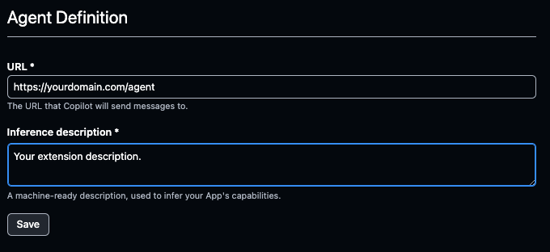

## How do I configure my GitHub Application to use my API?

Open the GitHub App that you created in [the first GitHub Copilot Extension Learning Path](learning-paths/servers-and-cloud-computing/gh-copilot-simple).

Navigate to the 'Copilot' tab, and add your URL to the field under the 'Agent Definition' section:

 

You will also want to change the 'Callback URL' under the General tab. This is the full URL to redirect to after a user authorizes an installation.

## Test your Extension

You are now ready to test your productionized Extension. For guidance on testing, see [Test your Copilot Extension](http://localhost:1313/learning-paths/servers-and-cloud-computing/gh-copilot-simple/copilot-test/) in the previous Copilot Extension Learning Path.

## Next Steps

You are now ready to build a more advanced Copilot Extension that uses RAG techniques in [Create a RAG-based GitHub Copilot Extension in Python](../copilot-extension).