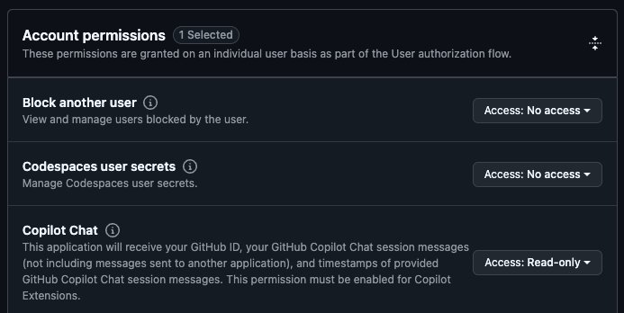
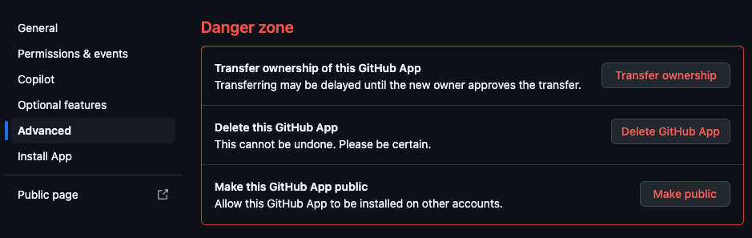

Now we need to configure the GitHub Application we created before to connect to our deployed Copilot extension application.

## Configure GitHub App for Copilot Extension

> For the most up to date instructions, follow the [official documentation for configuring your GitHub App for Copilot Extension](https://docs.github.com/en/copilot/building-copilot-extensions/creating-a-copilot-extension/configuring-your-github-app-for-your-copilot-extension#configuring-your-github-app).

On any page of [GitHub](https://github.com/), click your profile picture and go to Settings. Scroll down to developer settings, and open the GitHub App we made previously.

Make the following changes:

### In the "General" settings

In the "Callback URL" field, put the callback URL of your agent that you deployed in the previous step.

**Note:** If you are not using a deployed application and you want to test locally, you can use an ephemeral domain in ngrok. However you will need to update this URL every time you restart your ngrok server.

### In the "Permissions & events" settings

Under "Account permissions", grant read-only permissions to "GitHub Copilot Chat".

### In the "Copilot" settings

Set your app type to "Agent," then fill out the remaining fields.

Under "URL," enter your server's hostname (aka forwarding endpoint) that you deployed in the previous step.

## Test it out

After you update your GitHub App settings, you can start chatting with your extension by typing @YOUR-EXTENSION-NAME in the Copilot Chat window, then sending a prompt as normal.

## OPTIONAL: Publish your extension on the marketplace

> For the most up to date instructions, follow the [official documentation for listing your extension on the marketplace](https://docs.github.com/en/copilot/building-copilot-extensions/managing-the-availability-of-your-copilot-extension#listing-your-copilot-extension-on-the-github-marketplace).

If you would like to make your extension public so that anyone can use it, go into your GitHub App advanced settings. 

You will see one of two options:

### Make public

If you see the Make public option, your extension is currently private. It can only be installed by your organization (or the user) that created the app. You can click Make public to allow any other account to install your Copilot Extension, or leave your settings as they are to keep your app private.

### Make private

If you see the Make private option, your extension is currently public. The extension can be installed by any account. You can click Make private to only allow your organization (or user) that created the app to install it, or leave your settings as they are to keep your app public.

