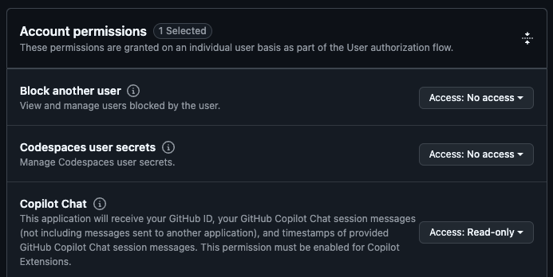

## Configure GitHub App for Copilot Extension

Now, configure the GitHub Application you created earlier to connect to your deployed Copilot extension.

For the most up-to-date instructions, follow the [official documentation for configuring your GitHub App for Copilot Extension](https://docs.github.com/en/copilot/building-copilot-extensions/creating-a-copilot-extension/configuring-your-github-app-for-your-copilot-extension#configuring-your-github-app).

On any page of [GitHub](https://github.com/), click your profile picture and go to Settings. Scroll down to **Developer Settings**, and open the GitHub App we made previously.

Make the following changes:

### **General** settings

In the **Callback URL** field, put the callback URL of your agent that you deployed in the previous step.

{}
If you are not using a deployed application and you want to test locally, you can use an ephemeral domain with ngrok. However you will need to update the callback URL each time you restart your ngrok server.
{}

### **Permissions & events** settings

Under **Account permissions**, grant read-only permissions to `GitHub Copilot Chat`.

### **Copilot** settings

Set your app type to `Agent`, then fill out the remaining fields.

Under **URL**, enter your server's hostname, which is also known as the forwarding endpoint, that you deployed in the previous step.

### Optional: add your Marketplace Endpoint

If you would like to get install/uninstall events when users interact with your marketplace posting, set up a webhook. 

Under the **General** tab of your application settings, activate the webhook and add your marketplace endpoint:

