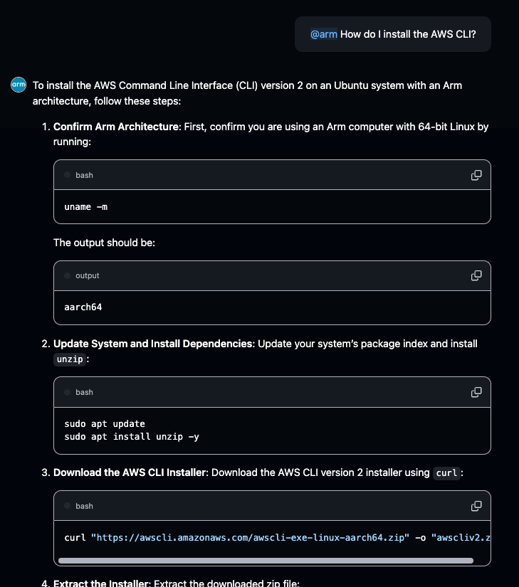

## Chat with your extension

After you update your GitHub App settings, you can start chatting with your extension by typing @YOUR-EXTENSION-NAME in the Copilot Chat window, followed by your prompt:

## Optional: Publish your extension on the marketplace

> For the most up to date instructions, follow the [official documentation for listing your extension on the marketplace](https://docs.github.com/en/copilot/building-copilot-extensions/managing-the-availability-of-your-copilot-extension#listing-your-copilot-extension-on-the-github-marketplace).

## Enhancements

There are many enhancements you can make to your extension, including inserting your own hard-coded links, etc into the response stream.

Another possibility is adding another copilot invocation to rephrase the previous conversation prior to your main copilot invocation. This yields more robust results, if users reference previous elements of the conversation in their question.

You can precisely tailor your RAG extension to your use case, to make your extension as useful as possible.

## Conclusion

Congratulations on completing this learning path! By following the steps and processes you learned here, you can now create your own powerful and customized Copilot extensions to enhance your development workflow.
