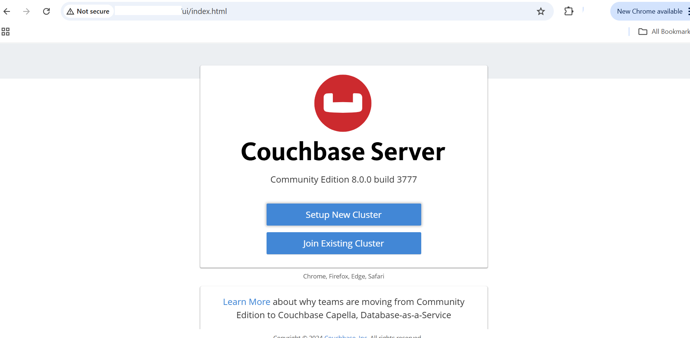

## Couchbase Baseline Testing on GCP SUSE VMs
This section confirms that Couchbase is correctly installed and running on the GCP SUSE Arm64 VM. It includes checking required ports, initializing the cluster, verifying node status, and accessing the Web UI — ensuring the setup is ready for benchmarking.

### Check Required Ports
This command checks if those ports are open and active. If you see “LISTEN” next to these ports, it means Couchbase is ready to accept connections.

Couchbase uses the following ports for basic operation:

- Web Console: `8091`  
- Query Service: `8093` (optional for N1QL queries)  
- Data Service: `11210`  

Check if the ports are listening:

```console
sudo ss -tuln | grep -E '8091|11210'
```

```output
tcp   LISTEN 0      128          0.0.0.0:8091       0.0.0.0:*
tcp   LISTEN 0      1024         0.0.0.0:11210      0.0.0.0:*
tcp   LISTEN 0      1024            [::]:11210         [::]:*
```

### Initialize Couchbase Cluster
This step sets up Couchbase for the first time, essentially turning it on and configuring its basic settings.
- You’re giving it an admin username and password for login.
- The cluster name helps identify your setup.
- You’re enabling key services (data, index, query).
- You’re assigning memory so Couchbase knows how much RAM it can use.
If it says **“SUCCESS: Cluster initialized”**, Couchbase is ready to store and manage data.

```console
/opt/couchbase/bin/couchbase-cli cluster-init \
  -c localhost:8091 \
  --cluster-username Administrator \
  --cluster-password password \
  --cluster-name MyCluster \
  --services data,index,query \
  --cluster-ramsize 1024 \
  --cluster-index-ramsize 512
```

You should see an output similar to:
```output
SUCCESS: Cluster initialized
```

### Verify Cluster Nodes
This command checks if your Couchbase server (called a “node”) is running properly.
If the output says **“healthy active”**, it means your Couchbase node is working fine and ready for operations.

```console
/opt/couchbase/bin/couchbase-cli server-list \
  -u Administrator -p password \
  --cluster localhost
```

```output
ns_1@cb.local 127.0.0.1:8091 healthy active
```

### Web UI Access
Ensure the Couchbase service is running and ports **8091 (Web UI)** and **11210 (Data)** are open. 

```console
sudo systemctl start couchbase-server
sudo systemctl enable couchbase-server
sudo systemctl status couchbase-server
```
These commands make sure Couchbase is running and will automatically start after system reboots. After starting the service, open your web browser and visit your VM’s IP on port 8091.
Once the service is running, Couchbase is accessible in your browser at:

```cpp
http://<VM-IP>:8091
```
You will see the Couchbase Web Console — a dashboard where you can log in, manage data buckets, and monitor performance visually.



You can now proceed to the next section for benchmarking to measure Couchbase’s performance.
