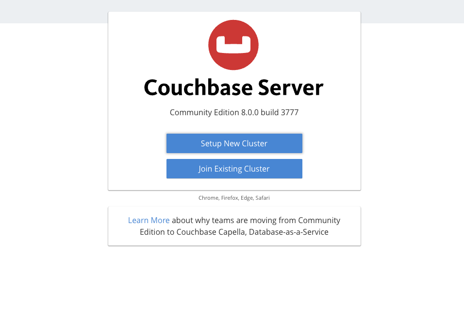
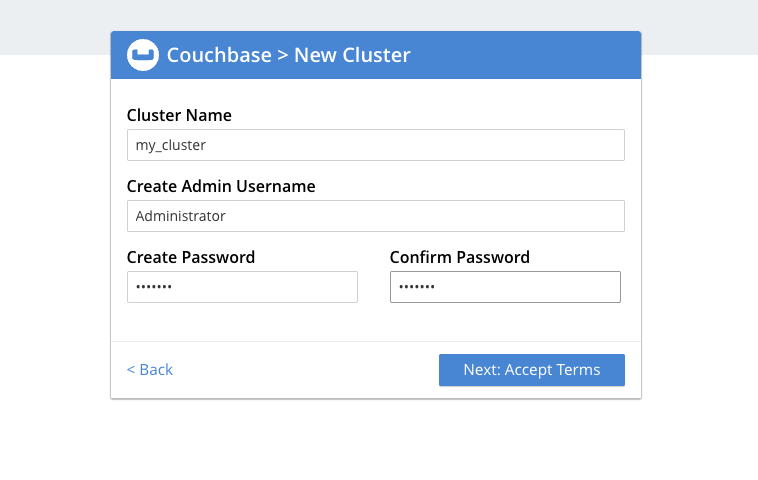
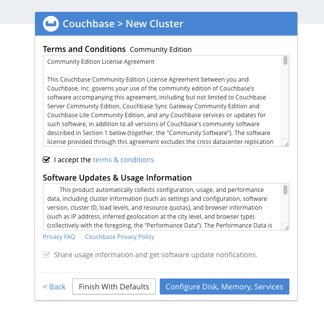
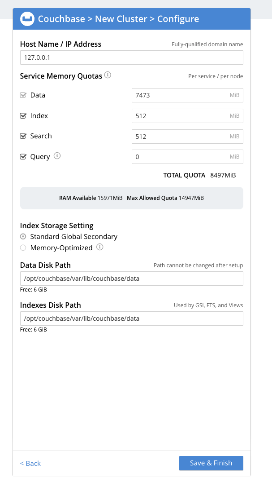
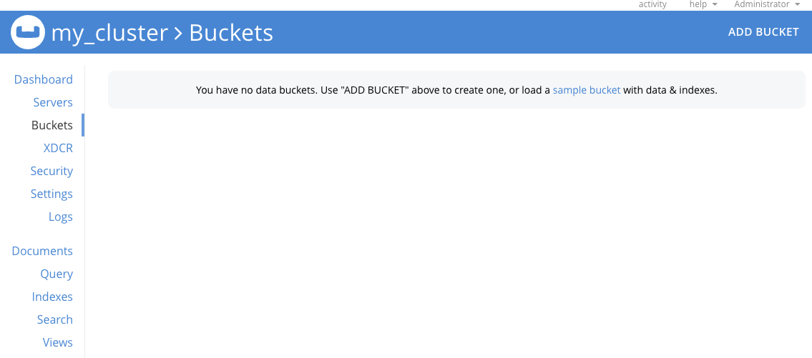
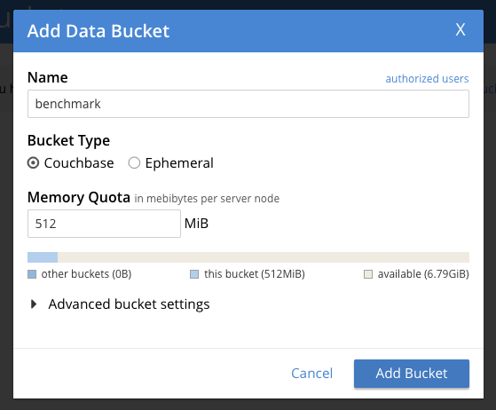
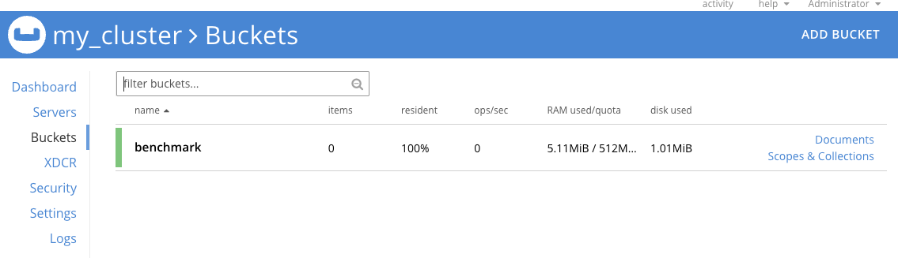

## Couchbase Baseline Testing on GCP SUSE VMs
This section confirms that Couchbase is correctly installed and running on the GCP SUSE Arm64 VM. It includes initializing the cluster, verifying node status, and accessing the Web UI to create a bucket — this ensures the setup is ready for benchmarking.

### Setup the default cluster 
Once the service is running, we need to setup the default cluster for the first time.

- Open Web Console using your VM public IP address that you saved off in the last step:

```console
http://<VM-Public-IP>:8091
```
- Press "Setup New Cluster"



- Provide a name for your cluster (example: "my_cluster") and create a password for your administrator account (leave the username as the default "Administrator")



- Check the "Accept terms" checkbox and press "Configure Disk, Memory, Services" button



- Accept the defaults of your cluster configuration and press "Save & Finish"



Our default cluster is now created!  Please retain the passord you created for your "Administrator" account... you'll need that in the next steps. 

### Verify Cluster Nodes
This command checks if your Couchbase server (called a “node”) is running properly. Replace "password" with your specified Couchbase Administrator password.
If the output says **“healthy active”**, it means your Couchbase node is working fine and ready for operations.

```console
/opt/couchbase/bin/couchbase-cli server-list \
  -u Administrator -p password --cluster localhost
```

```output
ns_1@cb.local 127.0.0.1:8091 healthy active
```

### Prepare a Couchbase Bucket for benchmarking
Once the service is running, you can access the **Couchbase Web Console** to create a bucket for benchmarking.

Open Web Console using the public IP address of your VM that you saved off from the last step:

```console
http://<VM-Public-IP>:8091
```
Use the admin `username` (default is "Administrator") and `password` you created during Couchbase cluster setup in the previous step.


- On the left hand side select "Buckets"
- Press the "Add Bucket" in the upper right hand corner:



- Name the new bucket "benchmark"
- The bucket type will be "Couchbase"
- The Memory Quota can be set to "512 MB"



| **Parameter** | **Value** |
|----------------|-----------|
| **Bucket Name** | benchmark |
| **Bucket Type** | Couchbase |
| **Memory Quota** | 512 MB |

- You should now see that your bucket has been created:



#### Additional notes about buckets in Couchbase

- A **bucket** in Couchbase is like a **database** — it stores and manages your data.  
- The **benchmark** bucket will be used for **load testing** and **performance benchmarking**.  
- Setting the **RAM Quota** ensures Couchbase allocates sufficient memory for **in-memory data operations**, improving overall speed.

You can now proceed to the next section for benchmarking to measure Couchbase’s performance.
