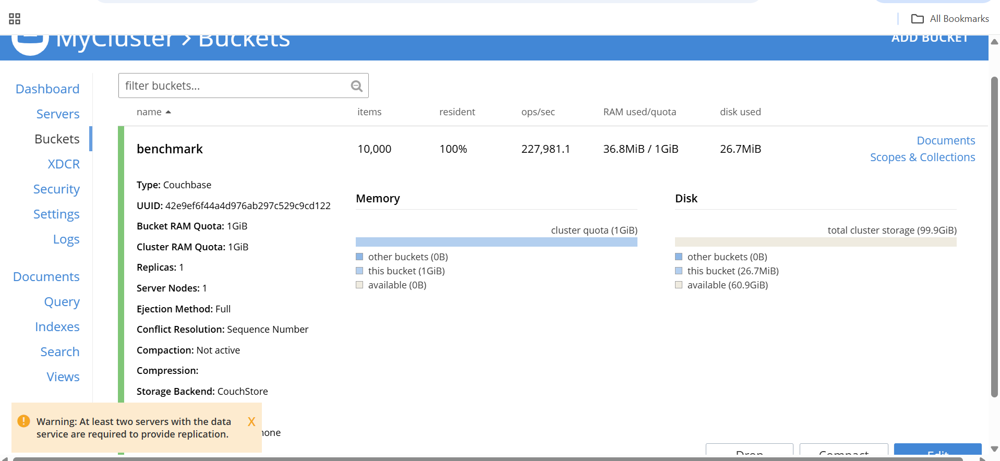

##  Puppet Benchmark on GCP SUSE Arm64 VM
This section guides you through benchmarking Couchbase performance on a GCP SUSE Arm64 VM using the **official `cbc-pillowfight` tool** from Couchbase C SDK.  
It involves installing dependencies, building the SDK, verifying the setup, and running the benchmark test.

### Install Build Tools & Dependencies
Before compiling the Couchbase SDK, install all required development tools and libraries.  

```console
sudo zypper install -y gcc gcc-c++ cmake make git openssl-devel libevent-devel cyrus-sasl-devel
```

### Download and Build the Couchbase C SDK (includes cbc-pillowfight)
`cbc-pillowfight` is a Couchbase command-line benchmarking tool that simulates a workload by performing concurrent read and write operations on a bucket to test Couchbase cluster performance.

Clone the official Couchbase C SDK repository from GitHub. This SDK includes benchmarking tools such as `cbc` and `cbc-pillowfight`.

```console
cd ~
git clone https://github.com/couchbase/libcouchbase.git
cd libcouchbase
```

**Then build and install:**

```console
mkdir build && cd build
cmake .. -DCMAKE_BUILD_TYPE=Release
make -j$(nproc)
sudo make install
```

### Update the Dynamic Linker Configuration
After installation, tell the system where to find the Couchbase libraries.

```console
echo "/usr/local/lib" | sudo tee /etc/ld.so.conf.d/libcouchbase.conf
```

Then refresh the linker cache to make the libraries available system-wide:

```console
sudo ldconfig
```

### Verify Installation
After installation, the tools like **cbc**, **cbc-pillowfight**, etc. should be available in `/usr/local/bin`.

**Verify with:**

```console
cbc version
cbc-pillowfight --help
```
You should see an output similar to:
```output
cbc:
  Runtime: Version=3.3.18, Changeset=a8e17873d167ec75338a358e54cec3994612d260
  Headers: Version=3.3.18, Changeset=a8e17873d167ec75338a358e54cec3994612d260
  Build Timestamp: 2025-11-06 04:36:42
  CMake Build Type: Release
  Default plugin directory: /usr/local/lib64/libcouchbase
  IO: Default=libevent, Current=libevent, Accessible=libevent,select
  SSL Runtime: OpenSSL 1.1.1l-fips  24 Aug 2021 SUSE release 150500.17.40.1
  SSL Headers: OpenSSL 1.1.1l-fips  24 Aug 2021 SUSE release SUSE_OPENSSL_RELEASE
  HAVE_PKCS5_PBKDF2_HMAC: yes
  Snappy: 1.1.8
  Tracing: SUPPORTED
  System: Linux-6.4.0-150600.23.73-default; aarch64
  CC: GNU 7.5.0;  -fno-strict-aliasing -ggdb3 -pthread
  CXX: GNU 7.5.0;  -fno-strict-aliasing -ggdb3 -pthread
```

### Run Benchmark using cbc-pillowfight
Once Couchbase Server is running and a bucket (e.g., `benchmark`) is created, you can run a workload test using the following command:

```console
cbc-pillowfight -U couchbase://127.0.0.1/benchmark \
-u Administrator -P password \
-I 10000 -B 1000 -t 5 -c 500
```

- **-U couchbase://127.0.0.1/benchmark**: Connection string to Couchbase bucket
- **-u Administrator**:	Couchbase username
- **-P password**: Couchbase password
- **-I 10000**:	Number of items (documents) to use
- **-B 1000**: Batch size for operations
- **-t 5**:	Number of concurrent threads
- **-c 500**:	Number of operation cycles to run

You should see an output similar to:
```output
Running. Press Ctrl-C to terminate...
Thread 0 has finished populating.
Thread 1 has finished populating.
Thread 2 has finished populating.
Thread 3 has finished populating.
Thread 4 has finished populating.
```

### Monitoring During Test
While the benchmark runs, open the Couchbase Web Console in your browser:

```bash
http://<your-vm-ip>:8091
```

**Navigate to**:
**Dashboard → Buckets → benchmark → Metrics tab**

Monitor real-time performance metrics such as:
- **Ops/sec** — should match your CLI output
- **Resident ratio** — how much data stays in memory
- **Disk write queue** — backlog of writes to disk
- **CPU and memory usage** — tells you how well ARM cores are handling load



### Benchmark summary on x86_64
To compare the benchmark results, the following results were collected by running the same benchmark on a `x86 - c4-standard-4` (4 vCPUs, 15 GB Memory) x86_64 VM in GCP, running SUSE:

| **Name**     | **Items** | **Resident** | **Ops/sec** | **RAM Used / Quota** | **Disk Used** |
|---------------|------------|---------------|---------------|-----------------------|---------------|
| benchmark     | 10,000     | 100%          | 219,961.9     | 36.9 MiB / 1 GiB      | 25.3 MiB      |

### Benchmark summary on Arm64
Results from the earlier run on the `c4a-standard-4` (4 vCPU, 16 GB memory) Arm64 VM in GCP (SUSE):

| **Name**     | **Items** | **Resident** | **Ops/sec** | **RAM Used / Quota** | **Disk Used** |
|---------------|------------|---------------|---------------|-----------------------|---------------|
| benchmark     | 10,000     | 100%          | 227,981.1     | 36.8 MiB / 1 GiB      | 26.7 MiB      |

### Couchbase benchmarking comparison on Arm64 and x86_64

- **Operations per Second:** 227,981.1 ops/sec — indicates high throughput
- **Resident Ratio:** 100% — all data served directly from memory
- **RAM Usage:** 36.8 MiB used out of 1 GiB quota — highly efficient memory utilization
- **Disk Usage:** 26.7 MiB — minimal disk consumption
- **Overall:** The Couchbase bucket performed efficiently with strong in-memory performance and low resource usage.
