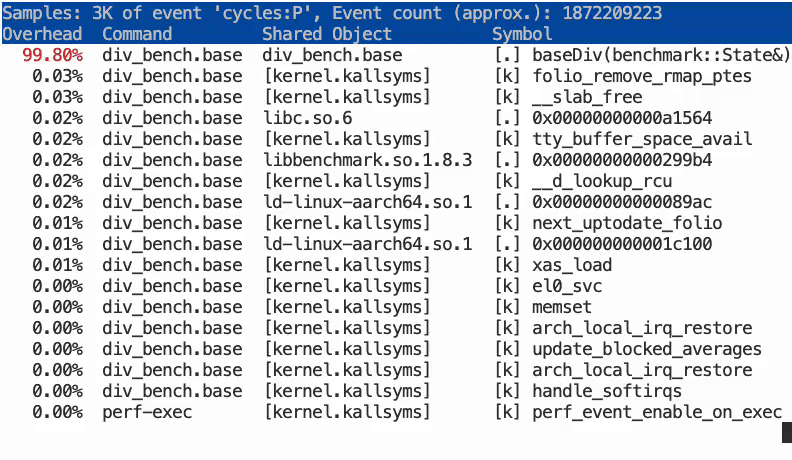

## Optimizing costly division operations with Google Benchmark and PGO

In this section, you'll learn how to use Google Benchmark and Profile-Guided Optimization to improve the performance of a simple division operation. This example demonstrates how even seemingly straightforward operations can benefit from optimization techniques.

Integer division is ideal for benchmarking because it's significantly more expensive than operations like addition, subtraction, or multiplication. On most CPU architectures, including Arm, division instructions have higher latency and lower throughput compared to other arithmetic operations. By applying Profile-Guided Optimization to code containing division operations, we can potentially achieve significant performance improvements.

## What tools are needed to run a Google Benchmark example?

For this example, you can use any Arm Linux computer. For example, an AWS EC2 `c7g.xlarge` instance running Ubuntu 24.04 LTS can be used.

Run the following commands to install the prerequisite packages:

```bash
sudo apt update
sudo apt install gcc g++ make libbenchmark-dev -y
```

## Division example

Use an editor to copy and paste the C++ source code below into a file named `div_bench.cpp`.

This trivial example takes in a vector of 4096 32-bit integers and divides each element by a number. Importantly, the use of `benchmark/benchmark.h` introduces indirection since the divisor value is unknown at compile time, although it is visible in the source code as 1500.

```cpp
#include <benchmark/benchmark.h>
#include <vector>

// Benchmark division instruction
static void baseDiv(benchmark::State &s) {
  std::vector<int> v_in(4096);
  std::vector<int> v_out(4096);

  for (auto _ : s) {
    for (size_t i = 0; i < v_in.size(); i++) v_out[i] = v_in[i] / s.range(0);
    // s.range(0) is unknown at compile time, cannot be reduced
  }
}

BENCHMARK(baseDiv)->Arg(1500)->Unit(benchmark::kMicrosecond); // value of 1500 is passed through as an argument so strength reduction cannot be applied

BENCHMARK_MAIN();
```

To compile and run the microbenchmark on this function, you need to link with the `pthreads` and `benchmark` libraries.

Compile with the command:

```bash
g++ -O3 -std=c++17 div_bench.cpp -lbenchmark -lpthread -o div_bench.base
```

Run the program:

```bash
./div_bench.base
```

### Example output

```output
Running ./div_bench.base
Run on (4 X 2100 MHz CPU s)
CPU Caches:
  L1 Data 64 KiB (x4)
  L1 Instruction 64 KiB (x4)
  L2 Unified 1024 KiB (x4)
  L3 Unified 32768 KiB (x1)
Load Average: 0.00, 0.00, 0.00
***WARNING*** Library was built as DEBUG. Timings may be affected.
-------------------------------------------------------
Benchmark             Time             CPU   Iterations
-------------------------------------------------------
baseDiv/1500       7.90 us         7.90 us        88512
```

### Inspect assembly

To inspect what assembly instructions are being executed most frequently, you can use the `perf` command. This is useful for identifying bottlenecks and understanding the performance characteristics of your code.

Install Perf using the [install guide](https://learn.arm.com/install-guides/perf/) before proceeding.

{}
You may need to set the `perf_event_paranoid` value to -1 with the `sudo sysctl kernel.perf_event_paranoid=-1` command to run the commands below.
{}

Run the following commands to record `perf` data and create a report in the terminal:

```bash
sudo perf record -o perf-division-base ./div_bench.base 
sudo perf report --input=perf-division-base
```

As the `perf report` graphic below shows, the program spends a significant amount of time in the short loops with no loop unrolling. There is also an expensive `sdiv` operation, and most of the execution time is spent storing the result of the operation.



