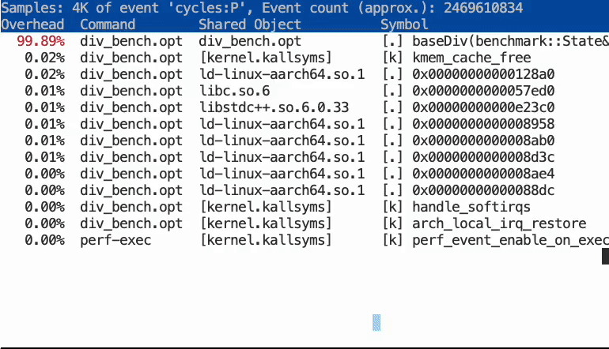

### Build with PGO

To generate a binary optimized using runtime profile data, first build an instrumented binary that records usage data. Run the following command, which includes the `-fprofile-generate` flag, to build the instrumented binary:

```bash
g++ -O3 -std=c++17 -fprofile-generate div_bench.cpp -lbenchmark -lpthread -o div_bench.opt
```

Next, run the instrumented binary to generate the profile data:

```bash
./div_bench.opt
```

This execution creates profile data files (typically with a `.gcda` extension) in the same directory. 

Now recompile the program using the `-fprofile-use` flag to apply optimizations based on the collected data: 

```bash
g++ -O3 -std=c++17 -fprofile-use div_bench.cpp -lbenchmark -lpthread -o div_bench.opt
```

### Run the optimized binary 

Now run the optimized binary:

```bash
./div_bench.opt
```

The following output shows the performance improvement:

```output
Running ./div_bench.opt
Run on (4 X 2100 MHz CPU s)
CPU Caches:
  L1 Data 64 KiB (x4)
  L1 Instruction 64 KiB (x4)
  L2 Unified 1024 KiB (x4)
  L3 Unified 32768 KiB (x1)
Load Average: 0.10, 0.03, 0.01
***WARNING*** Library was built as DEBUG. Timings may be affected.
-------------------------------------------------------
Benchmark             Time             CPU   Iterations
-------------------------------------------------------
baseDiv/1500       2.86 us         2.86 us       244429
```

As the terminal output above shows, the average execution time is reduced from 7.90 to 2.86 microseconds. This improvement occurs because the profile data informed the compiler that the input divisor was consistently 1500 during the profiled runs, allowing it to apply specific optimizations.

Next, let's examine how the code was optimized at the assembly level.

### Inspect assembly 

Use `perf` to inspect how the compiler optimized the binary:

```bash
sudo perf record -o perf-division-opt ./div_bench.opt
sudo perf report --input=perf-division-opt
```

As the graphic below illustrates, the profile data enabled the compiler to optimize the program significantly. The optimized code features loop unrolling and uses strength reduction (replacing the expensive division with cheaper operations), allowing the loop to execute much faster.

