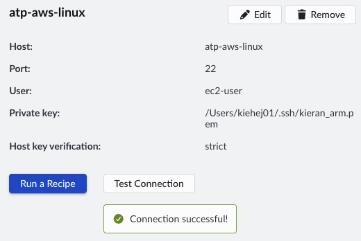

## Setup

This learning path uses a hands-on worked example to make sampling-based profiling and flame graphs practical. You’ll build a C++11 program that generates a fractal bitmap by computing the Mandelbrot set, then mapping each pixel’s iteration count to a pixel value. You’ll have the full source code, so you can rebuild the program, profile it, and connect what you see in the flame graph back to the exact functions and loops responsible for the runtime.

A fractal is a pattern that shows detail at many scales, often with self-similar structure. Fractals are usually generated by repeatedly applying a simple mathematical rule. In the Mandelbrot set, each pixel corresponds to a complex number, which is iterated through a basic recurrence. How quickly the value “escapes” (or whether it stays bounded) determines the pixel’s color and produces the familiar Mandelbrot image.

You don’t need to understand the Mandelbrot algorithm in detail to follow this learning path—we’ll use it primarily as a convenient, compute-heavy workload for profiling. If you'd  like to learn more, please refer to the [Wikipedia](https://en.wikipedia.org/wiki/Mandelbrot_set) page for more information.
 

## Connect to APT Target

Please refer to the [installation guide](https://learn.arm.com/install-guides/atp) if it is your first time setting up Arm Total Performance. In this learning path, I will be connecting to an AWS Graviton3 metal instance (`m7g.metal`) with 64 Neoverse V1 cores. From the host machine, test the connection to the remote server by navigating to `'Targets`->`Test Connection`. You should see the successul connection below. 

.

## Build Application on Remote Server

Next, connect to the remote server, for example using SSH or VisualStudio Code, and clone the Mandelbrot repository. This is available under the [Arm Education License](https://github.com/arm-university/Mandelbrot-Example?tab=License-1-ov-file) for teaching and learning. Create a new directory where you will store and build this example. Next, run the commands below.

```bash
git clone https://github.com/arm-university/Mandelbrot-Example.git
cd Mandelbrot-Example && mkdir images builds
git checkout single-thread
```

Install a C++ compiler, for example using your operating system's package manager.

```bash
sudo dnf update && sudo dnf install g++ gcc
```

Build the application. 

```bash
./build.sh
```