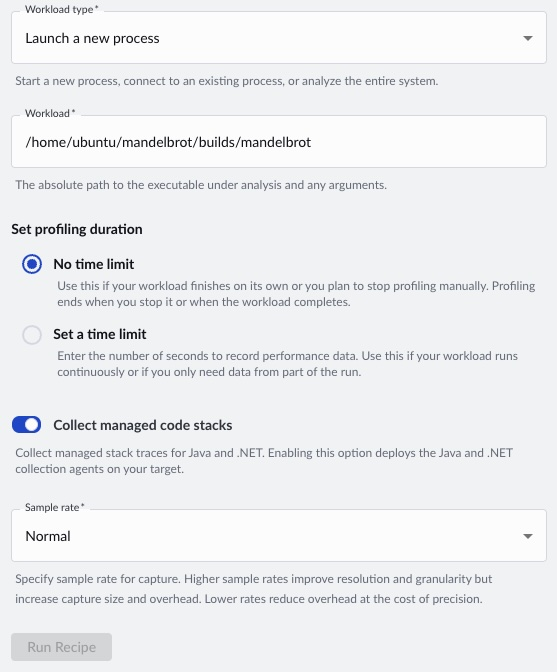

## Run CPU Cycle Hotspot Recipe

As shown in the `main.cpp` file below, the program generates a 1920×1080 bitmap image of our fractal. To identify performance bottlenecks, we’ll run the CPU Cycle Hotspot recipe in Arm Total Performance (ATP). ATP uses sampling to estimate where the CPU spends most of its time, allowing it to highlight the hottest functions—especially useful in larger applications where it isn’t obvious ahead of time which functions will dominate runtime.

**Please Note**: You will need to replace the first string argument in the `myplot.draw()` function with the absolute path to the image folder and rebuild the application. If not, the image will be written to the `/tmp/atperf/tools/atperf-agent` directory from where the binary is run. As the name suggests, this folder is periodically deleted. 

```cpp
#include "Mandelbrot.h"
#include <iostream>

using namespace std;

int main(){

    Mandelbrot::Mandelbrot myplot(1920, 1080);
    myplot.draw("./images/green.bmp", Mandelbrot::Mandelbrot::GREEN);

    return 0;
}
```

Open up ATP from the host machine. Click on the `CPU Cycle Hotspot` recipe. If this is the first time running the recipe you may need to click the install tools button.


Next we will configure the recipe. We will choose to launch a new process, ATP will automatically start collecting metric when the program starts and stop when the program exits.

Provide an absolute path to the recently built binary, `mandelbrot`. 

Finally, we will use the default sampling rate of `Normal`. If your application is a short running program, you may want to consider a higher sample rate, this will be at the tradeoff of more data to store and process. 



## Analyse Results

A flame graph should be generated. The default colour mode is to label the 'hottest function', those which are sampled and utilizing CPU most frequently, in the darkest shade. Here we can see that the `__complex_abs__` function is being called during ~65% of samples. This is then calling the `__hypot` symbol in `libm.so`.


To understand deeper, we can map the the lines of source code to the functions. To do this right clight on a specific function and select 'View Source Code'. At the time of writing (ATP Engine 0.44.0), you may need to copy the source code onto your host machine. 


Finally, looking in our images directory we can see the bitmap fractal.


