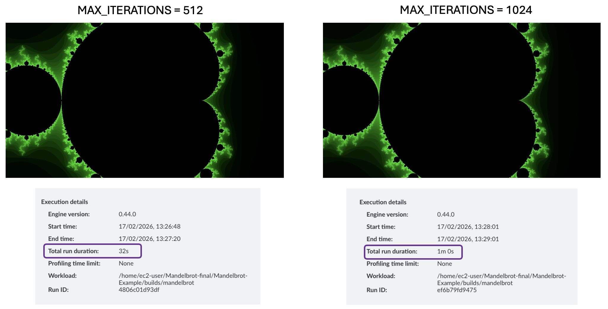
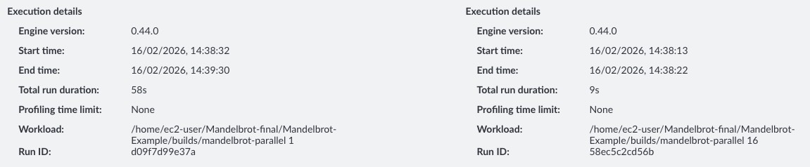

Now we can leverage the insights surfaced by ATP to focus the optimizations around the hottest functions. Looking at the source code, we understand the the hypotenuse function, `__hypot`, is being invoked by the `Mandelbrot::getIterations` function to calculate the absolute value of a complex number. You may consider trying to used an optimized version of `libm`

Looking at the `Mandelbrot::getIterations` function,  there are some obvious ways to optimize. 

```cpp
    while (iterations < MAX_ITERATIONS){
        z = (z*z) + c;
        if (abs(z) > THRESHOLD){
            break;
        }
        iterations++;
    }
```

### Optimization 1 - Limiting Loop Boundary


We can see that the number of iterations is of the absolute value is limited by the loop boundary, MAX_ITERATIONS. Our first optimization could be to reduce MAX_ITERATIONS. This is defined as 1024 a static const integer in the `Mandelbrot.h` header. We could half this to 512 and assess the perceived image quality on our fractal.

```cpp
public:
...
    static const int MAX_ITERATIONS = (1<<10);
...
```

On the remote server, reduce `MAX_ITERATIONS` in `Mandelbrot.h` and rename the output file string in `main.cpp` to something else and rebuild the binary with the following command.

```bash
./build.sh
```

Next, click on the refresh icon in the top right to rerun the recipe. Next we select the comparison mode to view differences in the run. Navigating to the 'Run Details' tab, we observe a reducion in run duration from 1m 0s to 0m 32s, almost proportional to the reduction in `MAX_ITERATIONS`. However, we need to see if the tradeoff between image quality and runtime was worth it. 

Looking at the change in image quality, there is neglible difference in perceived image quality when halfing MAX_ITERATIONS. 



### Optimization 2 - Parallelising Hot Function

Fortunately, our loop does not contain any loop-carried dependencies, where the result of an iterations depends on a future or previous iteration. As such we can parallelize our hot function to fun on multiple threads if our CPU has multiple cores. 

The repository contains a parallel version in the main branch. 

```bash
git checkout main
```

This branch parallelized the `Mandelbrot::draw` function, which is earlier function in the stack that eventually calls the `__hypot` function. 

Build the example, this creates a binary `./builds/mandelbrot-parallel` which takes in a numerical command line arguments to set the number of threads.

```bash
./build.sh
```

Rerun the recipe with the new binary from Arm Total Peformance running on the host. 

To assess the change, we can compare with a previous run. Looking under the `Run Details` tab, we can see the execution time has reduced further from 0m 32s to 7s with 32 threads.



The percentage point of samples has not changed significantly, but we see with 64 threads the % of sampling landing on the `Mandelbrot::draw` function has reduced by 7%. This suggests that if we want to further improve the execution time, further optimizations on the `Mandelbrot::draw` function will yield the greatest benefit. 

.

**Please Note:** The total run duration is the runtime for both the tooling setup and data analysis, not the runtime of the application. Using a command line tool such as `time` we observe the application duration is now ~ 1s. Resulting in almost a 100x improvement in runtime!  

### (Optional Challenge) Additional optimizations

You may have noticed our build script uses the `-O0` flag, which ensures the compiler does not add any additional optimizations. You can experiment with additional optimization levels, loop boundary sizes and threads. Please see our learning path introducing [basic compiler flags](https://learn.arm.com/learning-paths/servers-and-cloud-computing/cplusplus_compilers_flags/) for more information. Additionally, you may wish to look at vectorized libraries that could replace the hypotenuse function in `libm`, such as the [Arm Performance Libraries](https://developer.arm.com/documentation/101004/2601/Arm-Performance-Libraries-Math-Functions/Arm-Performance-Libraries-Vector-Math-Functions--Accuracy-Table).


## Summary

In this learning path, we reduced the runtime of the Mandelbrot example by focusing on the hottest code paths—cutting execution time from around 1 minute to ~1 second through targeted optimization and parallelization. While this example is relatively simple and the optimizations are more obvious, the same principle applies to real-world workloads: optimize what matters most first, based on measurement.

The cpu_hotspot recipe is designed to quickly identify an application’s hottest (most CPU-time-dominant) functions, giving you a clear, evidence-based starting point for performance work. By surfacing where execution time is actually being spent, it helps ensure any optimizations are targeted at the parts of the code most likely to deliver the largest performance gains, rather than relying on guesswork.

This is often one of the first profiling steps you’ll run when assessing an application’s performance characteristics—especially to determine which functions dominate runtime and should be prioritized. Once hotspots are identified, you can follow up with deeper, function-specific analysis, such as memory investigations or top-down studies, and even build microbenchmarks around hot functions to explore lower-level bottlenecks and uncover additional optimization opportunities.