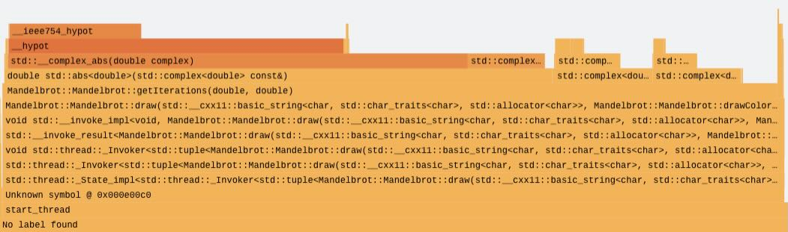

## What are flame graphs?

A flame graph is a visualization built from many sampled call stacks that shows where a program spends CPU time. In a performance investigation it's often the first thing to generate when it isn't yet clear which parts of the codebase are affecting execution time. Instead of guessing where the bottleneck is, you take a quick sample of real execution and use the resulting graph to identify the hottest code paths that deserve deeper analysis.

## How to read a flame graph

The flame graph below shows a typical profiling result.

The x-axis represents the relative number of samples attributed to code paths, ordered alphabetically, not a timeline. A wider block means that function appeared in more samples and therefore consumed more CPU time. The y-axis represents call stack depth. Frames at the bottom are closer to the root of execution, such as a thread entry point, and frames above them are functions called by those below.

Each sample captures a snapshot of the current call stack. Many samples are then aggregated by grouping identical stacks and summing their counts, which is what makes flame graphs compact and readable. A common workflow is to start with the widest blocks, then move upward through the stack to understand which callees dominate that hot path. Reliable stack walking depends on frame pointers being present; they allow the profiler to unwind through nested calls and produce accurate stacks that merge cleanly into stable blocks.

This Learning Path doesn't cover flame graphs in depth. To learn more, see [Brendan Gregg's flame graph reference](https://www.brendangregg.com/flamegraphs.html).

## Tooling options

On Linux, flame graphs are commonly generated from samples collected with `perf`. perf periodically interrupts the running program and records a stack trace, then the collected stacks are converted into a folded format and rendered as the graph. Sampling frequency is important. If the frequency is too low you might miss short-lived hotspots, and if it's too high you might introduce overhead or skew the results. To make the output informative, compile with debug symbols and preserve frame pointers so stacks resolve to meaningful function names and unwind reliably. A typical build uses `-g` and `-fno-omit-frame-pointer`.

Arm has built a tool, Arm Performix that simplifies this workflow through the Code Hotspots recipe, making it easier to configure collection, run captures, and explore the resulting call hierarchies without manually stitching together the individual steps. This is the tooling solution you'll use in this Learning Path.