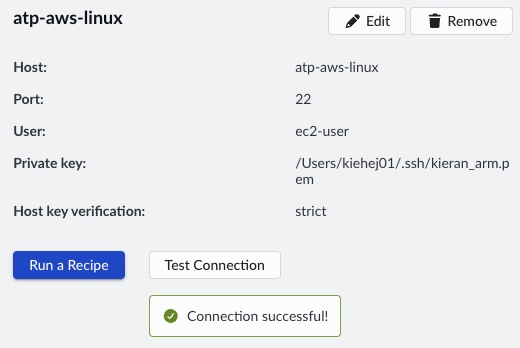

## Setup

This Learning Path uses a hands-on worked example to make sampling-based profiling and flame graphs practical. You’ll build a C++11 program that generates a fractal bitmap by computing the Mandelbrot set, then mapping each pixel’s iteration count to a pixel value. You’ll have the full source code, so you can rebuild the program, profile it, and connect what you see in the flame graph back to the exact functions and loops responsible for the runtime.

A fractal is a pattern that shows detail at many scales, often with self-similar structure. Fractals are usually generated by repeatedly applying a simple mathematical rule. In the Mandelbrot set, each pixel corresponds to a complex number, which is iterated through a basic recurrence. How quickly the value “escapes” (or whether it stays bounded) determines the pixel’s color and produces the familiar Mandelbrot image.

You don't need to understand the Mandelbrot algorithm in detail to follow this Learning Path — it's used here as a convenient, compute-heavy workload for profiling. To learn more, see the [Mandelbrot set article on Wikipedia](https://en.wikipedia.org/wiki/Mandelbrot_set).


## Connect to Target

If this is your first time setting up Arm Performix, follow the [Arm Performix installation guide](/install-guides/atp/). In this Learning Path you'll connect to an AWS Graviton3 metal instance (`m7g.metal`) with 64 Neoverse V1 cores, your remote target server. From the host machine, test the connection to the remote server by navigating to **Targets** > **Test Connection**. You should see the successful connection screen below.



## Build application on remote server

Connect to the remote server using SSH or Visual Studio Code. Install git and the C++ compiler. On dnf-based systems such as Amazon Linux 2023 or RHEL, run:

```bash
sudo dnf update && sudo dnf install git gcc g++ make
```

Clone the Mandelbrot repository, check out the single-threaded branch, and create the output directories. The repository is available under the [Arm Education License](https://github.com/arm-university/Mandelbrot-Example?tab=License-1-ov-file) for teaching and learning.

```bash
git clone https://github.com/arm-education/Mandelbrot-Example.git
cd Mandelbrot-Example
mkdir -p images build
```

Build the application:

```bash
make single_thread DEBUG=1
```

This creates the binary `./builds/mandelbrot_single_thread_debug`.