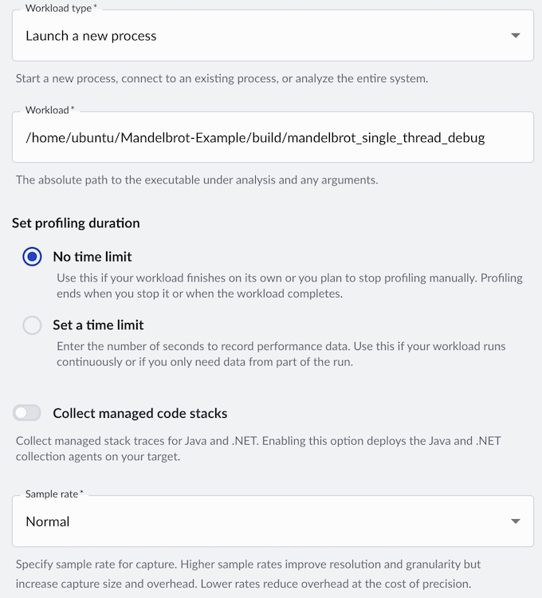

## Run Code Hotspots Recipe

As shown in the `src/main_single_thread.cpp` file below, the program generates a 1920×1080 bitmap image of the fractal. To identify performance bottlenecks, run the Code Hotspots recipe in Arm Performix (APX). APX uses sampling to estimate where the CPU spends most of its time, allowing it to highlight the hottest functions—especially useful in larger applications where it isn't obvious ahead of time which functions will dominate runtime.

{}
The `myplot.draw()` call uses a relative path (`./images/green.bmp`). When APX launches the binary, it runs it from a temporary location, so the image would be written there rather than to your project directory. To ensure the output is saved where you expect it, update the first string argument in `src/main_single_thread.cpp` to the absolute path of the output file, for example `/home/ec2-user/Mandelbrot-Example/images/green.bmp`.
{}

```cpp
#include "Mandelbrot.h"
#include <iostream>

using namespace std;

int main(int argc, char* argv[]){

    const int NUM_THREADS = 1;
    std::cout << "Number of Threads = " << NUM_THREADS << std::endl;

    Mandelbrot::Mandelbrot myplot(1920, 1080, NUM_THREADS);
    myplot.draw("/home/ec2-user/Mandelbrot-Example/images/green.bmp", Mandelbrot::Mandelbrot::GREEN);

    return 0;
}
```


 Rebuild the application before continuing:

 ```bash
make clean
make single_thread DEBUG=1
 ```

Open APX from the host machine. Select the **Code Hotspot** recipe. If this is the first time running the recipe on this target machine you might need to select the install tools button.


Configure the recipe to launch a new process. APX will automatically start collecting metrics when the program starts and stop when the program exits.

Provide the absolute path to the binary built in the previous step: `/home/ec2-user/Mandelbrot-Example/build/mandelbrot_single_thread_debug`.

Use the default sampling rate of **Normal**. If your application is short-running, consider a higher sample rate, at the cost of more data to store and process.



## Analyse Results

A flame graph is generated once the run completes. The default colour mode labels the hottest functions—those using CPU most frequently—in the darkest shade. In this example, the `__complex_abs__` function is present in approximately 65% of samples, and it calls the `__hypot` symbol in `libm.so`.


To investigate further, you can map source code lines to the functions in the flame graph. Right-click on a specific function and select **View Source Code**. You may need to copy the source code onto your host machine to use this feature.


Finally, check your `images` directory for the generated bitmap fractal `green.bmp`. This confirms the application ran successfully and produced the expected Mandelbrot set visualization.


