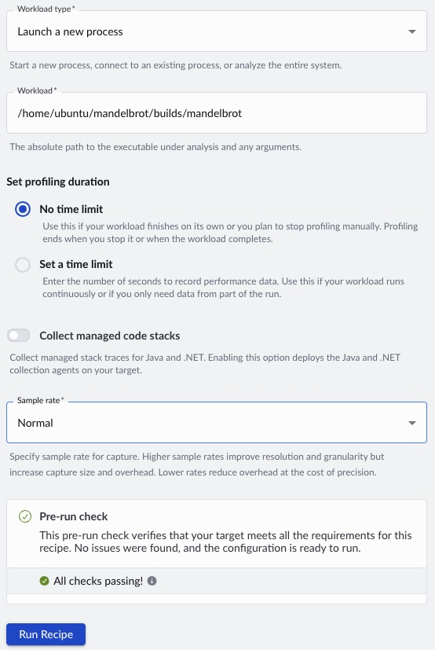
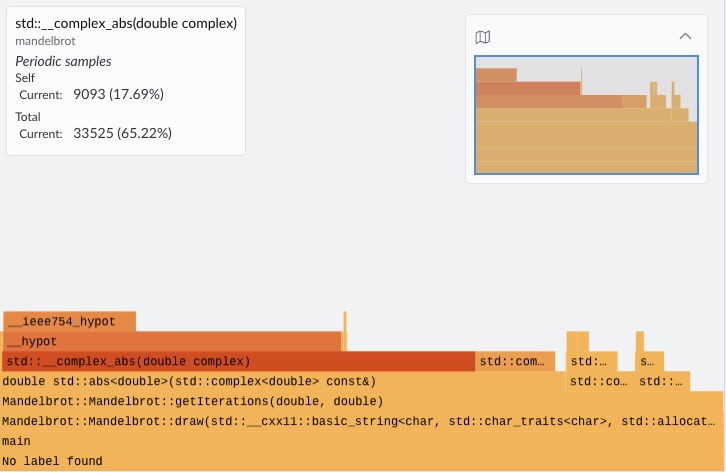
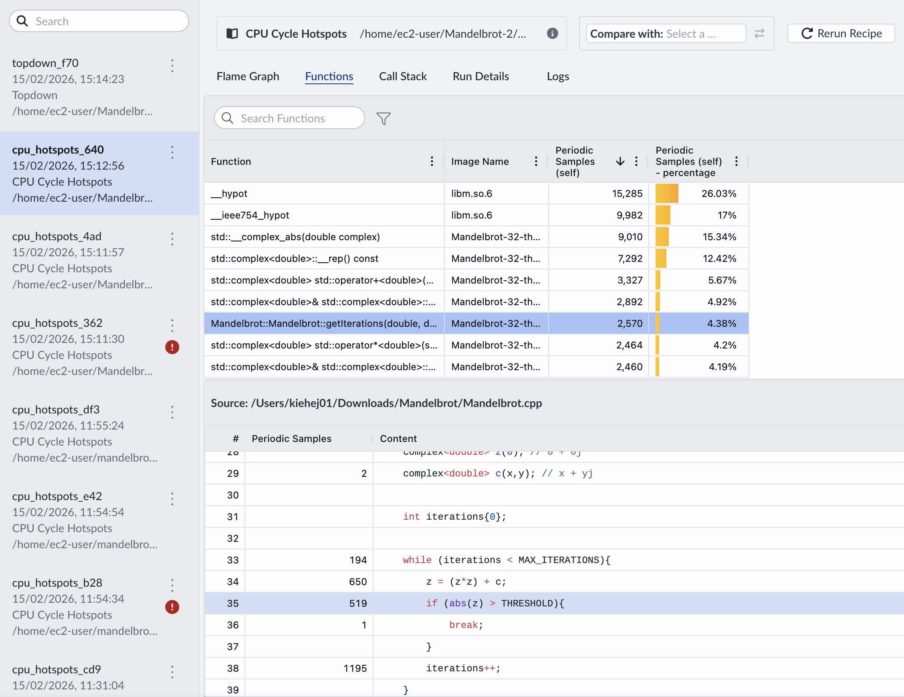

## Run CPU Cycle Hotspot Recipe

As shown in the `main.cpp` file below, the program generates a 1920×1080 bitmap image of the fractal. To identify performance bottlenecks, run the CPU Cycle Hotspot recipe in Arm Performix (APX). APX uses sampling to estimate where the CPU spends most of its time, allowing it to highlight the hottest functions—especially useful in larger applications where it isn't obvious ahead of time which functions will dominate runtime.

{}
The `myplot.draw()` call uses a relative path (`./images/green.bmp`). When APX launches the binary, it runs it from `/tmp/atperf/tools/atperf-agent`, so the image would be written there rather than to your project directory. Replace the first string argument with the absolute path to your `images` folder (for example, `/home/ec2-user/Mandelbrot-Example/green.bmp`) and rebuild the application before continuing.
{}

```cpp
#include "Mandelbrot.h"
#include <iostream>

using namespace std;

int main(){

    Mandelbrot::Mandelbrot myplot(1920, 1080);
    myplot.draw("./images/green.bmp", Mandelbrot::Mandelbrot::GREEN);

    return 0;
}
```

Open APX from the host machine. Select the **CPU Cycle Hotspot** recipe. If this is the first time running the recipe on this target machine you may need to select the install tools button.


Configure the recipe to launch a new process. APX will automatically start collecting metrics when the program starts and stop when the program exits.

Provide the absolute path to the binary built in the previous step: `/home/ec2-user/Mandelbrot-Example/builds/mandelbrot`.

Use the default sampling rate of **Normal**. If your application is short-running, consider a higher sample rate, at the cost of more data to store and process.



## Analyse Results

A flame graph is generated once the run completes. The default colour mode labels the hottest functions—those using CPU most frequently—in the darkest shade. In this example, the `__complex_abs__` function is present in approximately 65% of samples, and it calls the `__hypot` symbol in `libm.so`.



To investigate further, you can map source code lines to the functions in the flame graph. Right-click on a specific function and select **View Source Code**. At the time of writing (ATP Engine 0.44.0), you may need to copy the source code onto your host machine.



Finally, check your `images` directory for the generated bitmap fractal.


