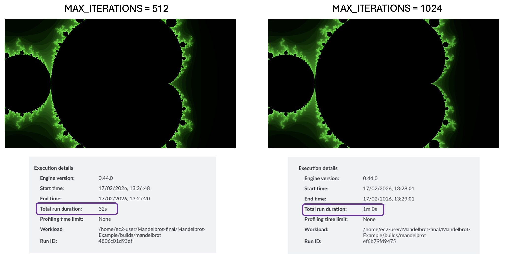
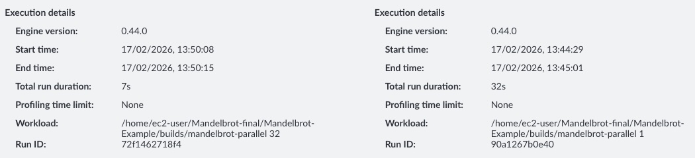
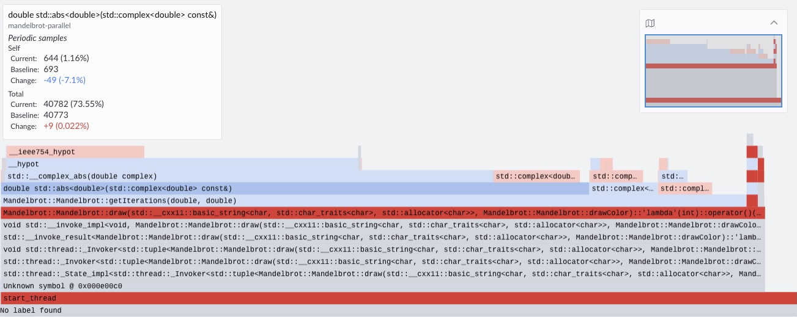

## Optimize hot functions

Use the insights from Arm Performix to focus optimizations on the hottest functions. The flame graph from the previous step shows that `__hypot` is invoked by `Mandelbrot::getIterations` to calculate the absolute value of a complex number. One option worth exploring is replacing the `libm` implementation with an optimized alternative, but first consider the more targeted changes below.

Looking at the `Mandelbrot::getIterations` function, there are two clear optimization opportunities.

```cpp
    while (iterations < MAX_ITERATIONS){
        z = (z*z) + c;
        if (abs(z) > THRESHOLD){
            break;
        }
        iterations++;
    }
```

### Optimization 1 - Limiting loop boundary

The iteration count is bounded by `MAX_ITERATIONS`, defined as 1024, a `static const` integer in the `Mandelbrot.h` header. Halving this to 512 reduces the maximum work per pixel but you will need to verify that the change in image quality is acceptable.

```cpp
public:
    ...
    static const int MAX_ITERATIONS = (1<<10);
    ...
```

On the remote server, reduce `MAX_ITERATIONS` in `Mandelbrot.h` to `(1<<9)` (512), update the output image filename in `main.cpp` to a different name (for example: `green-512.bmp`)so you can compare the output with the baseline image, then rebuild:

```bash
make clean
make single_thread DEBUG=1
```

Select the refresh icon in the top right to rerun the recipe, then switch to comparison mode to view differences between runs. Under the **Run Details** tab, the run duration drops from 1m 0s to 0m 32s — almost proportional to the reduction in `MAX_ITERATIONS`. The trade-off to verify is whether the image quality is still acceptable.

There is negligible difference in perceived image quality when halving `MAX_ITERATIONS`.



### Optimization 2 - Parallelising the hot function

The loop in `Mandelbrot::getIterations` has no loop-carried dependencies — each iteration's result is independent of any other. This means you can parallelize the hot function across multiple threads if your CPU has multiple cores.

The repository contains a parallel build target.


The `src/mandelbrot_parallel.cpp` parallelizes the `Mandelbrot::draw` function, which is an earlier function in the call stack that eventually calls `__hypot`. Before building, update the `myplot.draw()` call in `main.cpp` to use an absolute output path:

```cpp
myplot.draw("/home/ec2-user/Mandelbrot-Example/images/Green-Parallel-512.bmp", Mandelbrot::Mandelbrot::GREEN);
```

Build the example. This creates a binary `./builds/mandelbrot-parallel` that takes a single numeric command-line argument to set the number of threads.

```bash
make clean
make parallel DEBUG=1
```

Update the binary path in APX to `./builds/mandelbrot_parallel_debug` and pass the desired thread count as an argument, then rerun the recipe from the host.

To compare with a previous run, switch to comparison mode. Under the **Run Details** tab, execution time drops further from 0m 32s to 7s with 32 threads.



The proportion of samples has not changed significantly overall, but with 64 threads the percentage of samples landing on `Mandelbrot::draw` has reduced by 7%. To further improve execution time, you can continue optimizing `Mandelbrot::draw`.



{}
The total run duration shown in APX includes tooling setup and data analysis time, not just application execution time. To measure only the application, use the `time` command: the application now runs in approximately 1 second — close to a 100x improvement over the original single-threaded baseline.
{}

### (Optional Challenge) Additional optimizations

The `Makefile` uses the `-O0` flag when the `DEBUG=1` argument is passed in. This disables all compiler optimizations. Try experimenting with higher optimization levels, different loop boundary sizes, and thread counts. See the Learning Path [Get started with compiler optimization flags](/learning-paths/servers-and-cloud-computing/cplusplus_compilers_flags/) for guidance. You may also want to explore vectorized math libraries that could replace the `libm` hypotenuse function, such as the [Arm Performance Libraries vector math functions](https://developer.arm.com/documentation/101004/2601/Arm-Performance-Libraries-Math-Functions/Arm-Performance-Libraries-Vector-Math-Functions--Accuracy-Table).


## Summary

In this Learning Path, you reduced the runtime of the Mandelbrot example by focusing on the hottest code paths—cutting execution time from around 1 minute to ~1 second through targeted optimization and parallelization. While this example is relatively simple and the optimizations are more obvious, the same principle applies to real-world workloads: optimize what matters most first, based on measurement.

The Code Hotspots recipe is designed to quickly identify an application's most CPU-time-dominant functions, giving you a clear, evidence-based starting point for performance work. By surfacing where execution time is actually spent, it ensures your optimizations target the parts of the code most likely to deliver the largest gains.

This is often one of the first profiling steps to run when assessing an application's performance — especially to determine which functions dominate runtime and should be prioritized. Once hotspots are identified, you can follow up with deeper function-specific analysis, such as memory investigations or top-down studies, and build microbenchmarks around hot functions to explore lower-level bottlenecks and uncover additional optimization opportunities.