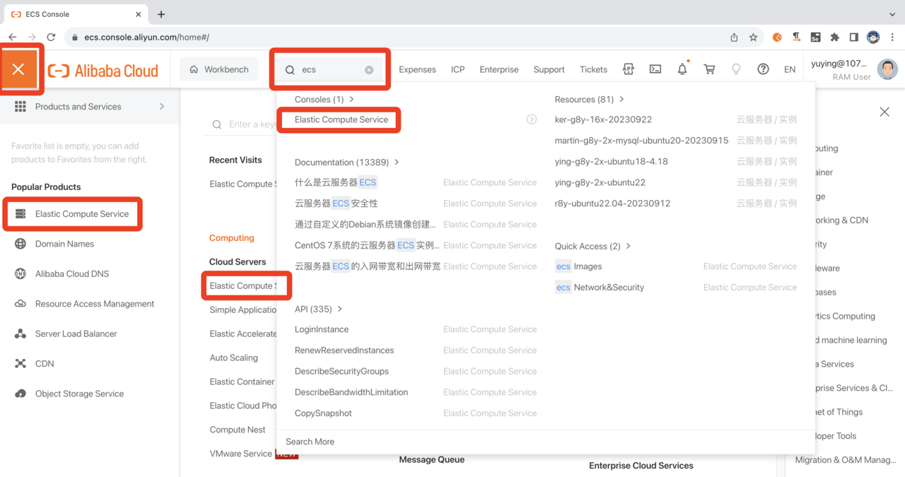
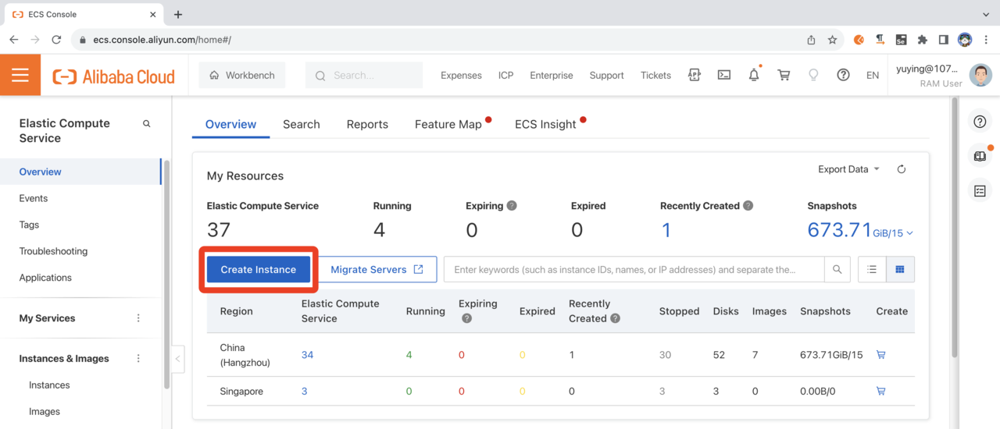
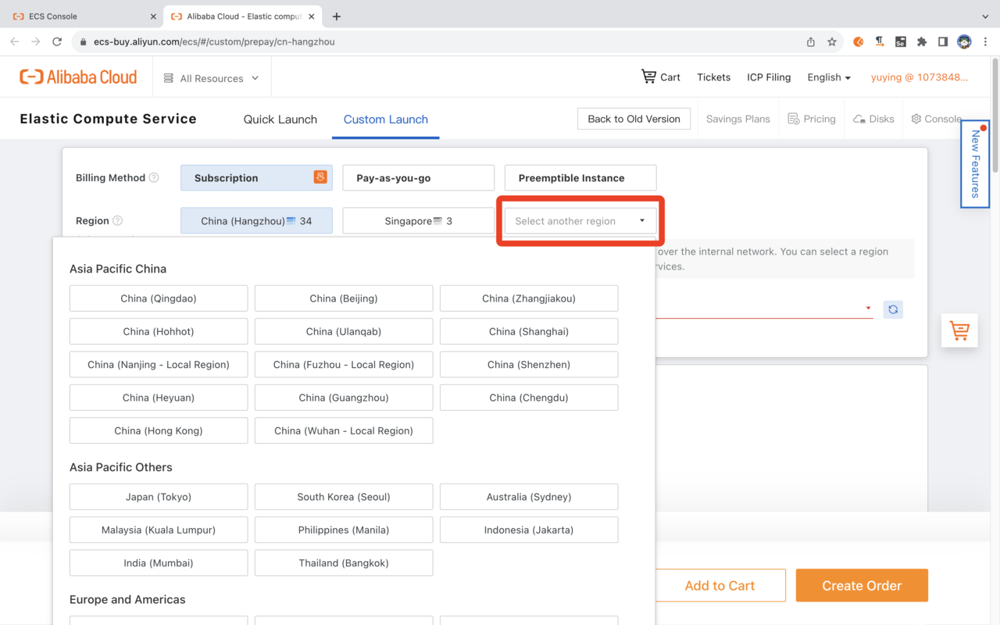
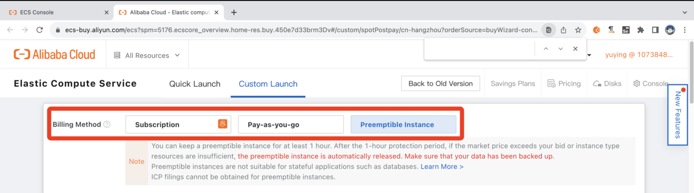
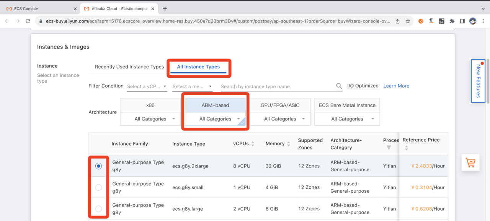
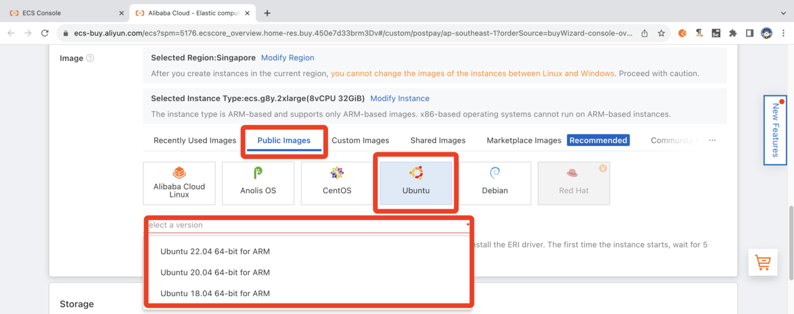
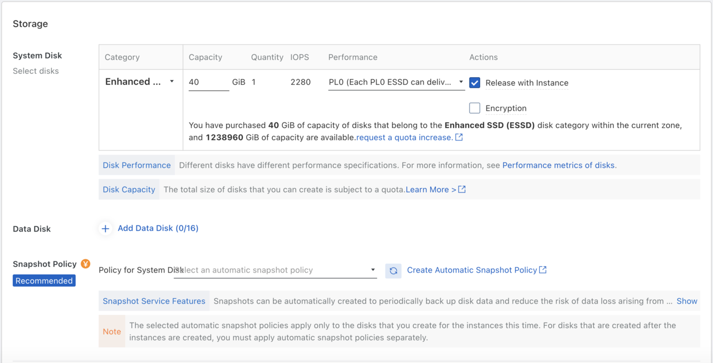
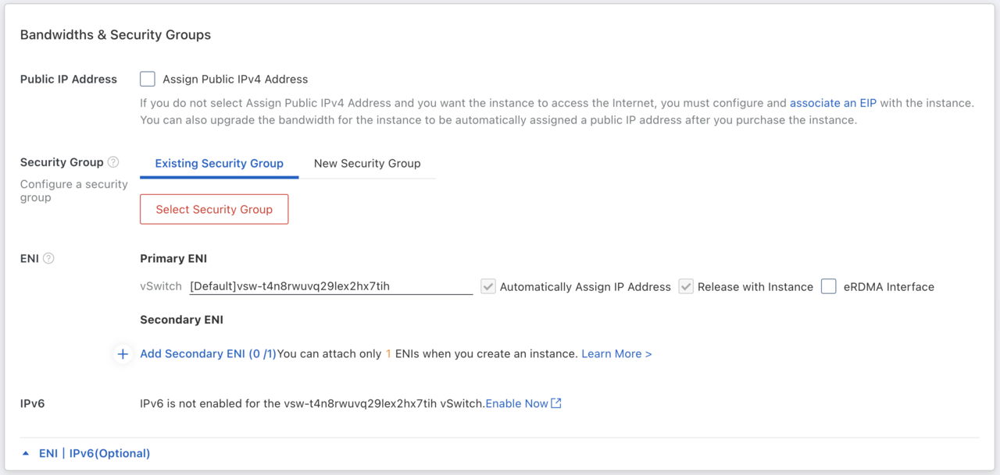
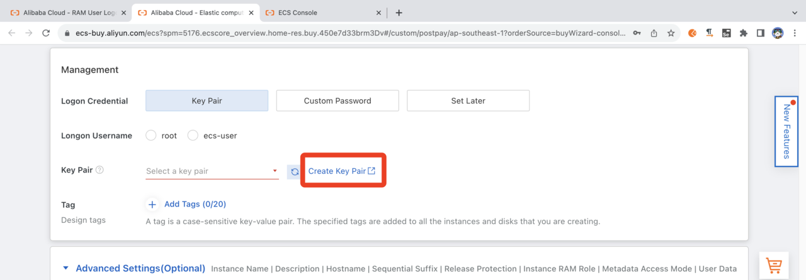
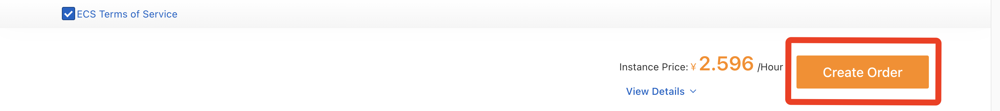

---
# User change
title: "Getting Started with Alibaba Cloud Services"

weight: 6 # 1 is first, 2 is second, etc.

# Do not modify these elements
layout: "learningpathall"
---
[Alibaba Cloud](https://www.alibabacloud.com/) is a public cloud computing platform. 

As with most cloud service providers, Alibaba Cloud offers a pay-as-you-use [pricing policy](https://www.alibabacloud.com/pricing), including a number of [free](https://www.alibabacloud.com/free) services.

This guide is to help you get started with their [Elastic Compute Service (ECS)](https://www.alibabacloud.com/product/ecs), using [Arm-based](https://www.alibabacloud.com/product/ecs/g8m) processors. This is a general-purpose compute platform, essentially your own personal computer in the cloud.

Detailed instructions are available in the Alibaba Cloud [documentation](https://www.alibabacloud.com/help/en/elastic-compute-service), as well as their [ECS Learning Path](https://www.alibabacloud.com/getting-started/learningpath/ecs).

## Create an account

Before you begin, create an account. For a personal account, click on [Free Trial](https://www.alibabacloud.com/), and follow the on-screen instructions to register. You can select an individual or business account.

If using an organization's existing account, you will likely need to consult with your internal administrator.

## Browse for an appropriate instance type

Alibaba Cloud offers a wide range of [instance families](https://www.alibabacloud.com/help/en/elastic-compute-service/latest/instance-family), covering all performance (and pricing) points. Select an appropriate Arm-based type for your needs. You may also wish to note in which [region](https://ecs-buy.aliyun.com/instanceTypes/#/instanceTypeByRegion) the instance family is available.


You then select an `instance size`, which will be one of a number of pre-defined configurations of a number of processors and available memory. If you are unsure what your compute needs are, don't worry, you can easily experiment with different configurations.

## Create your ECS instance

The easiest way to launch your instance is via the [ECS Console](https://ecs.console.aliyun.com/).

Navigate to `Elastic Compute Service` by search or the menu.



Use the `Create ECS Instance` button to get started. Select `Custom Launch` configuration.





### Select a Billing Method

`Subscription`, `Pay-as-you-go`, or `Preemptible Instance` options are available. If you are experimenting initially, select `Preemptible Instance` for the lowest cost. You will be prompted for pricing options later.



### Select Instance Type

Using the `Type-based Selection` tab, set `Architecture` as `ARM`, and `Category` as `General Purpose`, to see the available instance types. If you already know the desired instance type, you can enter this in the filter.



### Select OS image

There are many images available on the [Alibaba Cloud Marketplace](https://marketplace.alibabacloud.com/), providing pre-installed or pre-configured setups.

For now, select `Ubuntu` version (e.g. `20.04 64-bit for ARM`) from the pull-down menu.



### Other settings

Other settings, such as storage size are selectable. For now, use the default selection. Click `Next` to move to `Networking`. Proceed with the default selection for `Networking`. Click `Next` to move to `System Configurations`.





### Set a Key Pair and other security settings

To be able to access the instance (see later), you must use a [key pair](https://www.alibabacloud.com/help/en/elastic-compute-service/latest/key-pairs). If this is your first time logging in, use the `Create Key Pair` dialog to create your key. The `public-key` will be downloaded to your local machine. When created, select from the pull-down.



Select `Logon Credentials` and set `Logon Username` to `ecs-user` and an appropriate  `password` if desired.


Other settings such as `Instance Name` and `Description` are free-form for appropriate personal input. Other settings can be left as default.

")

In the `Preview` stage, click `Create Instance`. After a few moments, the instance will be available for use.




## Connect to your instance

There are a number of different [Connection methods](https://www.alibabacloud.com/help/en/elastic-compute-service/latest/connection-methods) supported.

Connecting by [SSH Key Pair](https://www.alibabacloud.com/help/en/elastic-compute-service/latest/connect-to-a-linux-instance-by-using-an-ssh-key-pair) is likely the most convenient.

For example, to ssh into your virtual machine instance:

```console
ssh -i <private_key> ecs-user@<public_ip_address>
```

{}
Replace `<private_key>` with the private key on your local machine and `<public_ip_address>` with the public IP of the target VM.
{}

Terminal applications such as [PuTTY](https://www.putty.org/), [MobaXterm](https://mobaxterm.mobatek.net/) and similar can be used to connect via `ssh`.

## Explore your instance

### Run uname

Use the [uname](https://en.wikipedia.org/wiki/Uname) utility to verify that you are using an Arm-based server. For example:

```console
uname -m
```
will identify the host machine as `aarch64`.

### Run hello world

Install the `gcc` compiler. If you are using `Ubuntu`, use the following commands. If not, refer to the [GNU compiler install guide](/install-guides/gcc):

```console
sudo apt-get update
sudo apt install -y gcc
```

Using a text editor of your choice, create a file named `hello.c` with the contents below:

```C
#include <stdio.h>
int main(){
    printf("hello world\n");
    return 0;
}
```

Build and run the application:

```console
gcc hello.c -o hello
./hello
```
