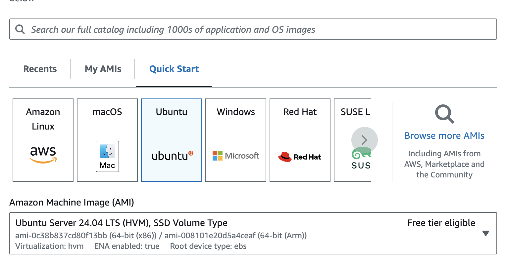

---
# User change
title: "Getting Started with AWS"

weight: 2 # 1 is first, 2 is second, etc.

# Do not modify these elements
layout: "learningpathall"
---
[Amazon Web Services (AWS)](https://aws.amazon.com/) is a public cloud computing platform. 

As with most cloud service providers, AWS offers a pay-as-you-use [pricing policy](https://aws.amazon.com/pricing/), including a number of [free](https://aws.amazon.com/free/) services.

This guide is to help you get started with [Amazon Elastic Compute Cloud (EC2)](https://aws.amazon.com/ec2/) compute services, using Arm-based [Graviton](https://aws.amazon.com/ec2/graviton/) processors. This is a general-purpose compute platform, essentially your own personal computer in the cloud.

Detailed instructions are available in the [Get started tutorial](https://docs.aws.amazon.com/AWSEC2/latest/UserGuide/EC2_GetStarted.html) from AWS.

## Create an account

Before you begin, create an account. For a personal account, click on [Create an AWS account](https://aws.amazon.com/), and follow the on-screen instructions to register. See the [Creating an AWS account documentation](https://docs.aws.amazon.com/accounts/latest/reference/manage-acct-creating.html) for full instructions.

If using an organization's account, you will likely need to consult with your internal administrator. See [this guide](https://docs.aws.amazon.com/organizations/latest/userguide/orgs_manage_accounts_create.html) for additional information.

## Browse for an appropriate instance

AWS offers a wide range of instance types, covering all performance (and pricing) points. For an overview of the Graviton instance types, see the [Instance Type Explorer](https://aws.amazon.com/ec2/instance-explorer/), and select `AWS Graviton` from the list of `Processors`. As a general rule, instances with a `g` at the end of their name (for example `M6g`) are Graviton based.

Then, select an `instance size`, which will be one of many pre-defined configurations of processors and available memory. If you are unsure what your compute needs are, don't worry, you can easily experiment with different configurations.

## Create your EC2 instance {#create}

The easiest way to launch your instance is via the [AWS Console](https://console.aws.amazon.com).

Note the `region` you have logged into (for example `us-east-1`) is displayed in the upper right corner. You can select a different location from the pull-down menu if your default region does not offer Graviton servers.


Navigate to the `EC2 Dashboard`, either by searching (`Alt+S`) for `EC2`, or via `Services` > `Compute` > `EC2`.


Use the `Launch instance` pull-down menu and select `Launch instance`.


### Name your instance {#name}

Give your instance a meaningful, but arbitrary, name. This is particularly useful when creating multiple instances.


### Select OS image

There are 1000s of [Amazon Machine Images (AMIs)](https://docs.aws.amazon.com/AWSEC2/latest/UserGuide/AMIs.html) available on the [AWS Marketplace](https://aws.amazon.com/marketplace), providing pre-configured setups.

For now, select `Ubuntu` images from the `Quick Start` list of available images, and version (e.g. `Ubuntu Server 24.04 LTS`) from the pull-down menu.


In the `Architecture` pull-down menu, select `64-bit (Arm)` to ensure an Arm-based instance type is used.

' Architecture")

### Select instance type

Select an appropriate `instance type` for your compute needs from the pull-down menu. There is a `Compare instance types` table available if you wish to quickly compare features of different types.


Scrolling down, there is an option to also `configure storage` if necessary.


### Set a Key Pair

To be able to access the instance, you must use a [key pair](https://docs.aws.amazon.com/AWSEC2/latest/UserGuide/ec2-key-pairs.html).

If this is your first time logging in, you will need to select `Create new key pair`. If you have an existing key pair, select it from the pull-down menu.


If creating a new key pair, name the key pair, then click `Create key pair`. This will initialize the key pair and save the private key to your local machine. Ensure that the private key is safe and accessible on your local machine. 


### Network settings

It is strongly recommended that you create (or use an existing) [security group](https://docs.aws.amazon.com/AWSEC2/latest/UserGuide/ec2-security-groups.html) to ensure that only users on your IP address can access your instance. Simple settings can be set here, such as selecting `My IP` from the `Allow SSH traffic from` pull-down menu. Other settings can be left as default.


For advanced settings, it is recommended that you search `security groups` and create and configure such a group in this dialog. You can then select that group when creating the instance.

### Launch instance

When all options are set, click `Launch instance` to get started. 


Your compute instance will be created and be available after initialization. Click the `Instance ID` to observe the `Instance state` and other details about your instance.


Once the `Instance state` reports that it is `Running`, you can connect to the instance. Click on the `Instance ID` to display the `Instance Summary` view which includes more details about your instance. You can also access this view from the list of `Instances` on the `EC2 dashboard`.


## Connect to your instance

You can interact with your instance via the browser (EC2 Instance Connect) or via an SSH terminal application.

### EC2 Instance Connect

In the `Instance summary` view, click `Connect`, and select the `EC2 Instance Connect` tab. Click the `Connect` button to open a terminal in the browser.


Once connected, you are now ready to use your instance.

### SSH client Connect

You can connect to the instance with your preferred SSH client. In the `Instance summary` view, click `Connect`, and select the `SSH client` tab to see the command used to launch the native SSH client.


For example if using `ubuntu` image:

```console
ssh -i <private_key> ubuntu@<public_ip_address>
```

{}
Replace `<private_key>` with the private key on your local machine and `<public_ip_address>` with the public IP of the target VM.
{}

Terminal applications such as [PuTTY](https://www.putty.org/), [MobaXterm](https://mobaxterm.mobatek.net/) and similar can be used.

Different Linux distributions have different default usernames you can use to connect. 

[Default usernames](https://docs.aws.amazon.com/AWSEC2/latest/UserGuide/connection-prereqs.html) for AMIs are listed in a table. Find your operating system and see the default username you should use to connect.

Once connected, you are now ready to use your instance.

## Explore your instance

### Run uname

Use the [uname](https://en.wikipedia.org/wiki/Uname) utility to verify that you are using an Arm-based server. For example:

```console
uname -m
```
will identify the host machine as `aarch64`.

### Run hello world

Install the `gcc` compiler. If you are using `Ubuntu`, use the following commands. If not, refer to the [GNU compiler install guide](/install-guides/gcc):

```console
sudo apt-get update
sudo apt install -y gcc
```

Using a text editor of your choice, create a file named `hello.c` with the contents below:

```C
#include <stdio.h>
int main(){
    printf("hello world\n");
    return 0;
}
```
Build and run the application:

```console
gcc hello.c -o hello
./hello
```

The output is shown below:

```output
hello world
```

## Automating Arm Based Infrastructure Deployment

Cloud infrastructure deployment is typically done via Infrastructure as code (IaC) automation tools. There are Cloud Service Provider specific tools like [AWS Cloud Formation](https://aws.amazon.com/cloudformation/). There are also Cloud Service Provider agnostic tools like [Terraform](https://www.terraform.io/).

There is a [Deploying Arm instances on AWS using Terraform](/learning-paths/servers-and-cloud-computing/aws-terraform) learning path that should be reviewed next.