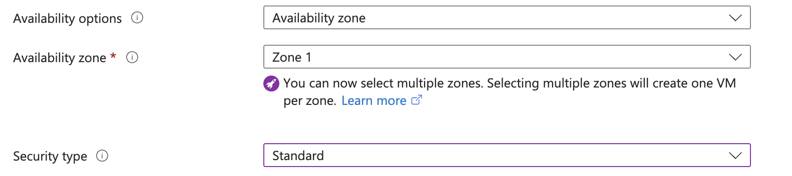
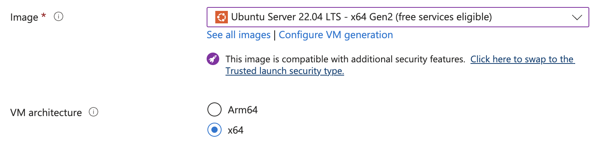
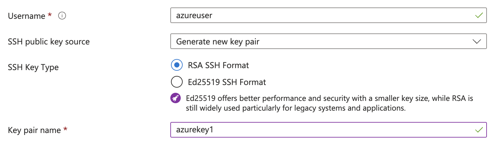

---
# User change
title: "Getting Started with Microsoft Azure"

weight: 3 # 1 is first, 2 is second, etc.

# Do not modify these elements
layout: "learningpathall"
---
[Microsoft Azure](https://azure.microsoft.com/) is a public cloud computing platform. 

As with most cloud service providers, Azure offers a pay-as-you-use [pricing policy](https://azure.microsoft.com/en-us/pricing/), including a number of [free](https://azure.microsoft.com/en-us/free/) services.

This guide is to help you get started with [Virtual Machines](https://azure.microsoft.com/en-us/products/virtual-machines/), using Arm-based VMs available in Azure. Microsoft Azure offers two generations of Arm-based VMs. The latest generation is based on [Azure Cobalt 100 processors](https://azure.microsoft.com/en-us/blog/azure-cobalt-100-based-virtual-machines-are-now-generally-available/). The previous generation VMs are based on [Ampere](https://azure.microsoft.com/en-us/blog/azure-virtual-machines-with-ampere-altra-arm-based-processors-generally-available/) processors. This is a general-purpose compute platform, essentially your own personal computer in the cloud.

Full [documentation and quickstart guides](https://learn.microsoft.com/en-us/azure/virtual-machines/) are available.

## Create an account

Before you begin, create an account. For a personal account, click on `Free account` or `Try Azure for free` on the [Azure homepage](https://azure.microsoft.com), and follow the on-screen instructions to log in or register as a new user. You can use an existing Microsoft account if you have one.

If using an organization's account, you will likely need to consult with your internal administrator.

Once logged in, you will be presented with the [Azure portal](https://portal.azure.com).

## Create your Virtual Machine (VM) instance

Locate [Virtual Machines](https://portal.azure.com/#view/HubsExtension/BrowseResource/resourceType/Microsoft.Compute%2FVirtualMachines) from the list of `Azure Services`, then click `Create` > `Azure virtual machine`.

You will be presented with the `Create a virtual machine` dialog.


## Project details

This section is used to separate instances, usually for internal budgeting or access permissions. 

If a `Resource group` to contain your VMs does not yet exist, click on `Create new`. If you do not create a group, a new one will automatically be created based on your first VM name.


## Instance details

This section defines key configuration details of the virtual machine.

### Virtual machine name

Give your virtual machine (VM) a meaningful, but arbitrary name. This is especially useful if you intend to create multiple VMs.


### Region

This is the location of the server where your VM will reside. While it is generally recommended to select a region closest to your location, not all regions may support Arm-based servers. You may need to change region to get access to such a server.


### Availability options / Security type

These are reliability and security settings. They can generally be left as default.



### Image

This is the operating system that will run on your VM. Select the appropriate one from the pull-down. Some will have additional pricing associated with them. 



You can then select a particular version of your preferred OS from the `Select` pull-down of that OS tab.


Note that if a `Windows` operating system is selected, the user must have an appropriate license. See the [Azure documentation](https://learn.microsoft.com/en-us/azure/virtual-machines/windows/windows-desktop-multitenant-hosting-deployment) for information.

### VM architecture

If not enabled automatically based on the above image, select `Arm64` for an Arm-based operating system. This will update the `Size` pull-down (see below) to present Arm-based servers.


### Run with Azure Spot discount

This is a low-cost pricing option. See [Azure documentation](https://learn.microsoft.com/en-us/azure/virtual-machines/spot-vms) for details. This does not affect the deployment of the virtual machine.


### Size

Select an appropriate [size](https://learn.microsoft.com/en-us/azure/virtual-machines/sizes) for your compute needs from the pull-down.


## Administrator account

This section defines how users [connect](https://learn.microsoft.com/en-us/azure/virtual-machines/linux-vm-connect) to the VM instance.

### Authentication type (Linux systems)

 `SSH public key` is the most common and recommended choice.



 ### Username

 Create an appropriate username. The default username is `azureuser`. Windows VMs will also require a password to be set.


 ### SSH public key resource / Key pair name (Linux systems)

 Use an existing key pair or generate a new one, as defined by `Key pair name`. If `Generate new key pair` is selected, your private key will be generated during the [Create](#create-instance) step.


## Inbound port rules

These settings can be used to limit access to your VM. See the documentation for more info. This can generally be left as default. You can connect to Linux machines using SSH. You can connect to Windows machines using Remote Desktop Protocol (RDP).


## Licensing (Windows only)

Tick the box to confirm you have an appropriate license to deploy a Windows virtual machine. See the [Azure documentation](https://learn.microsoft.com/en-us/azure/virtual-machines/windows/windows-desktop-multitenant-hosting-deployment) for information.

## Other settings

There are other tabs defining many advanced settings. They can generally be left as default.


## Create instance

When the VM settings are to your liking, click on `Review + create`. Your settings will be validated by Azure. If valid, click on `Create` to create your VM instance.


After a short time, the VM will be created. Click on `Go to resource` to see various parameters, particularly the `Public IP address`.

## Connect to your VM instance (Linux) {#linux}

These instructions are for Linux-based virtual machines. If you are using a Windows-based virtual machine, please jump to the [Windows section](#windows).

You can connect to the instance with your preferred SSH client. For example, if using the default username `azureuser`:

```console
ssh -i <private_key> azureuser@<public_ip_address>
```

{}
Replace `<private_key>` with the private key on your local machine and `<public_ip_address>` with the public IP of the target VM.
{}

You will also see this command under the `Connect` > `SSH` tab.

Terminal applications such as [PuTTY](https://www.putty.org/), [MobaXterm](https://mobaxterm.mobatek.net/) and similar can be used.

Once connected, you are now ready to use your instance.

## Explore your instance (Linux)

### Run uname

Use the [uname](https://en.wikipedia.org/wiki/Uname) utility to verify that you are using an Arm-based server. For example:

```console
uname -m
```
will identify the host machine as `aarch64`.

### Run hello world

Install the `gcc` compiler. If you are using `Ubuntu`, use the following commands. If not, refer to the [GNU compiler install guide](/install-guides/gcc):

```console
sudo apt-get update
sudo apt install -y gcc
```

Using a text editor of your choice, create a file named `hello.c` with the contents below:

```C
#include <stdio.h>
int main(){
    printf("hello world\n");
    return 0;
}
```
Build and run the application:

```console
gcc hello.c -o hello
./hello
```

The output is shown below:

```output
hello world
```

## Connect to your VM instance (Windows) {#windows}

These instructions are for Windows-based virtual machines. If you are using a Linux-based virtual machine, please jump to the [Linux section](#linux).

On your local host PC, launch the `Remote Desktop Connection` application.

Enter the `Public IP Address` of the Windows VM as the `Computer` to be connected to. Username can also be specified.

You will be prompted for the user password (set earlier), and you will connect. Once connected, you are now ready to use your instance. You can interact with the VM in the same way as you would a local desktop.

## Explore your instance (Windows)

Open `Control Panel` > `System` and verify that `Device` > `System Type` identifies as an Arm-based processor.

## Automating Arm Based Infrastructure Deployment

Cloud infrastructure deployment is typically done via Infrastructure as code (IaC) automation tools. There are Cloud Service Provider specific tools like [Azure Resource Manager](https://learn.microsoft.com/en-us/azure/azure-resource-manager/templates/overview) and the open source tool [Bicep](https://learn.microsoft.com/en-us/azure/azure-resource-manager/bicep/overview).

There are also Cloud Service Provider agnostic tools like [Terraform](https://www.terraform.io/). There is a [deploying Arm instances on Azure using Terraform learning path](/learning-paths/servers-and-cloud-computing/azure-terraform) that should be reviewed next.
