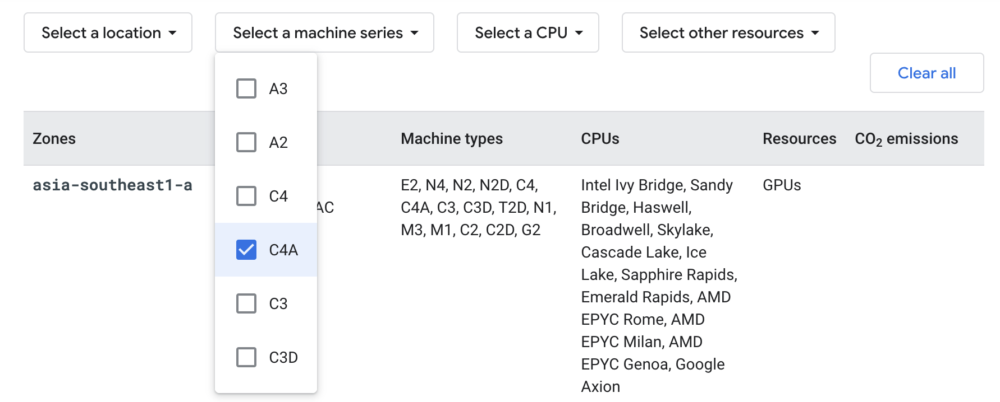
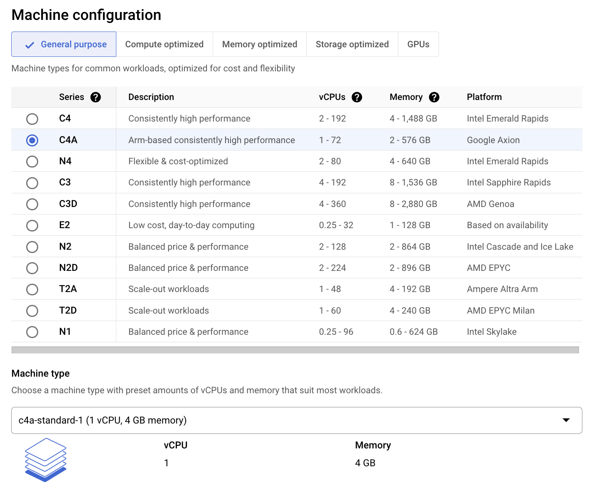

---
# User change
title: "Getting Started with Google Cloud Platform"

weight: 4 # 1 is first, 2 is second, etc.

# Do not modify these elements
layout: "learningpathall"
---
[Google Cloud](https://cloud.google.com/) is a public cloud computing platform. 

As with most cloud service providers, Google Cloud offers a pay-as-you-use [pricing policy](https://cloud.google.com/pricing), including a number of [free](https://cloud.google.com/free/docs/free-cloud-features) services.

This section is to help you get started with [Google Cloud Compute Engine](https://cloud.google.com/compute) compute services, using Arm-based Virtual Machines. Google Cloud offers two generations of Arm-based VMs, `C4A` is the latest generation based on [Google Axion](https://cloud.google.com/products/axion), Google’s first Arm-based server processor, built using the Armv9 Neoverse V2 CPU. The previous generation VMs are based on Ampere Altra processor and part of [Tau T2A](https://cloud.google.com/tau-vm) family of Virtual Machines. 

Detailed instructions are available in the Google Cloud [documentation](https://cloud.google.com/compute/docs/instances). 

## Create an account

Before you begin, create an account. For a personal account, click on [Get started for free](https://cloud.google.com/), and follow the on-screen instructions to register. You can use an existing Google account if you have one.

If using an organization's account, you will likely need to consult with your internal administrator. See [this guide](https://docs.aws.amazon.com/organizations/latest/userguide/orgs_manage_accounts_create.html) for additional information.

## Browse for an appropriate instance

Google Cloud offers a wide range of instance types, covering all performance (and pricing) points. For an overview of the `C4A` instance types, see the [General-purpose machine family](https://cloud.google.com/compute/docs/general-purpose-machines#c4a_series). Similarly, to know more about the `T2A` instance types, see this [page](https://cloud.google.com/compute/docs/general-purpose-machines#t2a_machines). 

Also note which [regions](https://cloud.google.com/compute/docs/regions-zones#available) these servers are available in.

## Create your Compute Engine instance

The easiest way to launch your instance is via the [Google Cloud Console](https://console.cloud.google.com). Activities can be separated by `Project`. By default, when you first login, you will be in `My First Project`. If you wish to rename this, navigate to `IAM & Admin` > `Settings`, and rename. You can also create new project(s) from the pull-down menu, or [directly](https://console.cloud.google.com/projectcreate).

Select `Compute Engine` from the `Quick access` section, if shown. Else navigate to `Compute Engine` > `VM instances`. If it is your first time, you will be prompted to enable `Compute Engine API`. Go to the [VM instances](https://console.cloud.google.com/compute/instances) area of the console.

Click the `CREATE INSTANCE` button.


### Name your instance

Give your instance a meaningful, but arbitrary, name. This is particularly useful when creating multiple instances. You can optionally add [labels](https://cloud.google.com/resource-manager/docs/creating-managing-labels) as additional identifiers.


### Select Region and Zone for your instance.

Select an appropriate `region` and `zone` that support Arm-based servers.


To view the latest information on which available regions and zones support Arm-based servers, see the [Compute Engine documentation](https://cloud.google.com/compute/docs/regions-zones#available). To filter for Arm-based machines, click on `Select a machine type`, then select `C4A` or `T2A` from the pull-down menu.



### Machine configuration

Select `C4A` from the `Series` pull-down menu. Then select an appropriate `Machine type` configuration for your needs.



### Boot disk configuration

Click the `CHANGE` button if you wish to change the virtual disk size, or the operating system or version, for example to `Ubuntu 24.04 LTS`. Be sure to select Arm compatible image.


## Security and SSH key pair

By default, you can access your instance via the browser. If you wish to use an SSH terminal, you must [create](https://cloud.google.com/compute/docs/connect/create-ssh-keys) and [add](https://cloud.google.com/compute/docs/connect/add-ssh-keys) an appropriate SSH key pair.


### Other options

Other options, such as `Confidential VM service`, can optionally be enabled. For now, leave as default (disabled). See the Google Cloud documentation for an explanation of these configurations.

When satisfied, click `CREATE`. After a few moments the instance will be available and listed in your [console](https://console.cloud.google.com/compute/instances).


## Connect to your instance

You can interact with your instance via the browser (SSH-in-browser) or via an SSH terminal application.

### SSH-in-browser Connect

Once running, the IP address will be displayed, and you are able to connect to the instance.

Select `Open in browser window` from the `SSH` pull-down to open an SSH shell directly.


Once connected, you are now ready to use your instance.

### SSH client Connect

If an SSH key pair was set, connect to the instance with your preferred SSH client. For example, if using `ubuntu` image:

```console
ssh -i <private_key> ubuntu@<public_ip_address>
```

{}
Replace `<private_key>` with the private key on your local machine and `<public_ip_address>` with the public IP of the target VM.
{}

Terminal applications such as [PuTTY](https://www.putty.org/), [MobaXterm](https://mobaxterm.mobatek.net/) and similar can be used.

Once connected, you are now ready to use your instance.

## Explore your instance

### Run uname

Use the [uname](https://en.wikipedia.org/wiki/Uname) utility to verify that you are using an Arm-based server. For example:

```console
uname -m
```
will identify the host machine as `aarch64`.

### Run hello world

Install the `gcc` compiler. If you are using `Ubuntu`, use the following commands. If not, refer to the [GNU compiler install guide](/install-guides/gcc):

```console
sudo apt-get update
sudo apt install -y gcc
```
Using a text editor of your choice, create a file named `hello.c` with the contents below:

```C
#include <stdio.h>
int main(){
    printf("hello world\n");
    return 0;
}
```
Build and run the application:

```console
gcc hello.c -o hello
./hello
```

The output is shown below:

```output
hello world
```

## Automating Arm Based Infrastructure Deployment

Cloud infrastructure deployment is typically done via Infrastructure as code (IaC) automation tools. There are Cloud Service Provider specific tools like [Google Cloud Deployment Manager](https://cloud.google.com/deployment-manager/docs/).

There are also Cloud Service Provider agnostic tools like [Terraform](https://www.terraform.io/).There is a [deploying Arm VMs on (GCP) using Terraform learning path](/learning-paths/servers-and-cloud-computing/gcp) that should be reviewed next.
