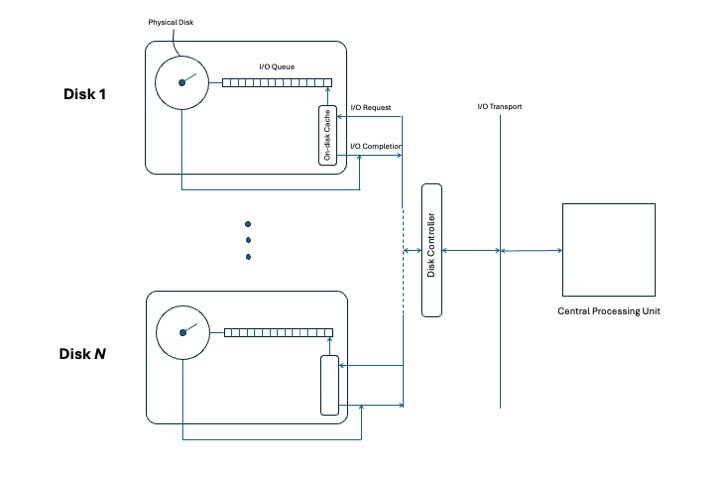

## Introduction

Performance-sensitive application data - such as frequently-accessed configuration files, logs, or transactional state - should ideally reside in system memory (RAM) or CPU cache, where data access latency is measured in nanoseconds to microseconds. These are the fastest tiers in the memory hierarchy, enabling rapid read and write operations that reduce latency and improve throughput. 

However, random-access memory (RAM) has the following constraints:

* It is volatile - data is lost on power down.
* It is limited in capacity.
* It is more expensive per gigabyte than other storage types. 

For these reasons, most applications also rely on solid-state drives (SSDs) or hard disk drives (HDDs).

## High-level view of data flow

The diagram below shows a high-level view of how data moves to and from storage in a multi-disk I/O architecture. Each disk (Disk 1 to Disk N) has its own I/O queue and optional disk cache, communicating with a central CPU through a disk controller. 

While memory is not shown, it plays a central role in providing fast temporary access between the CPU and persistent storage. Likewise, file systems (also not depicted) run in the OS kernel and manage metadata, access permissions, and user-friendly file abstractions. 

This architecture has the following benefits:

* It enables parallelism in I/O operations.
* It improves throughput.
* It supports scalability across multiple storage devices.

## Key Terms

#### Sectors and Blocks

* *Sectors* are the smallest physical storage units, typically 512 or 4096 bytes. Many modern drives use 4K sectors for better error correction and efficiency.

* *Blocks* are logical groupings of one or more sectors used by file systems, typically 4096 bytes in size. A block might span multiple 512-byte sectors or align directly with 4K physical sectors if supported by the device.

#### Input/Output Operations per Second (IOPS)

IOPS measures how many random read/write requests your storage system can perform per second. It depends on the block size or device type. For example, AWS does not show IOPS values for traditional HDD volumes, as shown in the image below:

#### Throughput and bandwidth

* *Throughput* is the data transfer rate, usually measured in MB/s. 

* *Bandwidth* is the maximum potential transfer rate of a connection.

You can calculate storage `throughput as IOPS × block size`.

#### Queue depth

*Queue depth* is the number of I/O operations a device can process concurrently. Consumer SSDs typically support a queue depth of 32–64, while enterprise-class NVMe drives can support hundreds to thousands of concurrent requests per queue. Higher queue depths allow more operations to be handled simultaneously, which can significantly boost throughput on high-performance drives — especially NVMe SSDs with advanced queuing capabilities.
 
#### I/O engine

The I/O engine is the software layer in Linux that manages I/O requests between applications and storage. For example, the Linux kernel's block I/O scheduler queues and dispatches requests to device drivers, using multiple queues to optimize disk access. Benchmarking tools like `fio` let you choose different I/O engines:

* `sync` – Performs blocking I/O operations using standard system calls. Simple and portable, but less efficient under high concurrency.
* `libaio` – Uses Linux's native asynchronous I/O interface (`io_submit`/`io_getevents`) for non-blocking operations with lower overhead than `sync`.
* `io_uring` – A modern, high-performance async I/O API introduced in Linux 5.1. It minimizes syscalls and context switches, and supports advanced features like buffer selection and batched submissions.

 
#### I/O wait

I/O wait is the time a CPU core spends waiting for I/O operations to complete. Tools like `pidstat`, `top`, and `iostat` can help identify storage-related CPU bottlenecks.
