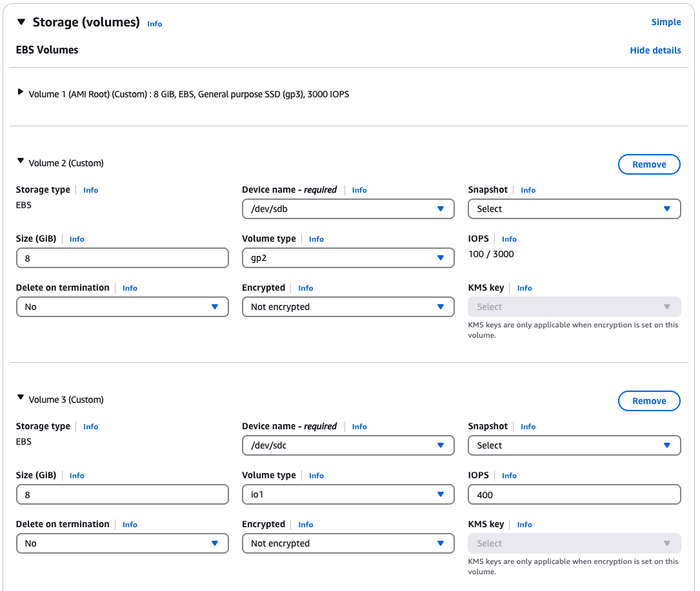
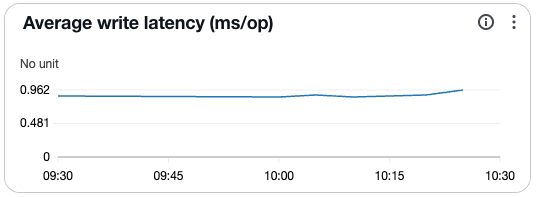

## Install fio

You can use the same `t4g.medium` instance from the previous section with 2 different types of SSD-based block storage devices as per the console screenshot below. 

To add the required EBS volumes to your EC2 instance:

1. In the AWS Console, navigate to EC2 > Volumes > Create Volume
2. Create a volume with the following settings:
   - Volume Type: io2 (Provisioned IOPS SSD)
   - Size: 8 GiB
   - IOPS: 400
   - Availability Zone: Same as your EC2 instance
3. Create another volume with the following settings:
   - Volume Type: gp2 (General Purpose SSD)
   - Size: 8 GiB
   - Availability Zone: Same as your EC2 instance
4. Once created, select each volume and choose Actions > Attach Volume
5. Select your t4g.medium instance from the dropdown and attach each volume

Both block devices have the same, 8GiB capacity but the `io2` is geared towards throughput as opposed to the general purpose SSD `gp2`. 



In this section you will observe what the real-world performance for your workload is so that it can inform your selection.

Flexible I/O (fio) is a command-line tool to generate a synthetic workload with specific I/O characteristics. This serves as a simpler alternative to full record and replay testing. Fio is available through most Linux distribution packages, please refer to the [documentation](https://github.com/axboe/fio) for the binary package availability.

```bash
sudo apt update
sudo apt install fio -y
```

Confirm installation with the following commands. 

```bash
fio --version
```

The version is printed:

```output
fio-3.37
```

## Locate Device 

Fio allows you to microbenchmark either the block device or a mounted filesystem. Use the disk free, `df` command to confirm your EBS volumes are not mounted. Writing to drives that hold critical information may cause issues. Hence you are writing to blank, unmounted block storage device.

Use the `lsblk` command to view the EBS volumes attached to the server (`nvme1n1` and `nvme2n1`). The immediate number appended to `nvme`, e.g., `nvme0`, shows it is a physically separate device. `nvme1n1` corresponds to the faster `io2` block device and `nvme2n1` corresponds to the slower `gp2` block device. 

```bash
lsblk -e 7
```

```output
NAME         MAJ:MIN RM  SIZE RO TYPE MOUNTPOINTS
nvme1n1      259:0    0    8G  0 disk 
nvme0n1      259:1    0    8G  0 disk 
├─nvme0n1p1  259:3    0    7G  0 part /
├─nvme0n1p15 259:4    0   99M  0 part /boot/efi
└─nvme0n1p16 259:5    0  923M  0 part /boot
nvme2n1      259:2    0    8G  0 disk 
```

{}
If you have more than 1 block volumes attached to an instance, the `sudo nvme list` command from the `nvme-cli` package can be used to differentiate between volumes
{}

## Generating a Synthetic Workload

Suppose you want to simulate a fictional logging application with the following characteristics observed using the tools from the previous section. 

{}
The logging workload has light sequential read and write characteristics. The system write throughput per thread is 5 MB/s with 83% writes. There are infrequent bursts of reads for approximately 5 seconds, operating at up to 16MB/s per thread. The workload can scale the infrequent reads and writes to use up to 16 threads each. The block size for the writes and reads are 64KiB and 256KiB respectively (as opposed to the standard 4KiB Page size). 

Further, the application is latency sensitive and given it holds critical information, needs to write directly to non-volatile storage through direct IO. 
{}

The fio tool uses simple configuration `jobfiles` to describe the characteristics of your synthetic workload. Parameters under the `[global]` option are shared among jobs. From the example below, you can create 2 jobs to represent the steady write and infrequent reads. Please refer to the official [documentation](https://fio.readthedocs.io/en/latest/fio_doc.html#job-file-format) for more details. 

Copy and paste the configuration file below into 2 files named `nvme<x>.fio`. Replace the `<x>` with the block devices you are comparing and adjust the `filename` parameter accordingly. 

```ini
 ; -- start job file including.fio --
[global]
ioengine=libaio
direct=1 ; write directly to the drive
time_based
runtime=30
group_reporting=1
log_avg_msec=1000
rate=16m,5m ; limit to 16 MB/s and 5MB/s for read and write per job
numjobs=${NUM_JOBS} ; set at the command line
iodepth=${IO_DEPTH} ; set at the command line
filename=/dev/nvme1n1 ; or nvme2n1

[steady_write]
name=steady_write
rw=write ; sequential write
bs=64k ; Block size of 64KiB (default block size of 4 KiB)

[burst_read]
name=burst_read
rw=read
bs=256k ; Block size of 256KiB for reads (default is 4KiB)
startdelay=10 ; simulate infrequent reads (5 seconds out 30)
runtime=5
; -- end job file including.fio --
```


{}
Running fio directly on block devices requires root privileges (hence the use of `sudo`). Be careful: writing to the wrong device can result in data loss. Always ensure you are targeting a blank, unmounted device.
{}

Run the following commands to run each test back to back.  

```bash
sudo NUM_JOBS=16 IO_DEPTH=64 fio nvme1.fio
```

Then run again with the following command:

```bash
sudo NUM_JOBS=16 IO_DEPTH=64 fio nvme2.fio 
```

### Interpreting Results

The final terminal output from both runs are shown below. 

```output
nvme1:

Run status group 0 (all jobs):
   READ: bw=118MiB/s (124MB/s), 118MiB/s-118MiB/s (124MB/s-124MB/s), io=629MiB (660MB), run=5324-5324msec
  WRITE: bw=80.0MiB/s (83.9MB/s), 80.0MiB/s-80.0MiB/s (83.9MB/s-83.9MB/s), io=2400MiB (2517MB), run=30006-30006msec

Disk stats (read/write):
  nvme1n1: ios=2663/38225, sectors=1294480/4892800, merge=0/0, ticks=148524/454840, in_queue=603364, util=62.19%

nvme2:

Run status group 0 (all jobs):
   READ: bw=85.6MiB/s (89.8MB/s), 85.6MiB/s-85.6MiB/s (89.8MB/s-89.8MB/s), io=456MiB (478MB), run=5322-5322msec
  WRITE: bw=60.3MiB/s (63.2MB/s), 60.3MiB/s-60.3MiB/s (63.2MB/s-63.2MB/s), io=1816MiB (1904MB), run=30119-30119msec

Disk stats (read/write):
  nvme2n1: ios=1872/28855, sectors=935472/3693440, merge=0/0, ticks=159753/1025104, in_queue=1184857, util=89.83%
```

Here you can see that the faster `io2` block storage (`nvme1`) is able to meet the throughput requirement of 80MB/s for steady writes when all 16 write threads are running (5MB/s per thread). However, `gp2` saturates at 60.3 MiB/s with over 89.8% SSD utilization. 

Suppose your fictional logging application is sensitive to operation latency. The output below highlights that over ~35% of operations have a latency above 1s on nvme2 compared to ~7% on nvme1. High latency percentiles can significantly impact application responsiveness, especially for latency-sensitive workloads like logging.

```output

  nvme2:

  lat (usec)   : 10=0.01%, 500=1.53%, 750=5.13%, 1000=7.55%
  lat (msec)   : 2=29.49%, 4=0.89%, 10=0.09%, 20=0.02%, 50=0.21%
  lat (msec)   : 100=0.56%, 250=1.84%, 500=6.39%, 750=9.76%, 1000=10.17%
  lat (msec)   : 2000=19.59%, >=2000=6.77%

  nvme1:

  lat (usec)   : 750=0.44%, 1000=0.41%
  lat (msec)   : 2=62.63%, 4=1.12%, 10=0.34%, 20=1.61%, 50=3.91%
  lat (msec)   : 100=2.34%, 250=5.91%, 500=8.46%, 750=4.33%, 1000=2.50%
  lat (msec)   : 2000=3.62%, >=2000=2.38%
```

These insights suggest the SSD designed for throughput, `io2`, is more suitable than the general purpose `gp2` storage to meet the requirements of your logging application.

{}
If the text output is hard to follow, you can use the `fio2gnuplot` package to plot the data graphically or use the visualizations available from your cloud service provider's dashboard. See image below for an example. 

 
{}

The insights gathered by microbenchmarking with fio above can lead to more informed decisions about which block storage to connect to your Arm-based instance.


