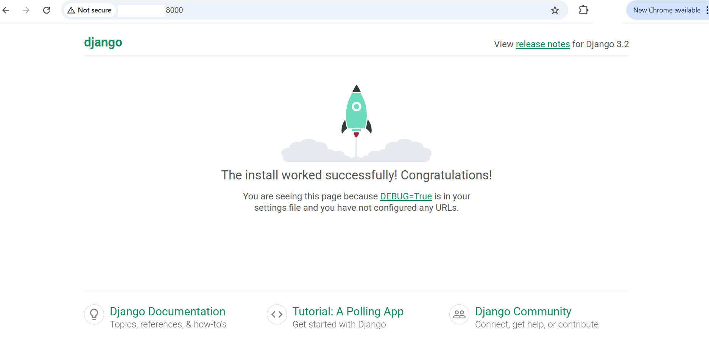
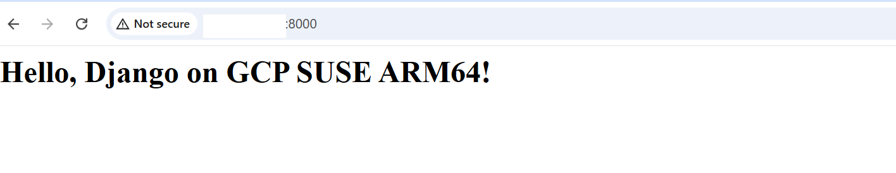

## Django Baseline Testing on GCP SUSE VMs
This baseline testing guide verifies that your **Django installation**, **web server**, and **basic application routing** are functioning correctly on a **Google Cloud SUSE Linux Arm64 (Axion C4A)** virtual machine.  
You will first run the Django development server and access it from your browser, then create a simple Django app to ensure routing works.

### Baseline 1 — View Django Welcome Page
This test confirms that Django is installed correctly and the server runs successfully.

#### Create a new Django project
Run the following command to create a new Django project named `myproject`:

```console
django-admin startproject myproject
cd myproject
```

This generates the following directory structure:

```markdown
myproject/
├── manage.py
└── myproject/
    ├── settings.py
    ├── urls.py
    ├── asgi.py
    └── wsgi.py
```
- `manage.py` is Django’s command-line utility for project management (running server, migrations, etc.).
- The inner `myproject/` folder contains the core configuration files that define your project’s settings and URLs.-

#### Run initial migrations
Migrations prepare your project’s database by creating the required tables for Django’s internal apps (admin, authentication, etc.):

```console
python3 manage.py migrate
```

You should get output showing the Running Migrations (all of which should be "OK").

#### Start the Django development server
Before starting the Django development server, you must configure your ALLOWED_HOSTS setting to allow access from your VM’s external IP.
This ensures that Django accepts HTTP requests from outside the localhost (e.g., when testing in a browser or from another machine).

**ALLOWED_HOSTS:** is a security setting in Django that defines which host/domain names your Django site can serve.

- Navigate to Your Project Settings
  Move into your Django project directory where the settings.py file is located.

  ```console
  cd ~/myproject/myproject/
  ```

- Open settings.py File
  Use any text editor (like vi or nano) to open the file ("edit" is used as an example below).

  ```console
  edit myproject/settings.py
  ```
  
- Locate the `ALLOWED_HOSTS` Line
  Inside the file, find the following line:

   ```python
  ALLOWED_HOSTS = []
  ```
 This setting defines which host/domain names Django will serve.

- Allow All Hosts (for Testing Only)
  To make your Django app accessible from your VM’s external IP address, update it to:
  ```python
  ALLOWED_HOSTS = ['*']
  ```
{}
Allowing all hosts `('*')` is suitable **only for development or testing**.
For production, replace `'*'` with specific domain names or IPs, such as your public IP address for your VM that you recorded earlier:
{}

```python
ALLOWED_HOSTS = ['your-external-ip', 'your-domain.com']
```

**Now start the Django development server:**

We can now start the Django development server since we have exposed TCP/8000 in our VM via firewall rules: 
```console
python3 manage.py runserver 0.0.0.0:8000
```

#### View in browser
Open a web browser on your local machine (Chrome, Firefox, Edge, etc.) and enter the following URL in the address bar. Please replace "YOUR_VM_EXTERNAL_IP" with the external IP address of your VM that you saved off earlier:

```console
http://<YOUR_VM_EXTERNAL_IP>:8000
```
- Replace `<YOUR_VM_EXTERNAL_IP>` with the public IP of your GCP VM.

If everything is set up correctly, you should see the default Django welcome page (“The install worked successfully!”). It looks like this:



### Baseline 2 — Create a Simple Django App
This test ensures Django’s application routing and view rendering work as expected.

#### Stop the server
Press `Ctrl + C` to stop the Django server if running.

#### Create a new app
Within your Django project directory, create a new app named `hello`:

```console
python3 manage.py startapp hello
```

**This creates the following directory:**

```markdown
hello/
├── admin.py
├── apps.py
├── models.py
├── tests.py
├── views.py
└── urls.py
```

#### Create a simple view
Edit `hello/views.py`. Replace your existing file with this:

```python
from django.http import HttpResponse

def home(request):
    return HttpResponse("<h1>Hello, Django on GCP SUSE ARM64!</h1>")
```
This defines a simple view function that sends a basic HTML message as the HTTP response.

#### Create app URL configuration
Create a new file `hello/urls.py` and add:

```python
from django.urls import path
from . import views

urlpatterns = [
    path('', views.home, name='home'),
]
```
This maps the root URL `(/)`of your app to the `home()` view function.

#### Link the app to the main project
Replace your default `myproject/urls.py` file with this version.

```python
"""myproject URL Configuration

The `urlpatterns` list routes URLs to views. For more information please see:
    https://docs.djangoproject.com/en/3.2/topics/http/urls/
Examples:
Function views
    1. Add an import:  from my_app import views
    2. Add a URL to urlpatterns:  path('', views.home, name='home')
Class-based views
    1. Add an import:  from other_app.views import Home
    2. Add a URL to urlpatterns:  path('', Home.as_view(), name='home')
Including another URLconf
    1. Import the include() function: from django.urls import include, path
    2. Add a URL to urlpatterns:  path('blog/', include('blog.urls'))
"""

from django.contrib import admin
from django.urls import path, include

urlpatterns = [
    path('admin/', admin.site.urls),
    path('', include('hello.urls')),
]
```
This tells Django to delegate routing for the root path (`''`) to the `hello` app’s URLs.

#### Add the app to settings
This makes Django aware of your new app so it can load its configuration and routes.
Edit `myproject/settings.py` → add `'hello'` to INSTALLED_APPS:

```python
INSTALLED_APPS = [
    'django.contrib.admin',
    'django.contrib.auth',
    'django.contrib.contenttypes',
    'django.contrib.sessions',
    'django.contrib.messages',
    'django.contrib.staticfiles',
    'hello',
]
```
#### Run the server again

```console
python3 manage.py runserver 0.0.0.0:8000
```

#### Test your app
Open in browser:

```console
http://<YOUR_VM_IP>:8000
```
You should see the Django app. It looks like this:


