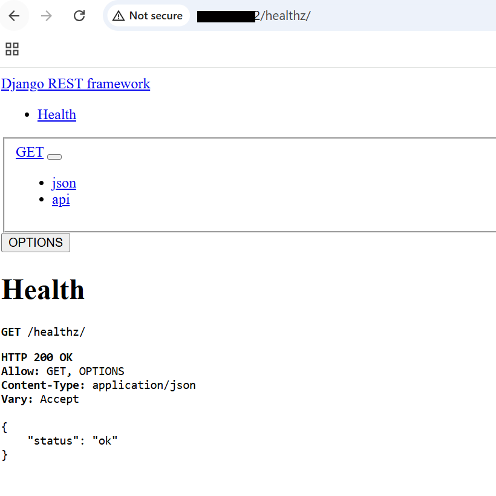

## Containerize and Deploy Django on Axion GKE
This guide converts your Django REST API into a **production-grade Arm64 container** and deploys it on **Axion-powered Google Kubernetes Engine (GKE)**.  
You will validate that the workload runs **natively on Arm** and is **publicly accessible** via a cloud Load Balancer.

### Create Docker Image
This step packages your Django API and all its dependencies into a **portable container image** that can run on any Axion Arm64 node.

Create a file called: `requirements.txt` and insert the following:

```text
django
djangorestframework
psycopg2-binary
django-redis
gunicorn
```

Create a file called `Dockerfile` and insert the following:

```dockerfile
FROM python:3.11-slim
WORKDIR /app
COPY . .
RUN pip install --no-cache-dir -r requirements.txt
CMD ["gunicorn","django_api.wsgi:application","--bind","0.0.0.0:8000","--workers","3"]
```

You now have a container blueprint that can run Django in production using Gunicorn on Arm64.

### Build and Push
This builds the image on an Arm machine and pushes it to Artifact Registry, ensuring Kubernetes pulls an Arm-native image:

(Please replace PROJECT_ID with your current project)

Build the docker image first:

```console
docker build -t us-central1-docker.pkg.dev/PROJECT_ID/django-arm/api:1.0 .
```

Then, push the built image:

```console
docker push us-central1-docker.pkg.dev/PROJECT_ID/django-arm/api:1.0
```

Your Django API is now stored in Google’s private container registry and ready for GKE.

### Deploy to GKE
Kubernetes Deployments define how many containers run and where. The nodeSelector forces pods onto Axion ARM64 nodes.

First, make a directory:

```console
mkdir ./k8s
```

Next, let's create `k8s/deployment.yaml` file with the following contents (replace PROJECT_ID with your current project):

```python
apiVersion: apps/v1
kind: Deployment
metadata:
  name: django-api
spec:
  replicas: 2
  selector:
    matchLabels:
      app: django-api
  template:
    metadata:
      labels:
        app: django-api
    spec:
      nodeSelector:
        kubernetes.io/arch: arm64
      containers:
      - name: django
        image: us-central1-docker.pkg.dev/PROJECT_ID/django-arm/api:1.0
        ports:
        - containerPort: 8000
        env:
        - name: DJANGO_SETTINGS_MODULE
          value: django_api.settings
```

**Apply:**

```console
kubectl apply -f k8s/deployment.yaml
```

**Verify pods are running on Axion Arm nodes:**

```console
kubectl get pods -o wide
```

Pods must show nodes like:
```output
NAME                          READY   STATUS    RESTARTS   AGE     IP         NODE                                                NOMINATED NODE   READINESS GATES
django-api-XXXXXX   1/1     Running   0          3h52m   10.0.2.9   gke-django-axion-cluster-axion-pool-xxxxxxx   <none>           <none>
django-api-XXXXXX   1/1     Running   0          3h52m   10.0.1.9   gke-django-axion-cluster-axion-pool-xxxxxxx   <none>           <none>
```
Your Django API is now running as replicated containers on Axion Arm64 nodes.

### Create Kubernetes Service (LoadBalancer)
A Service exposes your pods to the internet using **Google Cloud’s managed load balancer**.

Create `k8s/service.yaml`:

```python
apiVersion: v1
kind: Service
metadata:
  name: django-api
spec:
  type: LoadBalancer
  selector:
    app: django-api
  ports:
  - port: 80
    targetPort: 8000
```
Your Django service is now publicly reachable.

```console
kubectl apply -f k8s/service.yaml
```

### Validate Public Access

```console
kubectl get svc django-api
```

```output
NAME         TYPE           CLUSTER-IP       EXTERNAL-IP   PORT(S)        AGE
django-api   LoadBalancer   34.118.226.245   34.45.23.92   80:31700/TCP   3h57m
```

Please wait until the EXTERNAL-IP field gets populated! It will be needed in the next step. 

### Validate public access

Open the following URL in browser:

```bash
http://<EXTERNAL-IP>/healthz/
```

You should see output similar to the following:



Your Arm-based Django API is live on the internet.

### What you’ve accomplished
You have deployed a fully cloud-native, Arm-optimized application:

- Django REST API
- Running on Axion Arm64
- Exposed through Google Cloud LoadBalancer
- Backed by Cloud SQL PostgreSQL
- Accelerated by Memorystore Redis
- Delivered via Artifact Registry

This is a real production architecture running on Arm in GCP.
