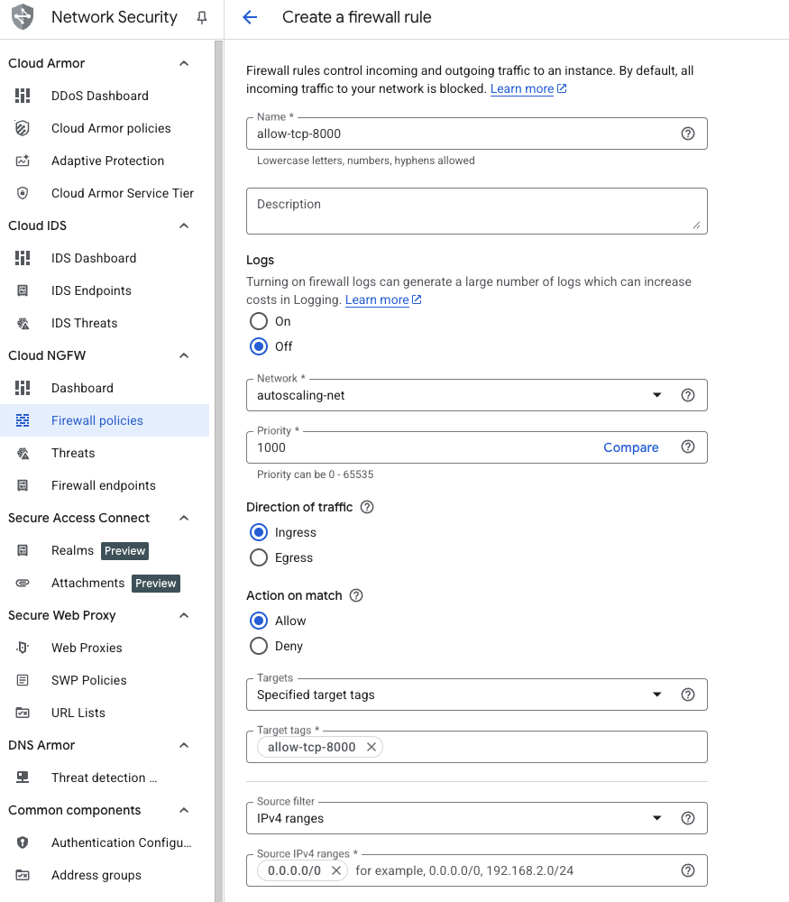

## Open port 8000 for your Django application

Before you can access your Django development server from your browser, you need to configure Google Cloud's firewall to allow inbound traffic on port 8000. This section walks you through creating a firewall rule that permits HTTP requests to reach your VM.

{}
For support on GCP setup, see the Learning Path [Getting started with Google Cloud Platform](/learning-paths/servers-and-cloud-computing/csp/google/).
{}

## Create a firewall rule in Google Cloud Console

Navigate to the Google Cloud Console and create a new firewall rule:

- Go to the **Google Cloud Console**
- Select **VPC network** > **Firewall**
- Select **Create firewall rule**

## Configure the firewall rule

Fill in the rule details to allow traffic on port 8000:

- Set **Name** to `allow-tcp-8000`.
- Select your network (the default is `default`; your organization may use a different network).
- Set **Direction of traffic** to **Ingress**.
- Set **Action on match** to **Allow**.
- Set **Targets** to **Specified target tags**.
- Enter `allow-tcp-8000` in the **Target tags** field.
- Set **Source IPv4 ranges** to `0.0.0.0/0` (allows traffic from any IP address; restrict this in production).

## Specify the port and protocol

Configure the protocol and port settings:

- Under **Protocols and ports**, select **Specified protocols and ports**.
- Check the **TCP** checkbox.
- Enter `8000` in the **Ports** field.
- Click **Create**.

## Summary and what's next

Your firewall rule is now created and active. Your Django application running on port 8000 is now accessible from external IP addresses. You're ready to proceed with VM creation and Django installation!