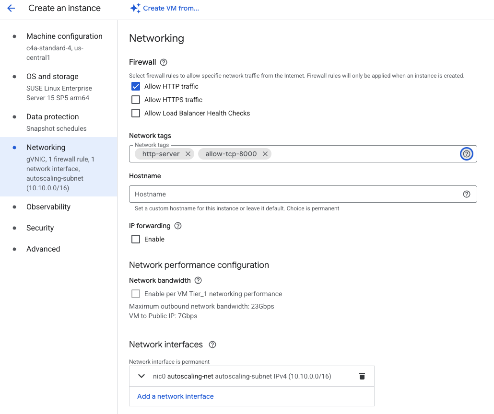

## Provision a Google Axion C4A Arm VM

You'll create a Google Axion C4A Arm-based virtual machine (VM) on Google Cloud Platform (GCP) using the `c4a-standard-4` machine type (4 vCPUs, 16 GB memory). This VM hosts your Django application.

{}
For help with GCP setup, see the Learning Path [Getting started with Google Cloud Platform](/learning-paths/servers-and-cloud-computing/csp/google/).
{}

## Provision a Google Axion C4A Arm VM in Google Cloud Console

To create a virtual machine based on the C4A instance type:
- Navigate to the [Google Cloud Console](https://console.cloud.google.com/).
- Go to **Compute Engine > VM Instances** and select **Create Instance**. 
- Under **Machine configuration**:
   - Populate fields such as **Instance name**, **Region**, and **Zone**.
   - Set **Series** to `C4A`.
   - Select `c4a-standard-4` for machine type.

- Under **OS and Storage**, select **Change**, then choose an Arm64-based OS image. For this Learning Path, use **SUSE Linux Enterprise Server**. 
- If using use **SUSE Linux Enterprise Server**. Select "Pay As You Go" for the license type. 
- Once appropriately selected, please Click **Select**. 
- Under **Networking**, enable **Allow HTTP traffic**.
- Also under **Networking**, in the "Network tags" text field add "allow-tcp-8000" as an additional tag

## Create the instance

Click **Create** to launch your VM instance. Google Cloud provisions the instance, which typically takes one to two minutes.
Once the instance is running, you'll see it listed in the VM instances table with a green checkmark. Note the External IP address displayed in the list; you'll need this to access your Django application later.

## Connect using SSH

Click the **SSH** button next to your running instance to open a browser-based terminal session.

A browser window opens with a terminal shell connected to your VM. You're now ready to install Django.

## What you've accomplished and what's next

In this section, you provisioned a Google Axion C4A Arm VM and connected to it using SSH.

Next, you'll install Django and the required dependencies on your VM.